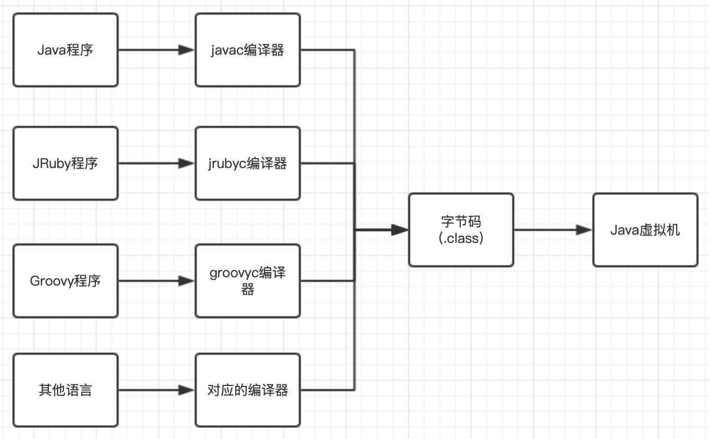
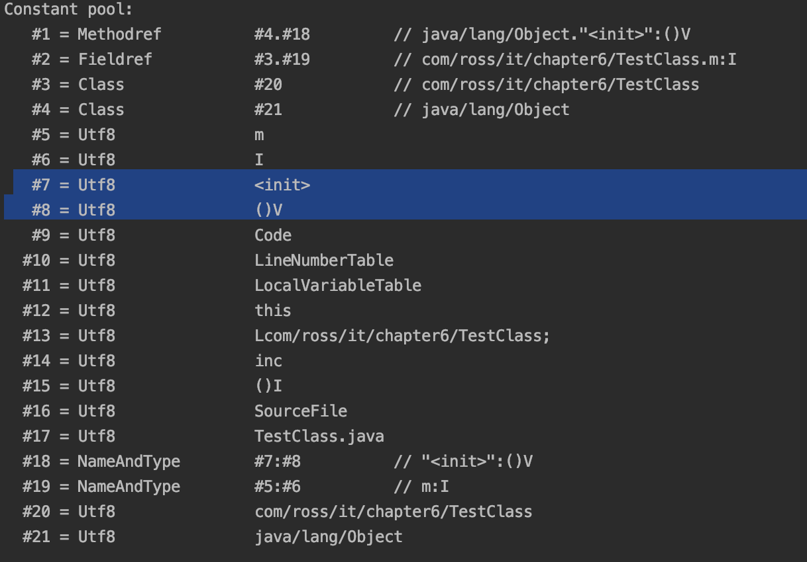

## 	JVM篇——Class文件结构

### 1、Java如何实现平台无关性

平台无关性的基石：字节码

语言无关性的基础：虚拟机和字节码存储格式。Java虚拟机不与包括Java语言在内的任何程序语言绑定，只与“Class文件”这种二进制文件格式关联，Class文件包括了Java虚拟机指令集、符号表、若干其他辅助信息。

Java语言中各种语法、关键字、常量变量和运算符号的语义都会由多条字节码指令组合来表达。

### 2、Class类文件的结构

Class文件是一组以8个字节为基础单位的二进制流，各个数据项目严格按照顺序紧凑排列在文件之中。Class文件格式采用一种类似C语言结构题的伪结构来存储数据，这种数据结构只有两种数据类型：无符号数和表。

- 无符号数是基本数据类型，以u1、u2、u4、u8分别表示1个字节、2个字节、4个字节和8个字节的无符号数，无符号数可以用来描述数字、索引引用、数量值或者按照utf-8构成字符串值；
- 表由多个无符号数或者其他表作为数据项构成的复合数据类型。所有表命名为"_info"结尾。

#### 2.1 魔数和Class文件的版本

- 魔数：Class文件的头4个字节`0xCAFFBABE`，作用是确定这个文件是否为 一个能被虚拟机接受的Class文件
- Class文件版本：紧接魔数的4个字节，第5和第6字节是次版本号，第7和第8字节是主版本号。Class文件校验部分明确要求即使文件格式并未发生变化，虚拟机也必须拒绝执行超过其版本号的Class文件。

#### 2.2 常量池

- 数据类型：表类型；

- 特点：Class文件里的资源仓库，是Class文件结构中与其他项目关联最多的数据，通常也是占用Class文件空间最大的数据项目之一；

- 常量池入口：u2类型的数据，代表常量池容量技术值，容器计数从1开始，目的是如果后面某些指向常量池的索引值的数据在特定情况下需要表达“不引用任何一个常量池项目”的含义，可以把索引值设置为0表示。

- 常量池存放的类变量：

  - 字面量：接近Java语言层面的常量概念
  - 符号引用：属于编译层面的概念，主要包括：
    - 被模块导出或开放的包；
    - 类和接口的全限定名；
    - 字段的名称和描述符；
    - 方法的名称和描述符；
    - 方法句柄和方法类型；
    - 动态调用点和动态常量

  Java在进行编译时不会有连接的步骤，Class文件不会保存各个方法、字段最终在内存中的布局信息。当虚拟机做类加载时进行动态连接，将会从常量池中获得对应的符号引用，再在类创建时或运行时解析、翻译到具体的内存地址中。

  查看Java字节码工具：javap -verbose .class文件

  

  "I"、"V"、"<init>"、"LineNumberTable"、"LocalVariableTable"等是编译器自动生成的，会被字段表、方和法表、属性表所引用，他们被用来描述一些不方便使用“固定字节”进行表达的内容。

现在常量池共有17种常量类型，具体如下：

| 类型                             | 标志 | 描述                         |
| -------------------------------- | ---- | ---------------------------- |
| CONSTANT_Utf8_info               | 1    | UTF-8编码的字符串            |
| CONSTANT_Integer_info            | 3    | 整型字面量                   |
| CONSTANT_Float_info              | 4    | 浮点型字面量                 |
| CONSTANT_Long_info               | 5    | 长整型字面量                 |
| CONSTANT_Double_info             | 6    | 双精度浮点型字面量           |
| CONSTANT_Class_info              | 7    | 类或接口的符号引用           |
| CONSTANT_String_info             | 8    | 字符串类型字面量             |
| CONSTANT_Fieldref_info           | 9    | 字段的符号引用               |
| CONSTANT_Methodref_info          | 10   | 类中方法的符号引用           |
| CONSTANT_InterfaceMethodref_info | 11   | 接口中方法的符号引用         |
| CONSTANT_NameAndType_info        | 12   | 字段或方法的部分符号引用     |
| CONSTANT_MethodHandle_info       | 15   | 表示方法句柄的符号引用       |
| CONSTANT_MethodType_info         | 16   | 表示方法类型的符号引用       |
| CONSTANT_Dynamic_info            | 17   | 表示动态计算常量的符号引用   |
| CONSTANT_InvokeDynamic_info      | 18   | 表示动态方法调用点的符号引用 |
| CONSTANT_Module_info             | 19   | 表示模块                     |
| CONSTANT_Package_info            | 20   | 表示模块中开放或导出的包     |

#### 2.3 访问标志

位置：常量池结束后紧接着的2个字节

作用：用于识别一些类或者接口层次的访问信息，包括Class是类还是接口、是否定义为public类、是否定义为abstract类型；如果是类，是否声明为final等访问标志

- ​	作用：表示一些类或者接口层次的访问信息，包括：Class类是类还是接口；是否定义为public类型；是否定义为abstract类型；如果是类，是否被声明为final等。
- ​	大小：2个字节

#### 2.4 类索引、父类索引和接口索引集合

大小：类索引和父类索引2个字节，接口索引集合是一组u2类型的数据集合；

作用：根据这3项数据确定该类型的继承关系

1. 字段表集合

   作用：描述接口或类中声明的变量；变量包括类级变量和实例级变量，但不包括方法内的局部变量；

   | 类型           | 名称             | 数量             | 作用                               |
   | -------------- | ---------------- | ---------------- | ---------------------------------- |
   | u2             | access_flags     | 1                | 字段包含的修饰符                   |
   | u2             | name_index       | 1                | 字段的简单名称，对常量池的引用     |
   | u2             | decription_index | 1                | 字段和方法的描述符，对常量池的引用 |
   | u2             | attributes_count | 1                |                                    |
   | Attribute_info | attributes       | attributes_count |                                    |

   

