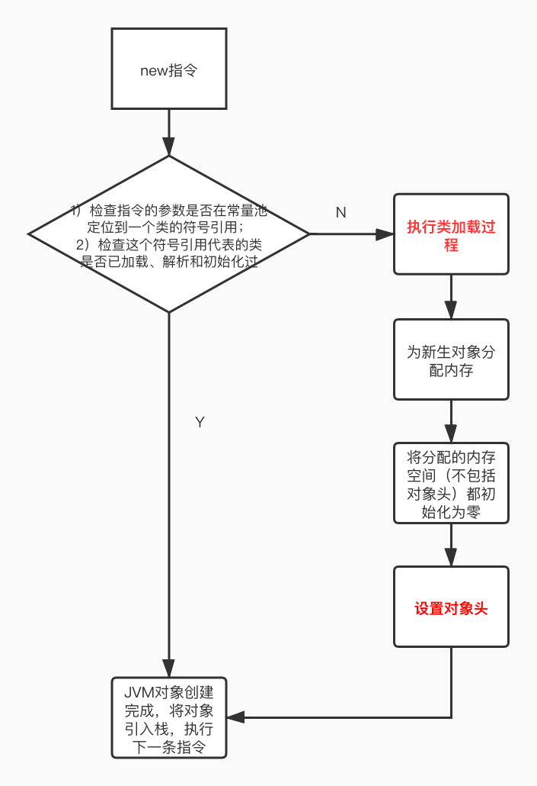

# 深入 HotSpot虚拟机对象

## 1、对象创建

对象创建的流程图如下：

### 1.1 内存分配

内存分配的方式：

- 指针碰撞：当Java堆中内存是绝对规整的，所有被使用过的内存都放在 一边，空闲的内存被放在一边，中间放着一个指针作为分界点的指示器，那分配的内存就仅仅把那个指针向空闲空间方向挪一段与对象大小相等的距离；
- 空闲列表：如果Java堆的内存不规整，使用过的与未使用的内存交错在一起，虚拟机就必须维护一个列表，记录哪些内存块是可用的，在分配的时候从列表中找到一块足够大的空间划分给对象实例，并更新列表上的记录，

分配方式由Java堆是否规整决定，Java堆是否规整由采用的垃圾收集器是否带有空间压缩整理的能力决定：

- 使用Serial、ParNew等带有压缩整理过程的收集器，系统采用分配算法是指针碰撞；
- 使用CMS这种基于清除算法的收集器时，理论上只能采用较为复杂的空闲列表来分配内存。

内存分配存在的问题：在并发情况下不是线程安全的，可能出现正在给对象A分配内存，指针还没来得及修改，对象B又同时使用了原来的指针来分配内存。解决方案有：

- 对分配内存空间的动作进行同步处理——虚拟机采用CAS配上失败重试的方式保证更新操作的原子性；
- 把内存分配的动作按照线程划分在不同的空间之中进行，每个线程在Java堆中预先划分一小块内存，称为本地线程分配缓冲（TLAB），哪个线程要分配内存，就在哪个线程的本地缓冲区分配，只有本地缓冲区用完，分配新的缓存区时才需要同步锁定。

虚拟机是否使用TLAB，通过`-XX:+/-UseTLAB`参数设置。

### 1.2 对象的内存布局

对象在堆内存中的存储布局分为3部分：对象头、实例数据、对齐填充。

1）对象头

- 存储对象自身的运行时数据： 哈希码、GC分代年龄、锁状态标志、线程持有的锁、偏向线程ID、偏向时间戳等；
- 类型指针：对象指向它的类型元数据的指针，Java虚拟机通过这个指针来确定该对象是哪个类的实例。
- 如果对象是数组，那么对象头还必须有一块用于记录数组长度的数据

2）实例数据

