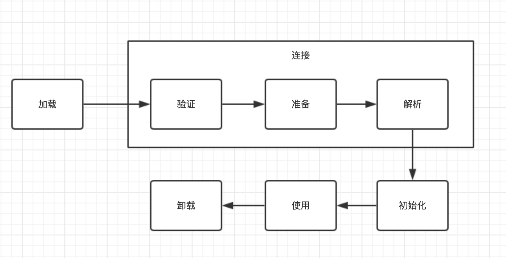
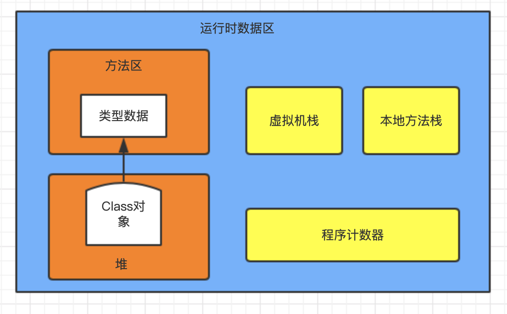

## 理解JVM——虚拟机类加载

Java虚拟机把描述类的数据的Class文件加载到内存，并对数据进行校验、转换解析和初始化，最终形成可以被虚拟机直接使用的Java类型，这个过程被称为虚拟机的类加载机制。

### 1 类加载过程

一个类从被加载到JVM内存中开始，到卸载出内存为止，整个生命周期包括加载、验证、准备、解析、初始化、使用和卸载7个阶段，其中验证、准备、解析被称为连接。这7个阶段的发生顺序如下：

加载、验证、准备、初始化和卸载这5个阶段的顺序是确定的，类型的加载过程必须按照这种顺序按部就班开始，而解析阶段不一定：在某些情况可以在初始化阶段之后再开始，这是为了支持Java语言的运行时绑定特性。

下面分别介绍类加载过程中每个阶段发生什么。

#### 1.1 加载

加载过程中，JVM需要完成3件事：

- 通过类的全限定名来获取定义该类的二进制字节流；
- 将字节流所代表的静态存储结构转化为方法区的运行时数据结构；
- 在内存中生成代表这个类的java.lang.Class对象，作为方法区这个类的各种数据的访问入口。

虽然JVM需要完成这3件事，但是没有规定从哪里获取、如何获取Class文件。所以开发者可以根据需要进行扩展。现在加载过程中可以通过ZIP压缩包读取、网络中获取、运行时计算生成、由其他文件生成、从数据库读取、从加密文件获取等方式。

而等于如何获取，因为数组类本身不通过类加载器创建，所以针对数组类和非数组类分别介绍。

1）**非数组类**

非数组类可以使用JVM内置的引导类加载器完成，也可以由用户自定义的类加载器完成。开发者通过定义自己的类加载器去控制字节流的获取方式（继承ClassLoader类并重写findClass()或loadClass()方法），实现根据自己的需求来赋予应用程序获取运行代码的动态性。

2）**数组类**

数组类不通过类加载器创建，而是由JVM直接在内存中动态构造出来的。但是数组类与类加载器仍有很大的关系，因为数组类的元素类型（Element Type，数组去掉所有维度的类型）最终还要靠类加载器来完成加载。数组类的创建过程遵循以下规则：

- 如果数组的组件类型（Component Type， 数组去掉一个维度的类型）是引用类型，则递归调用加载过程来加载这个组件类型，数组将被标识在加载该组件类型的类加载器的类名称空间上；
- 如果数组的组件类型不是引用类型，JVM将会把数组标记为与引导类加载器关联；
- 数组类的可访问性与它的组件类型一致，如果组件类不是引用类型，它的数组类的可访问性将默认为public，可被所有的类和接口访问到。

加载阶段结束后，JVM外部的二进制流就按照虚拟机设定的格式存储在方法区中。类型数据放在方法区后，同时在Java堆内存中实例化java.lang.Class类的对象，这个对象将作为程序访问方法区中的类型数据的外部接口。

#### 1.2 验证

验证的目的是确保Class文件的字节流包含的信息符合《Java虚拟机规范》的全部约束要求，保证这些信息被当作代码运行后不会危害虚拟机自身的安全。验证阶段大致上会完成以下4个检验动作：**文件格式验证、元数据验证、字节码验证和符号引用验证**。

1）**文件格式验证**

文件格式验证的目的是保证输入的字节流能正确解析并存储在方法区内，格式上符合描述一个Java类型信息的要求。这个阶段的验证是基于二进制字节流进行，只有通过这个阶段的验证，这段字节流才能被允许进入JVM内存的方法区进行存储。所以在加载阶段就会进行文件格式验证。

文件格式验证主要验证点有：

- 是否以魔数0xCAFEBABE开头
- 主次版本号是否在当前JVM接受范围内；
- 常量池的常量中是否有不被支持的常量类型；
- 指向常量的各种索引值中是否有指向不存在的常量或不符合类型的常量；
- CONSTANT_utf8_info型的常量中是否有不符合UTF-8编码的数据；
- Class文件中各个部分及文件本身是否有被删除或附加的其他信息。

2）**元数据验证**

元数据验证的目的是对类的元数据信息进行语义校验，保证不存在与《Java语言规范》定义相悖的元数据信息。这个阶段是基于方法区的存储结构进行的。包括的验证点有：

- 这个类是否有父类；
- 这个类的父类是否继承了不允许继承的类；
- 如果这个类不是抽象类，是否实现了其父类或接口中要求实现的所有方法。
- 类中字段、方法是否与父类产生矛盾。

3）**字节码验证**

字节码验证的目的是通过数据流分析和控制流分析，确定程序语义是合法、符合逻辑的。主要校验类的方法体，保证被校验类的方法在运行时不会做出危害虚拟机安全的行为。验证点如：

- 保证任意时刻操作数栈的数据类型与指令代码序列都能配合工作；
- 保证任何跳转指令都不会跳转到方法体意外的字节码指令；
- 保证方法体中的类型转换总是有效的。

因为字节码验证是非常复杂的过程，并且验证并不能保证程序的绝对准确。所以JDK6以后，javac编译器和Java虚拟机进行一项联合优化：在方法体Code属性的属性表增加"StackMapTable"属性，描述方法体所有的基本块开始时本地变量表和操作栈应有的状态，从而在字节码验证阶段，JVM可以根据StackMap Table属性去检验，这样讲字节码验证的类型推导转变为类型检查。JDK7以后只能使用类型检查来完成数据流分析校验。

4）**符号引用验证**

符号引用验证的目的是确保解析行为能正常执行，如果无法通过符号验证，JVM将抛出java.lang.IncompatibleClassError的子类异常。这个校验动作发生在虚拟机将符号引用转化为直接引用的时候，这个发生在解析阶段。

符号引用验证主要内容是校验该类是否缺少或被禁止访问它依赖的某些外部类、方法、字段等资源，校验点包括：

- 符号引用中通过字符串描述的全限定名能否找到对应的类；
- 在指定类中是否存在符合方法的字段描述符及简单名称所描述的方法和字段；
- 符号引用中的类、字段、方法的可访问性是否可被当前类访问；

#### 1.3 准备

准备阶段是正式为类的静态变量分配内存并设置类变量初始值阶段。JDK8后类变量会随Class对象一起存放在Java堆中。准备阶段需要注意：

- 内存分配的仅包括类变量，而不包括实例变量；
- 初始值通常情况是数据类型的零值

| 数据类型 |   零值   | 数据类型  | 零值  |
| :------: | :------: | :-------: | :---: |
|   int    |    0     |  boolean  | false |
|   long   |    0L    |   float   | 0.0f  |
|  short   |    0     |  double   | 0.0d  |
|   char   | '\u0000' | reference | null  |
|   byte   |    0     |           |       |

注：如果被定义为常量（final static修饰的变量），那么在准备阶段就会被初始化为变量值。

#### 1.4 解析

解析阶段是JVM将常量池内的符号引用替换为直接引用的过程。

- 符号引用：以一组符号来描述所引用的目标，符号可以是任何形式的字面量，只要使用时能无歧义地定位到目标即可；
- 直接引用：可以直接指向目标的指针、相对偏移量或者一个能间接定位到目标的句柄。

解析动作主要针对类或接口、字段、类方法、接口方法、方法类型、方法句柄和调用点限定符这7类符号引用。

#### 1.5 初始化

初始化阶段开始，JVM才真正开始执行类中编写的Java程序代码，将主导权移交给应用程序。初始化阶段就是执行类构造器`<clinit>()`方法的过程。

- `<clinit>()`方法是由编译器自动收集类中的所有类变量的赋值动作和静态语句块（static{}块）中的语句合并产生，编译器收集的顺序是由语句在源文件中出现的顺序决定的，静态语句块中只能当问到定义在静态语句块之前的变量；
- JVM保证在子类的`<clinit>()`方法执行前，父类的`<clinit>()`方法已经执行完毕；

- 由于父类的`<clinit>()`方法先执行，也就是父类中定义的静态语句块要优先于子类的变量赋值操作；
- 执行接口的`<clinit>()`方法不需要先执行父接口的`<clinit>()`方法，因为只有当父接口中定义的变量被使用时，父接口才会被初始化
- JVM必须保证一个类的`<clinit>()`方法在多线程环境中被正确的加锁同步，如果多个线程同时去初始化一个类，那么只有一个线程去执行这个类的`<clinit>()`方法，其他线程都需要阻塞等待，知道活动线程执行完毕。

什么时候初始化？

- 遇到new、getstatic、putstatic或invokestatic这四条字节码指令时，如果类型没有进行过初始化，则需要出发其初始化阶段。具体场景有：使用new关键字实例化对象、读取或设置一个类型的静态字段、调用一个类型的静态方法的时候。
- 使用java.lang.reflect包的方法对类型进行反射调用时，如果类型没有进行过初始化，则先出发其初始化；
- 当初始化类的时候，如果发现其父类还没有进行过初始化，则先出发其父类的初始化；
- 当虚拟机启动时，用户需要指定一个要执行的主类，虚拟机会先初始化这个主类；
- 当使用JDK7新加入的动态语言支持时，如果一个java.lang.invoke.MethodHandle实例最后的解析结果为REF_getStatic、REF_putStatic、REF_invokeStatic、REF_newInvokeSpecial四种类型的方法句柄，并且这个方法句柄对应的类还没有初始化过，则触发初始化；
- 当一个接口定义了JDK8新加入的默认方法（被default关键字修饰的接口方法）时，如果有这个接口的实现类发生了初始化，那该接口要在其之前初始化。

### 2 双亲委派模型

### 3 理解ClassLoader类

### 4 模块化

### Jboss modules

### osgi

### Jigsaw

### 5 问题思考：类加载过程是线程安全的吗？