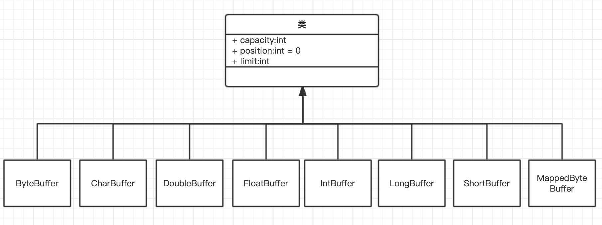

## Java——深入理解IO底层原理


### 1、IO读写的基础原理

用户程序进行IO读写依赖于底层的IO读写，基本上会用到底层的read&write两大系统。上层程序的IO操作的是内核缓冲区与进程缓冲区间的复制，底层的IO操作的是内核缓冲区与物理设备之间的复制。可以看出连接物理设备与程序之间的重要桥梁是内核缓冲区与进程缓冲区，所以首先了解一下这两个缓冲区的原理。

#### 1.1、内核缓冲区与进程缓冲区

缓冲区的目的是为了减少频繁地与设备之间的物理交换。外部设备的读写涉及到操作系统的中断，操作系统中断需要保存之前的进程数据和状态等信息，而结束中断之后还需要恢复之前的进程数据和状态信息。为了减少这种底层系统的时间损耗、性能损耗，于是出现了内存缓冲区。

上层应用使用read系统调用时，是把数据从内核缓冲区复制到应用的进程缓冲区；上层应用使用write系统调用时，是把数据从进程缓冲区复制到内核缓冲区中。

底层操作会对内核缓冲区进行监控，等待缓冲区达到一定数量时再进行IO设备的中断处理，集中执行物理设备的实际IO操作。这一步主要是由操作系统的内核决定的。

#### 1.2 IO调用流程


客户端请求：Linux通过网卡读取客户端的请求数据，将数据读取到内核空间；

获取请求数据：Java服务器通过read系统调用，从Linux内核缓冲区读取数据，再送入Java进程缓冲区；

服务器业务处理：Java服务器在自己的用户空间中处理客户端的请求；

服务端返回数据：Java服务器完成处理后，构建好的响应数据，通过write系统将这些数据从用户缓冲区写入内核缓冲区；

发送客户端：Linux内核通过网络IO，将内核缓冲区中的数据写入网卡，网卡通过底层的通信协议，将数据发送给目标客户端。


### 2、Java中的IO模型


#### 2.1 同步阻塞IO（Blocking IO）

传统的IO模型都是同步阻塞IO。

- 阻塞IO是指需要内核IO操作彻底完成后，才返回用户空间执行用户的操作；
- 同步IO是一种用户空间与内核空间的IO发起方式，指用户空间的线程是主动发起IO请求的一方，内核空间是被动接受方；

阻塞IO调用的流程如下：


阻塞IO的特点：在内核进行IO执行的两个阶段，用户线程都被阻塞了。

阻塞IO的优点：应用程序开发简单；在阻塞等待期间，用户线程挂起；在阻塞期间，用户线程基本不会占用CPU资源；

阻塞IO的缺点：一个线程维护一个连接的IO操作，在高并发场景下，需要大量的线程来维护大量的网络连接，内存、线程切换开销非常巨大。


#### 2.2 同步非阻塞IO（Non-Blocking IO）

这里的NIO模型不是Java的new IO库。非阻塞IO是指用户空间的程序不需要等待内核IO操作彻底完成，可以立即返回用户空间执行用户的操作。

在NIO模型中，应用程序一旦开始IO系统调用，会出现两种情况：

- 在内核缓冲区中没有数据的情况下，系统调用会立即返回一个调用失败的信息；
- 在内核缓冲区中有数据的情况下是阻塞的，直到数据从内核缓冲复制到用户进程缓冲。复制完成后，系统调用返回成功，应用程序开始处理用户空间的缓存数据。


同步非阻塞IO的特点：应用程序的线程需要不断地进行IO系统调用，轮询数据是否已经准备好，如果没有准备好就继续轮询，直到完成IO系统调用为止；

同步非阻塞IO的优点：每次发起的IO系统调用，在内核等待数据过程中可以立即返回，用户线程不会阻塞，实时性较好；

同步非阻塞IO的缺点：不断地轮训内核，这将占用大量的CPU时间，效率低下。在高并发场景下也是不可用的。


#### 2.3 IO多路复用（IO Multiplexing）

即经典的Reactor反应器设计模式，也称为异步阻塞IO，Java中的Selector选择器和Linux中的epoll都是这种模型。对应Java中的NIO（new IO）。

在Linux系统中，对应的系统调用为select/epoll系统调用。通过该系统调用，一个进程可以监视多个文件描述符，一旦某个描述符就绪（一般是内核缓冲区可读/可写），内核能够就绪的状态返回给应用程序。然后应用程序根据就绪状态进行相应的IO系统调用。

在IO多路复用模型中通过select/epoll系统调用，单个应用程序的线程不断地轮训成百上千的socket连接，当某个或某些socket网络连接有IO就绪的状态，就返回对应的可以执行的读写操作。


IO多路复用的特点：IO多路复用模型的IO涉及两种系统调用，一种是IO操作，另一种是select/epoll。负责select/epoll状态查询调用的线程，需要不断地进行select/epoll轮询，查找出达到IO操作就绪的socket连接。

IO多路复用模型的优点：一个选择器查询线程可以同时处理成千上万个连接，系统不必创建大量的线程，也不必维护这些线程，从而大大减少系统的开销。

IO多路复用模型的缺点：select/epoll系统调用是阻塞式，属于同步IO。都需要在读写事件就绪后，由系统调用本身负责读写，也就是这个读写过程是阻塞的。

#### 2.4 异步IO（Asynchronous IO）

异步IO是指系统内核是主动发起IO请求的一方，用户空间的线程是被动接受方。

AIO的基本流程是：用户线程通过系统调用，向内核注册某个IO操作。内核在整个IO操作（包括数据准备、数据复制）完成后，通知用户程序，用户执行后续的业务操作。


异步IO模型的特点：在内核等待数据和复制数据两个阶段，用户线程都不是阻塞的。用户线程需要接收内核的IO操作完成的事件，或者用户线程需要注册一个IO操作完成的回调函数。

异步IO模型的优点：实现真正的异步输入输出，吞吐量比IO多路复用模型更高。

异步IO模型的缺点：应用程序仅需要进行事件的注册与接收，其余工作都留给操作系统，也就是需要底层内核提供支持。


### 3、Java IO

Java IO类库非常庞大和复杂，有几十个类，负责IO数据的读取和写入。Java IO可以从两个维度划分：


针对不同的场景，Java IO又在这四个类基础上扩展出很多子类。Java BIO体系如下：


节点流直接处理数据源介质，处理流使用**装饰器模式**，对节点流功能的增强。例如BufferedInputStream对流增加缓存功能，DataInputStream是将原始数据流转换为基本数据类型的流。

```java
public class InputStreamDemo {

    public static void main(String[] args) throws IOException {
        FileInputStream file = new FileInputStream("test.txt");
        BufferedInputStream bufferedInputStream = new BufferedInputStream(file);

        int length = -1;
        byte[] bytes = new byte[48];

        while ((length = bufferedInputStream.read(bytes)) != -1) {
            System.out.println("read length is " + length);
            System.out.println(new String(bytes));
        }
    }
}
```


### 4、Java NIO

Java NIO是JDK1.4引入的异步IO，被称为Java New IO类库，建成后Java NIO。Java NIO的目标是让Java支持非阻塞IO。Java NIO由一下3个核心组件组成：Channel（通道）、Buffer（缓冲区）、Selector（选择器）。三者之间的关系如下：


在NIO中，同一个网络连接使用一个通道表示，所有的NIO的IO操作都是从通道开始的；

Selector的作用是实现IO多路复用，即一个线程/进程同时监视多个文件描述符，一旦其中一个或者多个文件描述符可读或可写，系统内核就通知该进程/线程；从开发的角度上，首先把通道注册到选择器中，然后通过选择器内部的机制，可以查询这些注册的通道是否有已经就绪的IO事件。

应用程序与通道主要的交互操作就是进行数据的read读取和write写入。通道的读取就是将数据从通道读取到缓冲区中，通道的写入就是将数据从缓冲区中写入到通道中。

下面分别详细介绍这三个类库。


#### 4.1 Buffer（缓冲区）

NIO的Buffer本质上是一个内存块，既可以写入数据，也可以从中读取数据。Java中NIO的Buffer类图如下：



Buffer类是一个抽象类，并且是一个非线程安全的类。Buffer类中最重要的三个成员属性：

- capacity（容量）
  - 一旦初始化就不能再改变
  - 容量不是指内存块的字节数量，而是写入的数据对象的数量
- position（读写位置）
  - 写入模式，position的值变化规则：
    - 刚进入写入模式，position=0
    - 每当一个数据写入缓冲区，position会向后移动一位；
    - 当position达到limit时，缓冲区就无空间可写
  - 读模式下，position的值变化规则：
    - 缓冲区刚开始到读模式时，position会被重置为0；
    - 从缓冲区读取时，也是从position为止开始读，读取后position向前移动到下一个可读的位置；
    - position最大的值为最大可读上限limit时，表明缓冲区已经无数据可读
  - 数据写入后，如果要从缓冲区读取数据，就进行模式的切换，可以调用flip翻转方法，将缓冲区变成读取模式
- limit（读写的限制）
  - 写入模式下，limit属性值为可以写入的数据最大上限，也就是capacity容量值；
  - 读取模式下，limit属性值为写模式下的position值，表示最多能从缓冲区读取的数据量

通过一个demo演示如何使用Buffer类：

```java
static IntBuffer buffer = null;

public static void bufferTest() {
    // 获取一个Buffer实例对象，缓冲区处于写模式
    buffer = IntBuffer.allocate(20);

    // 写入数据到缓冲区
    for (int i = 0; i < buffer.capacity() / 4; i++) {
        buffer.put(i);
    }

    // 翻转缓冲区，写入模式转换成读取模式
    buffer.flip();

    System.out.println("get data-------------------------------");
    // 从缓冲区读取数据
    for (int i = 0; i < buffer.limit(); i++) {
        System.out.println(buffer.get());
    }


    // 缓冲区倒带，可以重新读取缓冲区数据
    buffer.rewind();

    System.out.println("after rewind-------------------------------");
    for (int i = 0; i < buffer.limit(); i++) {
        if (i == 2) {
            // 将当前position读值保存起来，放在Mark属性中，让mark属性记住这个临时位置；调用Buffer.reset()方法将mark值恢复到position中
            buffer.mark();
        }
        System.out.println(buffer.get());
    }

    buffer.reset();
    System.out.println("after reset and mark-------------------------------");
    for (int i = buffer.position(); i < buffer.limit(); i++) {
        System.out.println(buffer.get());
    }
  
    // 将缓冲区切换成写入模式
    buffer.clear();
}
```

从Demo中可以看出，使用Java NIO Buffer的基本步骤为：

1. 使用创建子类实例对象的allocate()方法，创建一个Buffer类的实例对象；
2. 调用put方法，将数据写入到缓冲区中；
3. 写入完成后，在开始读取数据前，调用Buffer.flip()方法，将缓冲区转换为读取模式；
4. 调用get方法，从缓冲区读取数据；
5. 读取完成后，调用Buffer.clear()或Buffer.compact()方法，将缓冲区转换为写入模式

#### 4.2 Channel（通道）

NIO中一个连接就是用一个Channel来表示，一个通道可以表示一个底层的文件描述符，例如硬件设备、文件、网络连接等。Java NIO中常用的通道类型如下：

- FileChannel文件通道，用于文件的数据读写；
- SocketChannel套接字通道，用于Socket套接字TCP连接的数据读写；
- ServerSocketChannel服务器嵌套字通道，允许监听TCP连接请求，为每个监听的请求，创建一个SocketChannel套接字通道；
- DatagramChannel数据报通道，用于UDP协议的数据读写。

下面分别介绍Channel的获取、读取、写入、关闭四个操作。

##### 4.2.1 FileChannel文件通道

1）获取FileChannel文件通道

通过文件的输入流、输出流获取FileChannel文件通道，也可以通过RandomAccessFile文件随机访问类获取。注意：FileChannel的阻塞式的。

```java
// 创建一条文件输入流
FileInputStream fis = new FileInputStream(srcFile);
// 获取文件流的通道
FileChannel inChannel = fis.getChannel();

// 创建一条文件输出流
FileOutputStream fos = new FileOutputStream(desFile);
// 获取文件流的通道
FileChannel outChannel = fos.getChannel();

// 创建随机访问对象
RandomAccessFile randomAccessFile = new RandomAccessFile(srcFile, "rw");
// 获取文件流的通道
FileChannel inChannel01 = randomAccessFile.getChannel();
```


2）读取FileChannel通道

从通道读取数据一般会调用通道的`int read(ByteBuffer buf)`方法，从通道读取到数据写入ByteBuffer缓冲区，并且返回读取到的数据量。

```java
// 创建随机访问对象
FileInputStream fis = new FileInputStream("src/main/resources/test.txt");
// 获取文件流的通道
FileChannel inChannel = fis.getChannel();

// 获取一个字节缓冲区
ByteBuffer buffer = ByteBuffer.allocate(1024);
int length = -1;

// 调用通道的read方法，读取数据并写入字节类型的缓冲区，此时缓冲区处于写入模式
while ((length = inChannel.read(buffer)) != -1) {
    buffer.flip();
    for (int i = 0; i < buffer.limit(); i++) {
        System.out.println(buffer.get());
    }
}
```


3）写入FileChannel通道

写入数据到通道，会调用通道的int write(ByteBuffer buf)方法，此方法的参数ByteBuffer时数据的来源。write方法的作用是从ByteBuffer缓冲区读取数据，然后写入到通道自身，而返回值是写入成功的字节数。

```java
// 创建随机访问对象
FileInputStream fis = new FileInputStream("src/main/resources/test.txt");
// 获取文件流的通道
FileChannel inChannel = fis.getChannel();

FileOutputStream fos = new FileOutputStream("src/main/resources/des.txt");
FileChannel outChannel = fos.getChannel();

// 获取一个字节缓冲区
ByteBuffer buffer = ByteBuffer.allocate(100);
int length = -1;

// 调用通道的read方法，读取数据并写入字节类型的缓冲区，此时缓冲区处于写入模式
while ((length = inChannel.read(buffer)) != -1) {
    buffer.flip();
    int outLength = 0;
    // 调用write方法，将buf的数据写入通道
    while ((outLength = outChannel.write(buffer)) != 0) {
        System.out.println(outLength);
    }
    buffer.clear();
}
// 强制刷新到磁盘
outChannel.force(true);
// 关闭通道
outChannel.close();
inChannel.close();
fis.close();
fos.close();
```

上述Demo演示了利用FileChannel实现文件复制，在完成复制后调用FileChannel的force()方法保证写入通道的缓冲数据能写入磁盘。完成数据传输后调用close()方法关闭通道。

##### 4.2.2 SocketChannel套接字通道

在NIO中，涉及网络连接到通道有两个，一个是SocketChannel负责连接传输，另一个是ServerSocketChannel负责连接到监听。其中ServerSocketChannel应用于服务器端，SocketChannel同时用于服务器端和客户端。SocketChannel主要面向的是TCP传输协议。

SocketChannel的类图如下：


ServerSocketChannel的UML图如下：


两种通道都支持阻塞和非阻塞两种模式：

```java
// 设置为非阻塞模式
socketChannel.configureBlocking(false);

// 设置为阻塞模式
socketChannel.configureBlocking(true);
```

在非阻塞模式下，通道的操作都是异步、高效率的。下面分别介绍非阻塞模式下通道的打开、读写和关闭等操作。

1）获取SocketChannel传输通道

客户端：

先通过SocketChannel静态方法open()获得一个套接字传输通道，然后将socket套接字设置为非阻塞模式，最后通过connect()实例方法，对服务器等IP和端口发起连接。

```java
// 获得一个套接字传输通道
SocketChannel socketChannel = SocketChannel.open();
// 设置为非阻塞模式
socketChannel.configureBlocking(false);
// 对服务器的IP和端口发起连接
socketChannel.connect(new InetSocketAddress("127.0.0.1", 80));
while (! socketChannel.finishConnect()) {
    // 不断自旋、等待，或者做其他事情
}
```

在非阻塞等情况下，与服务器等连接可能还没有真正建立，因此需要不断的自旋检查当前是否是连接到了主机。

服务器端：

当新连接事件到来时，在服务器端的ServerSocketChannel能成功查询一个新连接事件，并且通过调用服务器端ServerSocketChannel监听套接字的accept()方法来获取新连接的套接字通道。

```java
// 新连接事件到来，首先通过事件获取服务器监听通过
ServerSocketChannel serverSocketChannel =（ServerSocketChannel）key.channel;
// 获取新连接的套接字通道
SocketChannel socketChannel1 = serverSocketChannel.accept();
// 设置为非阻塞模式
socketChannel1.configureBlocking(false);
```

这里的key是通过Selector类相关方法获取，具体可以参考4.3。


2）读取SocketChannel传输通道

当SocketChannel通道可读时，可以从SocketChannel读取数据。即调用read()方法，将数据读入缓冲区ByteBuffer。

```java
ByteBuffer buffer = ByteBuffer.allocate(100);
int byteRead = socketChannel.read(buffer);
```

在读取时必须检查read()的返回值，以便判断当前是否读取到了数据。如果返回-1，那么表示读取到对方的输出结束标志，对方已经输出结束，准备关闭连接。

3）写入到SocketChannel传输通道

和把数据写入到FileChannel文件通道一样，大部分应用场景都会调用通道的int write(ByteBuffer buf)方法。

```java
buffer.flip();
socketChannel.write(buffer);
```

4）关闭SocketChannel传输通道

在关闭SocketChannel传输通道前，如果传输通道用来写入数据，建议调用一次shutdownOutput()终止输出方法，向对方发送一个输出的结束标志（-1）。然后调用socketChannel.close()方法，关闭套接字连接。

```java
socketChannel.shutdownOutput();
socketChannel.close();
```

关于SocketChannel的案例，需要结合Selector一起实现。

##### 4.2.3 DatagramChannel数据报通道

UDP协议不是面向连接的协议，使用UDP协议只要知道服务器的IP和端口，就可以直接向对方传输数据。在Java NIO使用DatagramChannel数据报通道处理UDP协议的数据传输。

1）获取DatagramChannel数据报通道

调用DatagramChannel类的open静态方法，然后调用configureBlocking(false)方法，设置成非阻塞模式。

```java
// 获取DatagramChannel数据报通道
DatagramChannel channel = DatagramChannel.open();
// 设置为非阻塞模式
channel.configureBlocking(false);
```

如果需要接收数据，需要调用bind方法绑定一个数据报的监听端口：

```java
// 调用bind方法绑定一个数据报的监听端口
channel.socket().bind(new InetSocketAddress(18080));
```


2）读取DatagramChannel数据报通道数据

调用receive(ByteBuffer buf)将数据从通道读入，在写入到ByteBuffer缓冲区中。

```java
// 创建缓冲区
ByteBuffer buffer = ByteBuffer.allocate(1024);
// 从DatagramChannel读取，再写入到ByteBuffer缓冲区
SocketAddress clientAddr = channel.receive(buffer);
```


3）写入DatagramChannel数据报通道

调用send()方法写入数据。

```java
// 把缓冲区翻转到读取模式
buffer.flip();
// 调用send方法，把数据发送到目标IP+端口
channel.send(buffer, new InetSocketAddress("127.0.0.1", 80));
// 清空缓存， 切换到写入模式
buffer.clear();
```


4）关闭DatagramChannel数据报通道

调用close()方法即可关闭数据报通道。


#### 4.3 Selector（选择器）

选择器的目的是完成IO的多路复用，一个通道代表一条连接通路，通过选择器可以同时监视多个通道的IO状况。选择器和通道的关系是监视和被监视的关系。

使用选择器的步骤为：

1. 获取选择器实例；
2. 将通道注册到选择器中；
3. 轮训感兴趣的IO就绪事件（选择键集合）

下面分别介绍这三个步骤。

1）获取选择器实例

选择器实例是通过调用静态工厂方法open()来获取

```java
// 获取Selector实例
Selector selector = Selector.open();
```

Selector选择器的open()方法是向选择器SPI发出请求，通过默认的SelectorProvider（选择器提供者）对象，获取一个新的选择器实例。

Java SPI全称服务提供者接口，是JDK的一种可以扩展的服务提供和发现机制。Java通过SPI的方式，提供选择器的默认实现版本。

2）将通道注册到选择器中

```java
// 获取通道
ServerSocketChannel serverSocketChannel = ServerSocketChannel.open();
// 设置为非阻塞
serverSocketChannel.configureBlocking(false);
// 绑定连接
serverSocketChannel.bind(new InetSocketAddress(80));
// 将通道注册到选择器，并指定监听事件
serverSocketChannel.register(selector, SelectionKey.OP_ACCEPT);
```

通道与选择器之间通过register（注册）方式完成，调用通道的`Channel.register(Selector sel, int ops)`方法，可以将通道实例注册到一个选择器中。第一个参数是指定通道注册到选择器实例，第二个参数指定选择器监控到IO事件类型，可选择的类型有：

- 可读：SelectionKey.OP_READ
- 可写：SelectionKey.OP_WRITE
- 连接：SelectionKey.OP_CONNECT
- 接收：SelectionKey.OP_ACCEPT

如果选择器要监控通道的多种事件，可以用“按位或”运算符实现。在通道注册前可以调用通道的validOps()方法来获取该通道所支持的IO事件集合。

IO事件不是对通道的IO操作，而是通道的某个IO操作的一种就绪状态，表示通道具备完成某个IO操作的条件：

- SocketChannel通道完成和对端的握手连接，处于连接就绪状态；
- ServerSocketChannel服务器通道监听到一个新连接到到来，处于接收就绪状态；
- 有数据可读的SocketChannel通道，处于读就绪状态；
- 等待写入数据的SocketChannel，处于写就绪状态。

注意：注册到选择器的通道，必须处于非阻塞模式，否则将抛出IllegalBlockingModeException异常。这意味着FileChannel文件通道不能与选择器一起使用，因为FileChannel文件通道只有阻塞模式，而Socket套接字相关的所有通道都可以。

3）选择感兴趣的IO就绪事件

通过Selector选择器的select()方法，选出已经注册、已经就绪的IO事件，保存到SelectionKey选择键集合中。SelectionKey集合保存在选择器实例内部，是一个元素为SelectionKey类型的集合，调用选择器的selectedKeys()方法，可以取得选择键集合。

```java
// 轮询选择出感兴趣的IO就绪事件
while (selector.select() > 0) {
    Set<SelectionKey> selectedKeys = selector.selectedKeys();
    Iterator keyIterator = selectedKeys.iterator();
    while (keyIterator.hasNext()) {
        SelectionKey selectionKey = (SelectionKey) keyIterator.next();
        
        // 根据IO类型执行对应的业务操作
        if (selectionKey.isAcceptable()) {
            // IO事件为服务器监听通道有新连接
        } else if (selectionKey.isConnectable()) {
            // IO事件为传输通道连接成功
        } else if (selectionKey.isReadable()) {
            // IO事件为传输通道可读
        } else if (selectionKey.isWritable()) {
            // IO事件为传输通道可写
        }
        // 处理完成后移除选择键
        keyIterator.remove();
    }
}
```


