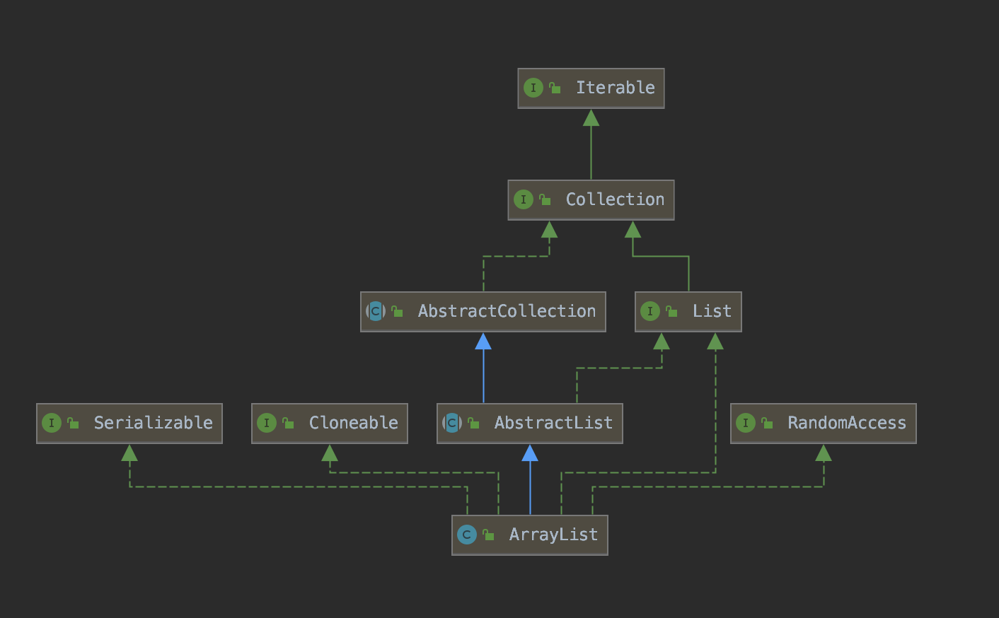
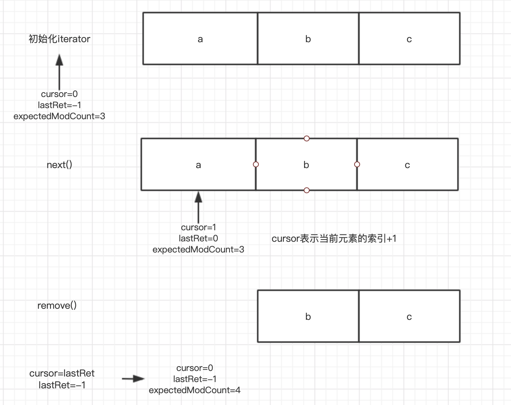
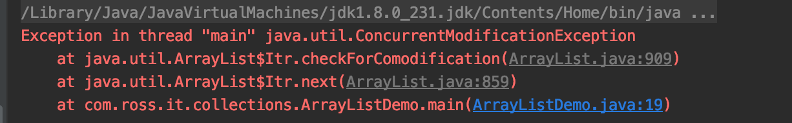

## Java集合系列——ArrayList

### 1、ArrayList类结构

ArrayList的UML如下：



- RandomAccess：表示支持随机访问；
- Cloneable：表示该类的实例可以创建一个字段对字段的副本；
- Serializable:可序列化
- List:实现List接口的方法

ArrayList常用方法：

**增：**

```java
public boolean add(E e);              #添加元素到末尾
public void add(int index, E element) # 添加元素到指定位置
```

**删：**

```
public E remove(int index)            #删除指定位置元素
public boolean remove(Object o)       #移除指定元素
public void clear()                   #清空元素
```

**查：**

```
public boolean contains(Object o)     #判断是否包含指定元素
public E get(int index)               #获取指定位置的元素
public int indexOf(Object o)          #查询元素，如果找到返回元素的位置，否则返回-1
public int lastIndexOf(Object o)      #从后往前找
public boolean isEmpty()              #判断是否为空
public int size()                     # 获取长度
```

**改：**

```
public E set(int index, E element)
```


### 2、基本原理

#### 2.1 ArrayList的属性和构造函数

```java
    # 默认初始化容量
    private static final int DEFAULT_CAPACITY = 10;

    # 空数组
    private static final Object[] EMPTY_ELEMENTDATA = {};

    # 共享空数组实例，我们将其与EMPTY_ELEMENTDATA区分开来，以了解添加第一个元素时要膨胀多少
    private static final Object[] DEFAULTCAPACITY_EMPTY_ELEMENTDATA = {};

     # 元素数组，用于存储ArrayList
    transient Object[] elementData; // non-private to simplify nested class access

    # ArrayList包含元素的个数，不是elementData的长度
    private int size;
```

ArrayList使用一个Object数组存储数据，elementData会随着实际元素个数的增多而重新分配，而size始终记录实际元素的个数。

ArrayList有3个构造函数：

1）空构造函数

```java
    public ArrayList() {
        this.elementData = DEFAULTCAPACITY_EMPTY_ELEMENTDATA;
    }
```

从源码看出，使用空构造函数时，直接将DEFAULTCAPACITY_EMPTY_ELEMENTDATA赋值给elementData。

2）指定初始化容量大小

```java
    public ArrayList(int initialCapacity) {
        if (initialCapacity > 0) {
            this.elementData = new Object[initialCapacity];
        } else if (initialCapacity == 0) {
            this.elementData = EMPTY_ELEMENTDATA;
        } else {
            throw new IllegalArgumentException("Illegal Capacity: "+
                                               initialCapacity);
        }
    }
```

当初始容量>0时，直接new一个Object数组；当初始化容量=0时，将EMPTY_ELEMENTDATA赋值给elementData，而不是初始化一个默认容量的数组。

3）将其他集合类作为参数

```java
    public ArrayList(Collection<? extends E> c) {
        elementData = c.toArray();
        if ((size = elementData.length) != 0) {
            // c.toArray might (incorrectly) not return Object[] (see 6260652)
            if (elementData.getClass() != Object[].class)
                elementData = Arrays.copyOf(elementData, size, Object[].class);
        } else {
            // replace with empty array.
            this.elementData = EMPTY_ELEMENTDATA;
        }
    }
```

首先调用集合类的toArray()方法，将集合类转换为数组，如果数组长度>0并且数组的类型不等于Object[].class，则会进行进一步拷贝（**深拷贝还是浅拷贝？**）。如果转换数组长度为0，依然会用来EMPTY_ELEMENTDATA来替代。


#### 2.2 常用方法原理

**1）添加元素add方法**

```java
public boolean add(E e) {
    ensureCapacityInternal(size + 1);  // Increments modCount!!
    elementData[size++] = e;
    return true;
}
```

首先调用ensureCapacityInternal确保容量足够，ensureCapacityInternal的代码为：

```java
private void ensureCapacityInternal(int minCapacity) {
    ensureExplicitCapacity(calculateCapacity(elementData, minCapacity));
}

private static int calculateCapacity(Object[] elementData, int minCapacity) {
    if (elementData == DEFAULTCAPACITY_EMPTY_ELEMENTDATA) {
        return Math.max(DEFAULT_CAPACITY, minCapacity);
    }
    return minCapacity;
}
```

首先判断数组是不是空，如果是空则首次要分配的大小为DEFAULT_CAPACITY=10，否则容量大小为size+1。接下来调用ensureExplicitCapacity方法：

```java
    private void ensureExplicitCapacity(int minCapacity) {
        modCount++;

        // overflow-conscious code
        if (minCapacity - elementData.length > 0)
            grow(minCapacity);
    }

    private void grow(int minCapacity) {
        // overflow-conscious code
        int oldCapacity = elementData.length;
        int newCapacity = oldCapacity + (oldCapacity >> 1);
        if (newCapacity - minCapacity < 0)
            newCapacity = minCapacity;
        if (newCapacity - MAX_ARRAY_SIZE > 0)
            newCapacity = hugeCapacity(minCapacity);
        // minCapacity is usually close to size, so this is a win:
        elementData = Arrays.copyOf(elementData, newCapacity);
    }
```

modCount表示内部修改的次数，**为什么要记录修改次数**？

当需要的长度大于当前elementData的长度时，就需要扩容。**ArrayList的扩容机制为**：1）elementData长度增加50%，因为oldCapacity >> 1，相当于增加原来长度的一半；2）如果扩容后的长度依然小于需要的长度，则将其扩容为需要的长度minCapacity；3）扩容后的最大长度为Integer.MAX_VALUE - 8，为什么要保留8？因为一些VM可能会在数组保留一些header。

**2）删除元素remove**

```java
public E remove(int index) {
    # 检查索引的合法性，不能大于size
    rangeCheck(index);

    modCount++;
    E oldValue = elementData(index);

    int numMoved = size - index - 1;
    if (numMoved > 0)
        System.arraycopy(elementData, index+1, elementData, index,
                         numMoved);
    elementData[--size] = null; // clear to let GC do its work

    return oldValue;
}
```

从源码中可以看出，删除元素时也增加了modCount，然后计算要移动的元素个数，从index往后的元素都向前移动一位，实际调用System.arraycopy方法移动，并将elementData[size]=null，设置为null后不再引用原来的对象，如果原来对象不再被其他对象引用，就可以被垃圾回收。

3）其他查询和修改的接口

因为ArrayList底层是数组的数据结构，该数据接口支持随机访问，所以如果按照索引查询或者修改，可以直接利用索引返回查询结果或直接修改；如果是查询元素，则需要对数组进行遍历。因为这些方法比较简单，所以我们接下来看一下ArrayList的遍历。

#### 2.3 迭代器

ArrayList支持多种方式的遍历：for循环、foreach语法、Iterator迭代。foreach语法的遍历例如：

```java
ArrayList<String> list = new ArrayList<>();
list.add("a");
list.add("b");
list.add("c");

for (String str: list) {
    System.out.println(str);
}
```

foreach语法相比于for循环更加简洁，并且适用于各种容器。foreach的原理是什么？使用javap -v语法编译.class文件，其中一段为：

```java
        30: invokevirtual #8                  // Method java/util/ArrayList.iterator:()Ljava/util/Iterator;
        33: astore_2
        34: aload_2
        35: invokeinterface #9,  1            // InterfaceMethod java/util/Iterator.hasNext:()Z
        40: ifeq          63
        43: aload_2
        44: invokeinterface #10,  1           // InterfaceMethod java/util/Iterator.next:()Ljava/lang/Object;
        49: checkcast     #11                 // class java/lang/String
        52: astore_3
        53: getstatic     #12                 // Field java/lang/System.out:Ljava/io/PrintStream;
        56: aload_3
        57: invokevirtual #13                 // Method java/io/PrintStream.println:(Ljava/lang/String;)V

```

从编译的结果可以看出，编译器会将foreach语法转化为类似如下代码：

```java
Iterator<String> iterator = list.iterator();
while (iterator.hasNext()) {
    System.out.println(iterator.next());
}
```

所以接下来主要分析迭代器的原理。

1）迭代器接口

从类图中可以看出，ArrayList接口实现Iterable接口，该接口表示类是可迭代的。JDK1.8中定义为：

```java
public interface Iterable<T> {

    Iterator<T> iterator();
    
     // jdk1.8中新增，定义增强型遍历
    default void forEach(Consumer<? super T> action) {
        Objects.requireNonNull(action);
        for (T t : this) {
            action.accept(t);
        }
    }

     // jdk1.8中新增，对每个元素执行给定操作直到所有元素都处理完成
    default Spliterator<T> spliterator() {
        return Spliterators.spliteratorUnknownSize(iterator(), 0);
    }
```

实现Iterable接口，必须实现iterator()方法，并返回一个实现Iterator接口的对象。Iterator接口定义为：

```java
public interface Iterator<E> {

     // 判断是否还有元素
    boolean hasNext();

		// 返回下一个元素
    E next();

		// 移除元素
    default void remove() {
        throw new UnsupportedOperationException("remove");
    }

     // 1.8新增，对每个元素执行给定的操作
    default void forEachRemaining(Consumer<? super E> action) {
        Objects.requireNonNull(action);
        while (hasNext())
            action.accept(next());
    }
```

这里比较一下Iterable与Iterator接口的区别：

- Iterable表示对象可以被迭代，它有一个方法iterator()，返回Iterator对象，实际通过Iterator接口的方法进行遍历；
- 如果对象实现了Iterable，就可以使用foreach语法；
- 类可以不实现Iterable，也可以创建Iterator对象。

2）Iterator的实现原理

ArrayList在内部实现了一个内部类Itr实现Iterator接口，声明为：

```java
private class Itr implements Iterator<E>
```

该内部类有3个实例变量：

```java
int cursor;       // 下一个要返回的元素位置
int lastRet = -1; // 最后一个返回的索引位置，如果没有为-1
int expectedModCount = modCount;
```

expectedModCount表示期望的修改次数，初始化为外部类当前的修改次数modCount。因为成员内部类可以直接访问外部类的实例变量，并且从2.2中介绍的源码可以看到：每次新增或删除元素时，modCount都会发生自增。而每次迭代器操作的时候都会检查expectedModCount是否与modCount相同，这样就能检测出结构性变化，当这两个值不相等时则会抛出异常。

```java
final void checkForComodification() {
    if (modCount != expectedModCount)
        throw new ConcurrentModificationException();
}
```

在迭代器进行遍历或者移除元素时都会调用checkForComodification方法，检查迭代器结构是否发生变化。

hasNext()方法的原理就是当cursor等于size时已经遍历完元素，否则则还有元素未遍历。

```java
public boolean hasNext() {
    return cursor != size;
}
```

next()方法的源码如下：

```
public E next() {
    checkForComodification();
    int i = cursor;
    if (i >= size)
        throw new NoSuchElementException();
    Object[] elementData = ArrayList.this.elementData;
    if (i >= elementData.length)
        throw new ConcurrentModificationException();
    cursor = i + 1;
    return (E) elementData[lastRet = i];
}
```

首先检查是否发生结构性变化，如果没有变化就更新cursor和lastRet的值，以保持其语义然后返回对应的元素。其中一旦下一个元素的索引大于ArrayList的元素个数或者大于动态数组的长度，则抛出异常。

remove()方法的源码为：

```java
public void remove() {
    if (lastRet < 0)
        throw new IllegalStateException();
    checkForComodification();

    try {
        ArrayList.this.remove(lastRet);
        cursor = lastRet;
        lastRet = -1;
        expectedModCount = modCount;
    } catch (IndexOutOfBoundsException ex) {
        throw new ConcurrentModificationException();
    }
}
```

该方法调用了Arraylist的remove方法，同时更新cursor为lastRet，同时将lastRet更新为-1，所以在调用remove方法前必须先调用next，否则会抛出IllegalStateException异常。最后将expectedModCount赋值为modCount，因为调用了ArrayList的remove，modCount会自增。

为了更好理解迭代过程中几个成员变量的变化，就以下面例子说明：

```java
ArrayList<String> list = new ArrayList<>();
list.add("a");
list.add("b");
list.add("c");

Iterator<String> iterator = list.iterator();
while (iterator.hasNext()) {
    System.out.println(iterator.next());
    iterator.remove();
}
```

debug上面代码，Iterator的成员变量变化如下：



使用迭代器的优点：

- 从设计模式角度：迭代器表示是一种关注点分离的思想，将数据的实际组织方式与数据的迭代遍历相分离；
- 从封装的思想：迭代器封装了各种数据组织方式的迭代操作，提供简单和一致的接口。


### 3、ArrayList迭代问题——fail-fast

在第2节中遗留了一个问题：为什么要记录modCount？这里引入一个概念：**fail-fast机制**，这是一种对集合遍历操作时的错误检测机制，在遍历中途出现意料之外的修改时，通过unchecked异常暴力的反馈出来。这种机制在多线程环境下，当前线程维护一个计数比较器expectedModCount记录期望的已经修改次数，在进入遍历前，会比较modCount和expectedModCount，如果两个数据不相等则抛出异常。

使用foreach遍历元素，使用删除方式测试fail-fast:

```java
ArrayList<String> list = new ArrayList<>();
list.add("a");
list.add("b");
list.add("c");
list.add("d");

for (String s : list) {
    if (s.equals("b")) {
        list.remove(s);
    }
}
System.out.println(list);
```

运行结果为：



为什么会产生这种异常？因为list.remove()调用的是ArrayList实例的remove()方法，该方法会导致modCount自增，而在迭代器内部会维护一个expectedModCount，这就会导致expectedModCount不等于modCount。

如何实现安全的遍历？

- 使用迭代器的remove方法；
- 遍历时使用一个额外的临时ArrayList保存元素，遍历后将临时ArrayList赋值给原来的list变量。

### 4、ArrayList特点小结

- ArrayList底层数据结构：动态数组
- 线程安全性：线程不安全
- 扩容机制：每次扩容增加50%
- 支持随机访问，按照索引位置进行访问效率很高:O(1)
- 除非数组已排序，否则按照内容查找元素效率比较低：O(n)
- 插入和删除元素的效率比较低，因为需要移动元素，具体为O(n)