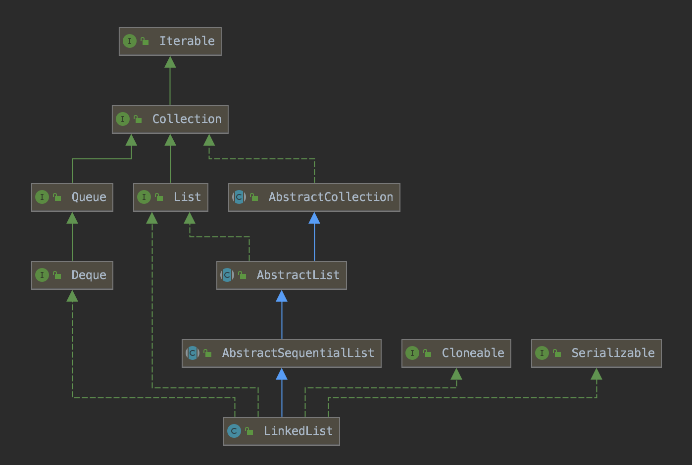
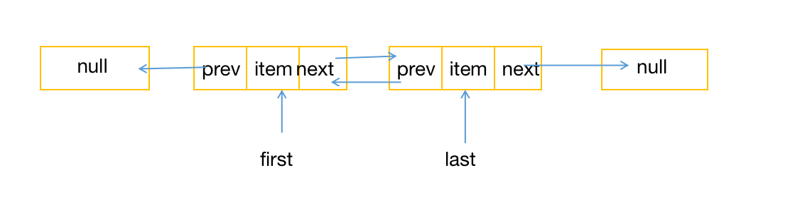
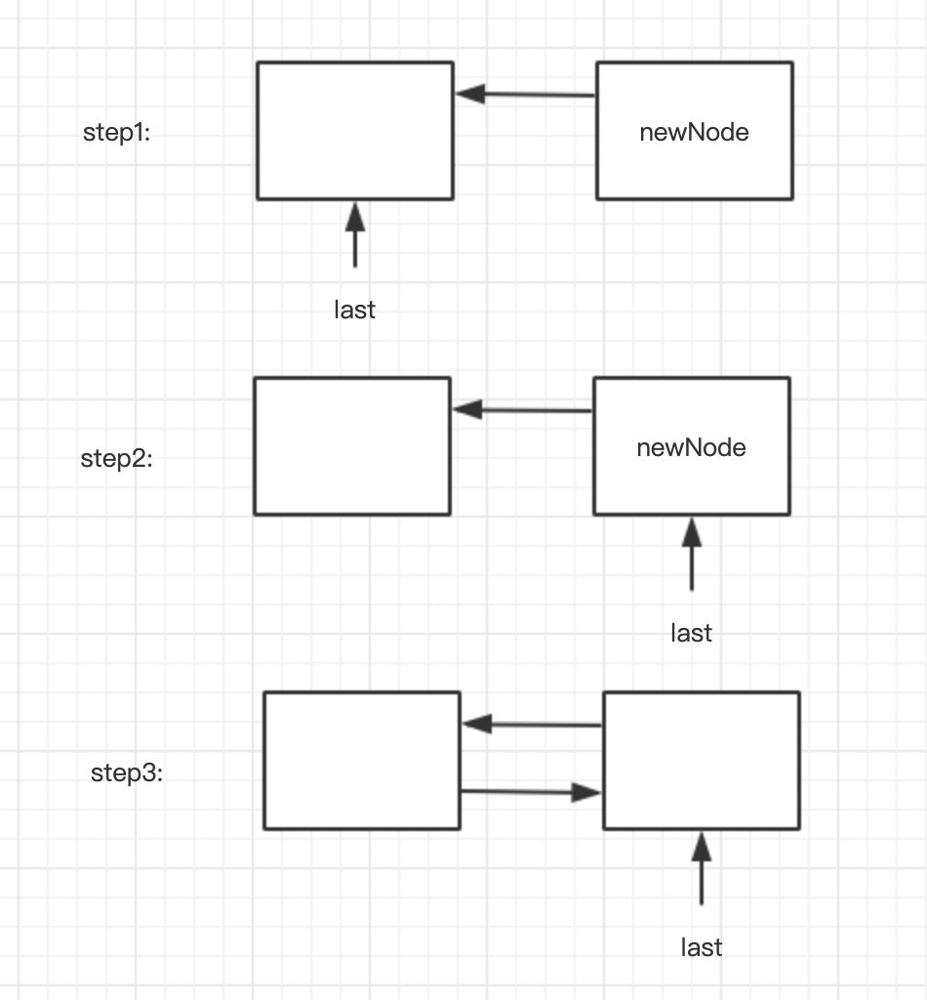

## Java集合系列——LinkedList

ArrayList随机访问效率很高，但是插入和删除的性能比较低，所以不适用插入和删除使用较频繁的场景。而LinkedList底层是双向链表，所以插入和删除的性能更好。本文主要基于JDK8分析LinkedList的源码。

### 1、LinkedList类图结构

首先看一下LinkedList的类图：



从UML图中可以看出，LinkedList除了实现List接口，还实现了Deque和Quene接口。

1）LinkedList实现List接口：说明LinkedList具有与ArrayList相同的功能；

2）LinkedList实现队列接口Quene，队列的特点是先进先出，在尾部添加元素，在头部删除元素，主要方法：

```java
// 在尾部添加元素
boolean add(E e)   // 队列为满时抛出异常
boolean offer(E e)
// 删除头部元素
E remove()         // 队列为空时抛出异常
E poll()
// 查看头部元素
E element()        // 队列为空时抛出异常
E peek()
```

每种操作都有两种方法，其区别在于对待队列为空或者队列满情况下处理不同。当队列为空时，element和remove会抛出NoSuchElementException，peek和poll会返回null；当队列满时，add抛出IllegalStateException，而offer只是返回false。

3）LinkedList实现双端队列接口Deque：说明LinkedList具有栈的功能，主要有方法有：

```java
// 压栈，在头部添加元素
void push(E e)
// 出栈， 在头部删除元素
E pop()
// 查看头部元素
E peek()
```

栈和队列都是双端队列的特殊情况，它们的方法都可以使用双端队列Deque的方法替代

### 2、LinkedList基本原理

#### 2.1 内部组成

LinkedList的底层是双向链表，每个元素在内存都是单独存放的，元素之间通过链连接在一起，其定义如下：

```java
private static class Node<E> {
    E item;
    Node<E> next;
    Node<E> prev;

    Node(Node<E> prev, E element, Node<E> next) {
        this.item = element;
        this.next = next;
        this.prev = prev;
    }
}
```

其结构示意图如下：



Node类表示节点，item指向实际的元素，next指向下一个节点，prev指向前一个节点。

#### 2.2 LinkedList成员变量与初始化

LinkedList具有3个成员变量：

```java
transient int size = 0
transient Node<E> first
transient Node<E> last
```

size表示链表长度，默认为0；first指向头节点，last指向尾节点，初始值都为null。

LinkedList初始化有两种方式：空参构造器和传入Collection的构造器。

```java
public LinkedList()
public boolean addAll(int index, Collection<? extends E> c)
```


#### 2.3 LinkedList常用方法原理

##### 2.3.1 添加元素

1）add方法

```java
    public boolean add(E e) {
        linkLast(e);
        return true;
    }

	  // 插入到最后一个元素
    void linkLast(E e) {
        final Node<E> l = last;
        final Node<E> newNode = new Node<>(l, e, null);
        last = newNode;
        if (l == null)
            first = newNode;
        else
            l.next = newNode;
        size++;
        modCount++;
    }
```

添加元素到步骤：

- 创建一个新的节点newNode，并指向原来的尾节点;
- 将尾节点指向最新的节点newNode;
- 修改前节点的后向节点，如果原来链表为空，则让头节点指向新节点，否则让前一个节点的next指向新节点；
- 最后增加链表大小与modCount，modCount的目的与ArrayList相同。

添加元素示意图如下：



add方法是在尾部添加元素，如果在头部或者中间插入元素，可以使用方法：

```java
public void add(int index, E element)
```

其添加元素过程与add方法类似，这里就不介绍。

##### 2.3.2 删除元素

删除元素有多种方法：

```java
// 删除指定位置的元素
public E remove(int index)
// 删除指定元素
public boolean remove(Object o)
// 删除第一个位置的元素
public E removeFirst()
// 删除最后一个元素位置
public E removeLast()
```

删除节点最关键的方法是unlink，这个方法源码为：

```java
E unlink(Node<E> x) {
    final E element = x.item;
    final Node<E> next = x.next;
    final Node<E> prev = x.prev;

    if (prev == null) {
        first = next;
    } else {
        prev.next = next;
        x.prev = null;
    }

    if (next == null) {
        last = prev;
    } else {
        next.prev = prev;
        x.next = null;
    }

    x.item = null;
    size--;
    modCount++;
    return element;
}
```

基本思路是让x的前驱和后继直接链接起来，具体步骤：

- 让x前驱节点的next指向x的后继节点，如果x的前驱节点为null，说明删除的是first节点，则让first指向x的后继节点；
- 让x后继节点的prev指向x的前驱节点，如果x没有后继节点，说明删除的是last节点，则让last指向x的前驱节点。

##### 2.3.3 查询元素

查询元素分两种：根据索引查询元素和根据内容查询元素位置。

根据索引查询元素的方法为：

```java
    public E get(int index) {
        checkElementIndex(index);
        return node(index).item;
    }

    Node<E> node(int index) {
        if (index < (size >> 1)) {
            Node<E> x = first;
            for (int i = 0; i < index; i++)
                x = x.next;
            return x;
        } else {
            Node<E> x = last;
            for (int i = size - 1; i > index; i--)
                x = x.prev;
            return x;
        }
    }
```

size>>1等于size/2，所以如果索引位置在前半部分，则从头节点开始查找，否则则从尾节点开始查询。这里与ArrayList不相同，ArrayList数组元素连续存放，可以根据索引直接定位，而LinkedList必须从头或者尾部顺着链接查找，效率比较低。

根据内容查询元素位置的方法为：

```java
public int indexOf(Object o) {
    int index = 0;
    if (o == null) {
        for (Node<E> x = first; x != null; x = x.next) {
            if (x.item == null)
                return index;
            index++;
        }
    } else {
        for (Node<E> x = first; x != null; x = x.next) {
            if (o.equals(x.item))
                return index;
            index++;
        }
    }
    return -1;
}
```

该方法很简单，就是从first节点往后找，如果要找的是null，则着第一个item为null的节点，否则使用equals方法进行比较。

##### 

### 3、小结

- 实现原理上：内部是一个双向链表，并维护了长度、头节点和尾节点；
- 功能上：能够实现列表、队列、栈的功能；
- 效率上：
  - 按需分配空间，不需要预先分配很多空间；
  - 不可以随机访问，按照索引位置访问效率低，必须从头或者尾顺着链接找，时间复杂度为O(n/2);
  - 不管列表是否已排序，只要按照内容查找元素，效率都比较低，时间复杂度为O(n);
  - 在两端添加或删除元素效率很高，时间复杂度为O(1)；
  - 在中间插入和删除元素，要先定位，效率比较低，但是修改本身效率很高

