## 红黑树的实现——基于JDK1.8 HashMap

### 1、 红黑树定义

红黑树是一棵二叉搜索树，它在每个结点上增加了一个存储位来表示结点的颜色，可以是RED或者是BLACK。通过对任何一条从根到叶子的简单路径上各个结点颜色的约束，红黑树确保没有一条路径会比其他路径长2倍，因此是近似于平衡的。

树中每个结点包含5个属性：color、key、left、right、parent。如果一个节点没有子节点或父节点，则该节点相应指针属性设置为NIL（NULL）。红黑树的性质有：

- 每个节点要么是红色，要么是黑色；
- 根节点是黑色的；
- 每个叶节点（NIL）是黑色的；
- 对每个结点，从该节点到其所有后代叶结点到简单路径上，均包含相同数目的黑色结点；

基于红黑树的定义，可以定义红黑树的成员变量：

```java
    static final class TreeNode<K,V> extends LinkedHashMap.Entry<K,V> {
        TreeNode<K,V> parent;  // 父节点
        TreeNode<K,V> left; //左孩子
        TreeNode<K,V> right; //右孩子
        TreeNode<K,V> prev;    // needed to unlink next upon deletion
        boolean red; //是红节点
    }
```

从定义中可以看出，定义的红黑树的链表结构为双向链表。

### 2、左旋与右旋

为了维护红黑树的性质，需要对树的结构和颜色进行改变。改变树的结构的常见操作为：左旋和右旋，这也是平衡二叉树的常见操作。当某个节点x做左旋时，假设它的右孩子为y（不为NIL），左旋以x到y的链为“支轴”进行，x成为y的左子树，y原来的左子树成为x的右子树。具体左旋和右旋的示意图如下：


下面看一下HashMap中如何实现红黑树的左旋和右旋。

#### 2.1 左旋

左旋的源代码如下：

```java
static <K,V> TreeNode<K,V> rotateLeft(TreeNode<K,V> root,
                                      TreeNode<K,V> p) {
    /**
     * pp：p的父节点
     * r：p的右结点
     * rl：r的左结点
     */
    TreeNode<K,V> r, pp, rl;
    if (p != null && (r = p.right) != null) {    
        // 场景1
        if ((rl = p.right = r.left) != null)    
            rl.parent = p;
        // 场景2
        if ((pp = r.parent = p.parent) == null)  
            (root = r).red = false;
        else if (pp.left == p)                   
            pp.left = r;
        else
            pp.right = r;                        
        r.left = p;
        p.parent = r;
    }
    return root;
}
```

左旋子树的初始结构为，其中假设图中结点都不为NIL：

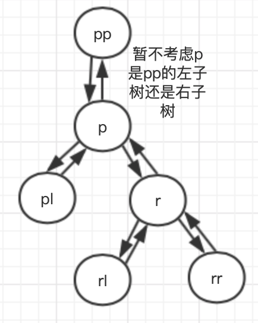

1）第1个条件时判断p和r是不是为NIL，如果为空则不需要旋转；否则可以进行旋转。

2）如果进行旋转，首先将p的右孩子指向rl；再判断rl是否为NIL，因为空节点没有父亲结点，如果不为NIL，则将rl的父节点设置为p。

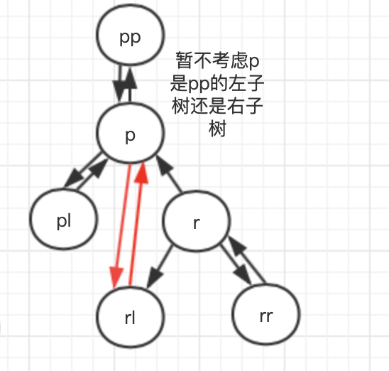


3）将r的父节点指向p的父节点pp，然后针对pp进行判断：

​	pp如果为空，则p为根节点，就必须将p的颜色设置为黑色；

​	pp如果不为空，并且p是pp的左孩子，则将pp的左孩子设置为r；

​	pp如果不为空，并且p是pp的右孩子，则将pp的右孩子设置为r；

最后将r的左孩子设置为p，p的父节点设置为r。以p为pp的左孩子为例，具体示意图如下：

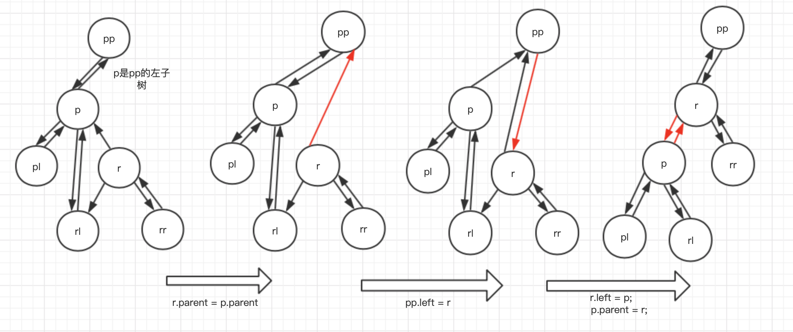

整体步骤总结来说，先将r的左子树关联到p，再建立pp与r的关系，最后建立p和r的关系。

#### 2.2 右旋

右旋的源码如下：

```java
static <K,V> TreeNode<K,V> rotateRight(TreeNode<K,V> root,
                                       TreeNode<K,V> p) {
    /**
     * pp：p的父节点
     * l：p的左结点
     * lr：l的右结点
     */
    TreeNode<K,V> l, pp, lr;
    if (p != null && (l = p.left) != null) {
        if ((lr = p.left = l.right) != null)
            lr.parent = p;
        if ((pp = l.parent = p.parent) == null)
            (root = l).red = false;
        else if (pp.right == p)
            pp.right = l;
        else
            pp.left = l;
        l.right = p;
        p.parent = l;
    }
    return root;
}
```

右旋的步骤与左旋很相似，大体旋转步骤如下：

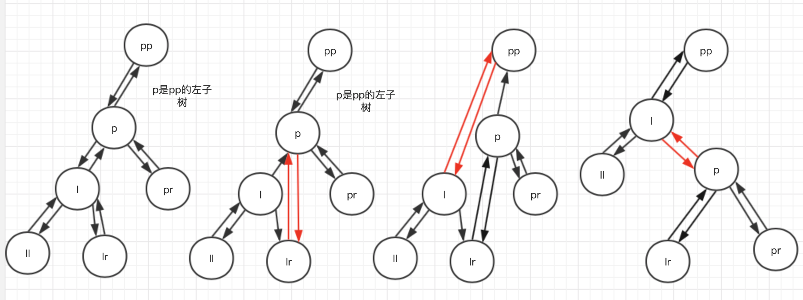

### 3、红黑树的插入

红黑树的节点插入的时间复杂度为O(lgn)。插入的主要步骤为：首先遍历树找到插入的位置，然后将其着色为红色，最后为了保持红黑树的性质，需要调用辅助函数对树进行着色和旋转。

在阅读源码前，先通过构造一个值为1～8的红黑树，构造步骤如下：

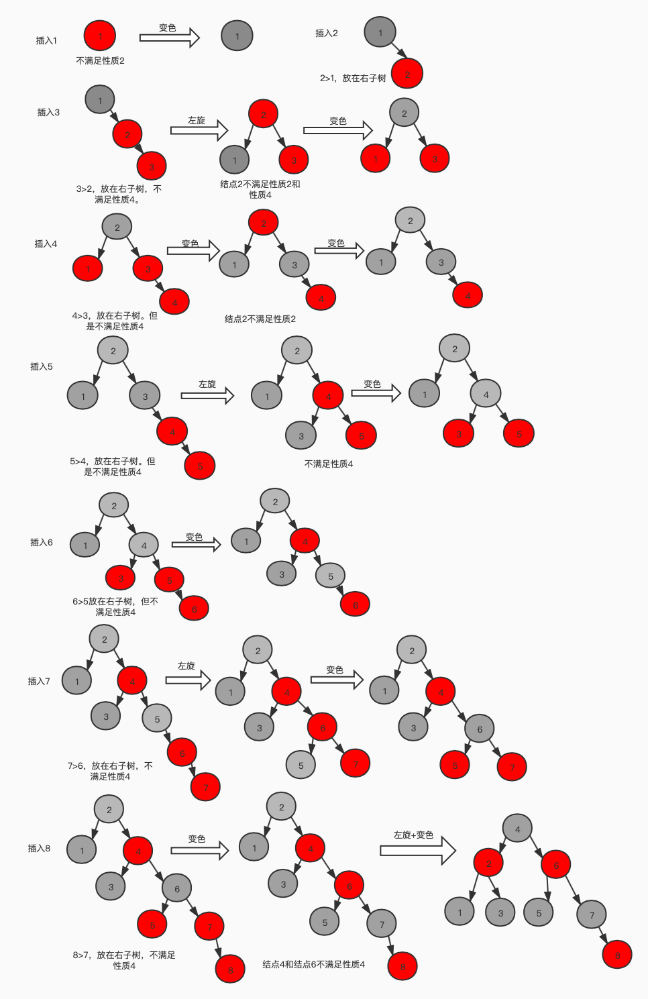


HashMap中插入的源码如下：

```java
        final TreeNode<K,V> putTreeVal(HashMap<K,V> map, Node<K,V>[] tab,
                                       int h, K k, V v) {
            Class<?> kc = null;
            boolean searched = false;    //记录是否查询到结点
            // 判断父亲结点是否为null，如果parent不为null，则调用root()方法查找root结点，否则当前结点设置为root
            TreeNode<K,V> root = (parent != null) ? root() : this;
            // 遍历红黑树
            for (TreeNode<K,V> p = root;;) {
                /**
                 * dir：记录选择左子树还是右子树
                 * ph：p结点的hash值
                 * pk：p结点的key值
                 */
                int dir, ph; K pk;
                // x结点的hash值小于当前树结点p的hash值：dir=-1，则放在左子树；
                if ((ph = p.hash) > h)
                    dir = -1;
                // x结点的hash值大于当前树结点p的hash值：dir=1，则放在右子树
                else if (ph < h)
                    dir = 1;
                // x结点的hash值相等，pk等于插入结点的key或者key不为null且k等于pk，则相当于插入的结点已经存在红黑树中，直接返回当前结点
                else if ((pk = p.key) == k || (k != null && k.equals(pk)))
                    return p;
                // HashMap相关，略去
                else if ((kc == null &&
                          (kc = comparableClassFor(k)) == null) ||
                         (dir = compareComparables(kc, k, pk)) == 0) {
                    if (!searched) {
                        TreeNode<K,V> q, ch;
                        searched = true;
                        if (((ch = p.left) != null &&
                             (q = ch.find(h, k, kc)) != null) ||
                            ((ch = p.right) != null &&
                             (q = ch.find(h, k, kc)) != null))
                            return q;
                    }
                    dir = tieBreakOrder(k, pk);
                }


                TreeNode<K,V> xp = p;
                /**
                 * 当dir<=0并且p=p.left，当dir>0时，p=p.right
                 * 当p==null时，则插入，当p!=null,继续查找结点
                 */
                if ((p = (dir <= 0) ? p.left : p.right) == null) {
                    Node<K,V> xpn = xp.next;
                    // 生成新的TreeNode
                    TreeNode<K,V> x = map.newTreeNode(h, k, v, xpn);
                    // 新增结点，设置相关属性
                    if (dir <= 0)
                        xp.left = x;
                    else
                        xp.right = x;
                    xp.next = x;
                    x.parent = x.prev = xp;

                    if (xpn != null)
                        ((TreeNode<K,V>)xpn).prev = x;
                    // 先调用辅助函数balanceInsertion维护红黑树的性质，moveRootToFront是维护HashMap桶的性质，暂不考虑
                    moveRootToFront(tab, balanceInsertion(root, x));
                    return null;
                }
            }
        }
```

从源码中可以看出insert函数的主要流程为：

- 首先获取根节点。如果当前结点的parent不为空，则调用root()函数获取根节点，否则将当前对象设置为根节点；
- 遍历红黑树，分别将插入结点的值与遍历的当前结点的值进行比较，如果小于当前结点的值，则遍历左子树，否则遍历右子树。当前结点的左子树或右子树为空时则插入该结点；
- 插入结点后调用balanceInsertion()函数维护红黑树的性质。

balanceInsertion()函数的源码为：

```java
static <K,V> TreeNode<K,V> balanceInsertion(TreeNode<K,V> root,
                                            TreeNode<K,V> x) {
    x.red = true;
    /**
     * xp为x的父节点
     * xpp为x的祖父结点
     * xppl为祖父结点的左结点，即为x的叔叔结点
     * xppr为祖父结点的右结点，即为x的叔叔结点
     */
    for (TreeNode<K,V> xp, xpp, xppl, xppr;;) {
        // 新结点X的的父节点为null，则将颜色变为黑色即可；
        if ((xp = x.parent) == null) {
            x.red = false;
            return x;
        }
        // x结点的父节点是黑色或者祖父结点为空，直接返回
        else if (!xp.red || (xpp = xp.parent) == null)
            return root;
        // X父结点为祖父结点的左子树
        if (xp == (xppl = xpp.left)) {
            // X的叔叔结点为红色，叔叔结点和父亲结点设置为黑色，x的祖父结点设置为红色。并将x设置为xpp进行迭代遍历
            if ((xppr = xpp.right) != null && xppr.red) {
                xppr.red = false;
                xp.red = false;
                xpp.red = true;
                x = xpp;
            }
            // x的叔叔结点为空或者叔叔结点为黑色，需要进行旋转和变色
           else {
                // x是父节点的右子树
                if (x == xp.right) {
                    // 将xp、x子树左旋
                    root = rotateLeft(root, x = xp);
                    // 如果x的父亲结点是null，则x的祖父结点也为null
                    xpp = (xp = x.parent) == null ? null : xp.parent;
                }
                // 变色+右旋
                if (xp != null) {
                    // x的父亲结点设置为黑色，
                    xp.red = false;
                    if (xpp != null) {
                        xpp.red = true;
                        //将xpp子树右旋
                        root = rotateRight(root, xpp);
                    }
                }
            }
        }
        // X父节点为祖父结点的右子树
        else {
            // 叔叔结点不为空并且为红色，只进行变色
            if (xppl != null && xppl.red) {
                xppl.red = false;
                xp.red = false;
                xpp.red = true;
                x = xpp;
            }
            else {
                // x是xp的左子树，则要先进行右旋
                if (x == xp.left) {
                    root = rotateRight(root, x = xp);
                    xpp = (xp = x.parent) == null ? null : xp.parent;
                }
                // 进行左旋变色
                if (xp != null) {
                    xp.red = false;
                    if (xpp != null) {
                        xpp.red = true;
                        root = rotateLeft(root, xpp);
                    }
                }
            }
        }
    }
}
```

源码中分为几种场景：

1）场景1:x父节点空，只需要变色：红变黑

2）场景2:x的父节点是黑色或x的祖父结点是NULL

3）场景3:**X父结点为祖父结点的左子树**

- 场景3.1:叔叔结点是红色：父节点和叔叔结点变黑色，祖父结点变红色；
- 场景3.2:叔叔结点是黑色或者为空，并且x为右子树：左旋将其转换为场景3.3
- 场景3.3:叔叔结点是黑色或者为空，并且x为左子树：先右旋，再将x的父亲结点变为黑色，x的祖父结点变为红色，

4）场景4:**X父结点为祖父结点的右子树**

场景4.1:叔叔结点是红色：父节点和叔叔结点变黑色，祖父结点变红色；

场景4.2:叔叔结点是黑色或者为空，并且x为左子树：右旋将其转换为场景4.3；

场景4.3:叔叔结点是黑色或者为空，并且x为右子树：先左旋，再将x的父亲结点变为黑色，祖父结点变为红色。

具体示意图如下：

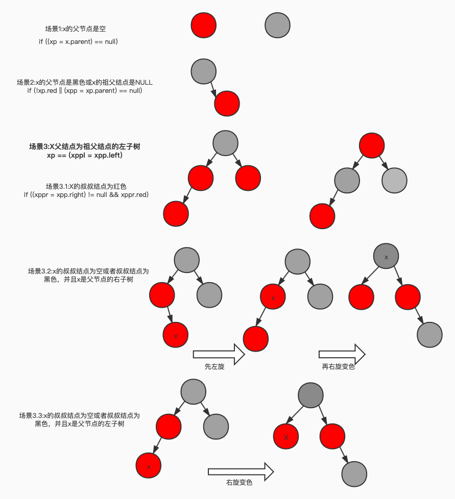

场景4与场景3类似，所以在示意图中未展示出来。因为一棵有n个结点的红黑树的高度为O(lgn)，因此结点遍历的要花费O(lgn)时间。当x的叔叔结点是红色时将x的祖父结点变为红色，所以会触发循环，循环的次数为O(lgn)。而旋转操作最多执行2次并且不会出发循环，所以插入的时间复杂度为O(lgn)。

### 4、红黑树的删除

与n个结点的红黑树的插入操作一样，删除一个结点的时间复杂度为O(lgn)时间。但是与插入操作相比，删除操作要稍微复杂一些。

先看一下删除主流程的源码（忽略HashMap相关的操作）：


```java
// 删除结点
final void removeTreeNode(HashMap<K,V> map, Node<K,V>[] tab,
                          boolean movable) {
  .......(省略HashMap相关操作)
    /**
     * p:当前结点
     * pl：p的左结点
     * pr：p的右结点
     * replacement：替换结点
     */
    TreeNode<K,V> p = this, pl = left, pr = right, replacement;
    // 场景1：p1和pr都不为空
    if (pl != null && pr != null) {
        // s为pr，sl：为s的左结点
        TreeNode<K,V> s = pr, sl;
        // 寻找p右子树的最小值s，并交换s与p的颜色
        while ((sl = s.left) != null) // find successor
            s = sl;
        boolean c = s.red; s.red = p.red; p.red = c; // swap colors
        /**
         * sr：s的右孩子
         * pp：p的父亲结点
         */
        TreeNode<K,V> sr = s.right;
        TreeNode<K,V> pp = p.parent;
        // 如果s==pr，说明p是s的父节点，直接交换s与p的位置，转换为场景3
        if (s == pr) { // p was s's direct parent
            p.parent = s;
            s.right = p;
        }
        // 如果s！=pr，经过一系列链表操作交换s与p的关系，并转换为场景2或场景3
        else {
            // 将p的父亲结点指向s的父亲结点
            TreeNode<K,V> sp = s.parent;
            // 建立sp与p的关联关系，将p子树插入到sp作为子结点
            if ((p.parent = sp) != null) {
                // 如果s是sp的左子树，则将sp的左子树指向p；否则将sp的右子树指向p。即替换sp与p的位置
                if (s == sp.left)
                    sp.left = p;
                else
                    sp.right = p;
            }
            // 建立s与pr的父子关系
            if ((s.right = pr) != null)
                pr.parent = s;
        }
        p.left = null;
        // 建立pr与sr的负责关系
        if ((p.right = sr) != null)
            sr.parent = p;
        // 建立s与pl的父子关系
        if ((s.left = pl) != null)
            pl.parent = s;
        // 建立pp与s的父子关系
        if ((s.parent = pp) == null)
            root = s;
        else if (p == pp.left)
            pp.left = s;
        else
            pp.right = s;
        // 如果sr不为null,将sr作为替换点，则与场景3相同
        if (sr != null)
            replacement = sr;
        // f如果sr为null，则将p作为替换点，则与场景4相同
        else
            replacement = p;
    }
    // 场景2：p1不为空，pr为空
    else if (pl != null)
        replacement = pl;
    // 场景3：pr不为空，pl为空
    else if (pr != null)
        replacement = pr;
    // 场景4：pr和pl都为空
    else
        replacement = p;

    // 将替换结点repalcement替换删除结点p
    if (replacement != p) {
        TreeNode<K,V> pp = replacement.parent = p.parent;
        // 如果pp为null，所以p为根节点，所以将replacement设置为根节点
        if (pp == null)
            root = replacement;
        // 如果p是pp的左结点，则将pp的左结点设置为replacement
        else if (p == pp.left)
            pp.left = replacement;
        // 如果p是pp的右结点，则将pp的右结点设置为replacement
        else
            pp.right = replacement;
        // 释放删除结点
        p.left = p.right = p.parent = null;
    }
    // 如果p是红色则直接返回，否则调用辅助函数balanceDeletion()维护红黑树的性质
    TreeNode<K,V> r = p.red ? root : balanceDeletion(root, replacement);

    // 处理删除结点是叶子结点
    if (replacement == p) {  // detach
        TreeNode<K,V> pp = p.parent;
        p.parent = null;
        if (pp != null) {
            if (p == pp.left)
                pp.left = null;
            else if (p == pp.right)
                pp.right = null;
        }
    }
    if (movable)
        moveRootToFront(tab, r);
}
```

从源码总结来说，删除主要分为4个场景：

1）删除结点p的左孩子和右孩子都不为空（也是最复杂的）：

- 首先遍历红黑树找到p右孩子子树的最小值，记作s，并交换s与p的颜色；
- 如果s是p的直接子孩子，则交换s与p的位置，并转换为场景2～4；
- 如果s不是p的直接子孩子，则需要经过一系列链表操作交换s与p的位置，并转化为场景2～4。

2）删除结点p的左孩子不为空，右孩子为空：左孩子替换p；

3）删除结点p的右孩子不为空，左孩子为空：右孩子替换p；

4）删除结点p的左右孩子都为空：将p设置为null。

具体示意图如下：

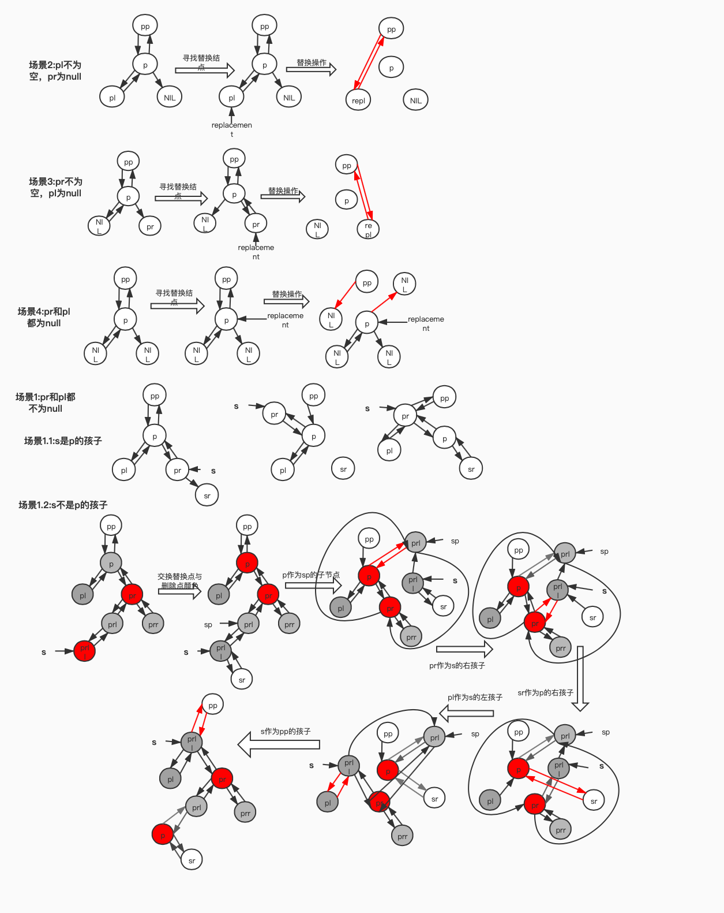

如果结点p是黑色，就有可能引入一个或多个红黑树性质被破坏的情况，所以调用balanceDeletion()函数恢复红黑性质。如果结点p是红色，当p被移动或删除时，红黑树性质不变。因为：1）树中的黑高没有变化；2）不存在两个相邻的红结点；3）如果p是红色，就不可能是根节点，所以根节点仍然是黑色。

```java
TreeNode<K,V> r = p.red ? root : balanceDeletion(root, replacement);
```

通过插入源码的分析，可以看删除情形可以转换为场景2～4。因为p是红色不影响红黑树性质，所以下面分析p为黑色的情况。

- 情形1:删除结点p是根节点，且无孩子节点：无需操作

```java
// 情形1：如果x为null或x==root说明删除结点p为根节点且无孩子结点
if (x == null || x == root)
    return root;
```

- 情形2:p为根节点，并且只有一个子结点：将x变为黑色即可

```java
if ((xp = x.parent) == null) {
    // 变为黑色
    x.red = false;
    return x;
}
```

- 情形3:如果xp不为null,并且x为红色：将x变为黑色即可

```java
if (x.red) {
    x.red = false;
    return root;
}
```

情形1～情形3的具体示意图为：

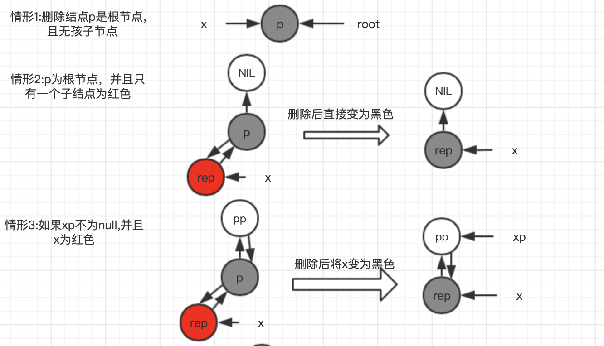

- 情形4:如果xp不为null，x为黑色，其中x为xp的左子树或者右子树是对称的。以x为xp的左子树为例：

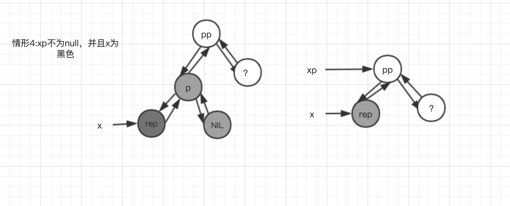

删除结点p后如右边的图，这时bh(x) = bh(xpr)-1，即xp的左子树的黑高比右子树的黑高少1。x的兄弟结点被标记为?，因为针对兄弟结点不同情况处理也不一样。

1）如果x的兄弟结点是红色，操作为：

- 变色：将xpr的颜色设置为黑色，xp的颜色设置为红色；
- 旋转：围绕xp作左旋

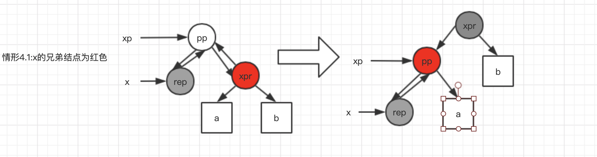

经过操作后，对于xpr子树来说，即可满足红黑树的性质。

2）如果x的兄弟结点是黑色，而且兄弟结点的两个字结点都是黑色，操作为：

- 变色：将x的兄弟结点变为红色
- 上移：将x上移：x=xp

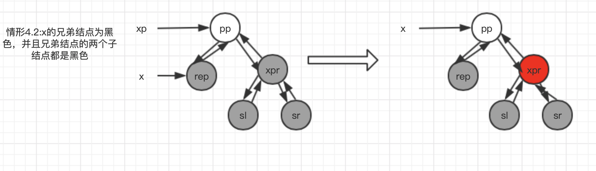

3）如果x的兄弟结点是黑色，而且兄弟结点的左孩子是红色，右孩子是黑色，操作为：

- 变色：将左孩子变为黑色，x的兄弟结点变为红色；
- 旋转：以x的兄弟结点xpr为轴右旋
- 转换为情形4.4

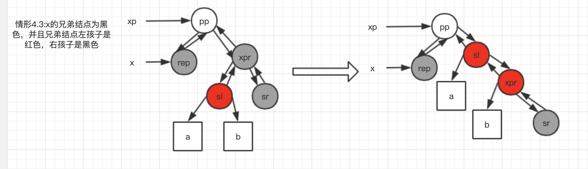


4）如果x的兄弟结点是黑色，而且兄弟结点的左孩子是黑色，右孩子是红色，操作为：

- 变色：如果xpr不等于null，xp为null时，则xpr的颜色为黑色，否则与xp的颜色相同；sr不为null时，sr的颜色设置为黑色；xp的颜色设置为黑色；
- 旋转：以xp为轴左旋
- 上移：将x指向根节点，终止循环

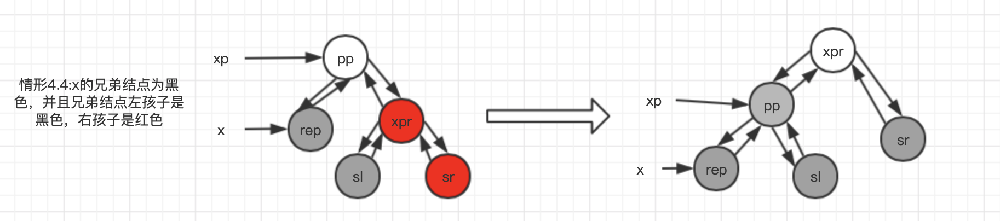

到这里就分析完红黑树删除时维护红黑树性质的情形。Hashmap关于情形4的源码为：

```java
if ((xpl = xp.left) == x) {
    // xpr：x的兄弟结点是红色
    if ((xpr = xp.right) != null && xpr.red) {
        xpr.red = false;
        xp.red = true;
        root = rotateLeft(root, xp);
        xpr = (xp = x.parent) == null ? null : xp.right;
    }

    if (xpr == null)
        x = xp;
    else {
        // 兄弟结点的两个子结点
        TreeNode<K,V> sl = xpr.left, sr = xpr.right;
        if ((sr == null || !sr.red) &&
            (sl == null || !sl.red)) {
            xpr.red = true;
            x = xp;
        }
        else {
            // 右孩子是黑色，左孩子是红色
            if (sr == null || !sr.red) {
                if (sl != null)
                    sl.red = false;
                xpr.red = true;
                root = rotateRight(root, xpr);
                xpr = (xp = x.parent) == null ?
                    null : xp.right;
            }
            // 右孩子为红色，左孩子为黑色
            if (xpr != null) {
                xpr.red = (xp == null) ? false : xp.red;
                if ((sr = xpr.right) != null)
                    sr.red = false;
            }
            if (xp != null) {
                xp.red = false;
                root = rotateLeft(root, xp);
            }
            x = root;
        }
    }
}
```


### 5、小结

总结下来，红黑树的插入和删除需要注意的：

- 熟记左旋和右旋，重点找准旋转轴；
- 插入时连续两个红色结点时，并且叔叔结点为空或者为黑色时才考虑旋转+变色；
- 删除时有4种场景，不过在最复杂的场景1，经过交换位置可以转换为场景2～场景4，所以在balanceDeletion()函数中只要针对后面3中场景分析即可。

