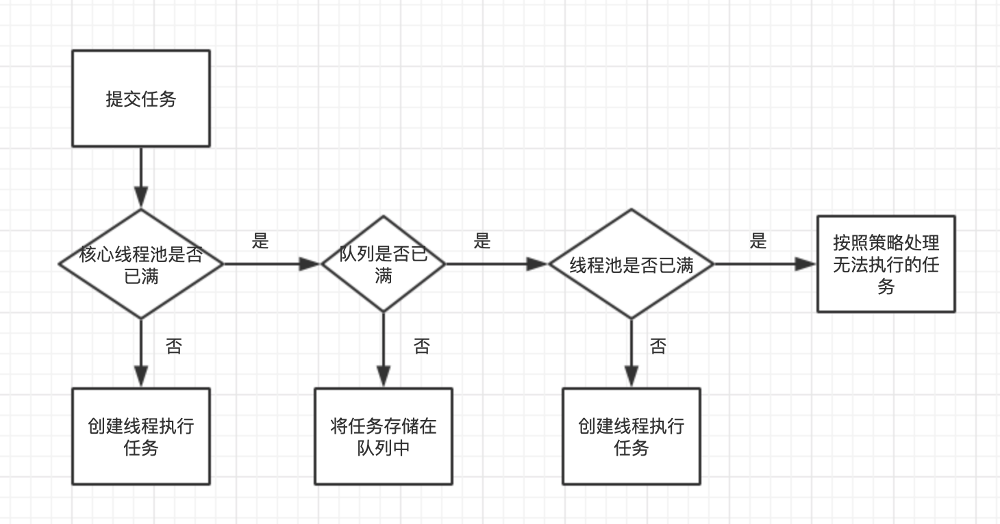

## Java多线程篇——线程池

了解线程池前，首先需要知道为什么需要线程池？因为对于服务端程序，经常面对客户端传入的短小任务，需要服务端快速处理。如果服务端每接收一次请求都创建一个线程，那么会创建非常多的线程，这会导致操作系统频繁的进行上下文切换，并且线程的创建和销毁都需要消耗系统资源。

线程池技术预先创建若干线程缓存起来，并且不能由用户直接对线程的创建进行控制，在这个前提下重复使用固定或较为固定的线程来完成任务的执行。这样可以避免频繁创建和销毁线程，并且面对过量的任务提交能够平缓的劣化。

1、线程池的实现原理

线程池的主要处理流程如下：



当一个新任务提交到线程池时，线程池的处理流程：

- 判断核心线程池里的线程是否都在执行任务。如果不是，则创建一个新的工作线程来执行任务。如果是核心线程池里的线程都在执行任务，则进入下个流程；
- 判断工作队列是否已满。如果工作队列没有满，则将提交的任务存储在这个工作队列里。如果工作队列满了，则进入下个流程。
- 判断线程池是否都处于工作状态。如果没有，则创建一个新的工作线程来执行任务。如果已经满了则交给饱和策略来处理这个任务。

源代码如下：

```java
public void execute(Runnable command) {
    if (command == null)
        throw new NullPointerException();
    int c = ctl.get();
  // 1、如果正在运行的线程少于corePoolSize，尝试以给定的command作为其第一个任务来启动新线程。对addWorker的调用以原子方式检查runState和workerCount，因此可以通过返回false来防止错误警报，从而在不应该添加线程时添加线程。
    if (workerCountOf(c) < corePoolSize) {
        if (addWorker(command, true))
            return;
        c = ctl.get();
    }
  // 2、如果一个任务可以成功地排队，那么我们仍然需要仔细检查是否应该添加一个线程（因为自从上次检查以来已有的线程已经死了），或者在进入这个方法之后线程池是否关闭了。因此，我们重新检查状态，如果有必要，在停止排队时回滚排队，如果没有，则启动一个新线程。
    if (isRunning(c) && workQueue.offer(command)) {
        int recheck = ctl.get();
        if (! isRunning(recheck) && remove(command))
            reject(command);
        else if (workerCountOf(recheck) == 0)
            addWorker(null, false);
    }
  // 3、如果不能放入队列，先尝试创建新的线程，如果创建失败则拒绝任务
    else if (!addWorker(command, false))
        reject(command);
}
```


线程池创建线程时，会将线程封装成工作线程Worker，Worker在执行完任务后，还会循环获取工作队列里的任务来执行。

2、线程池的使用


