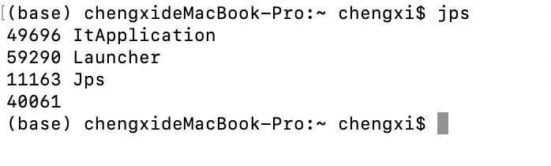
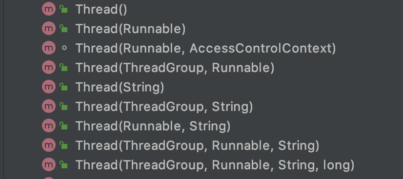
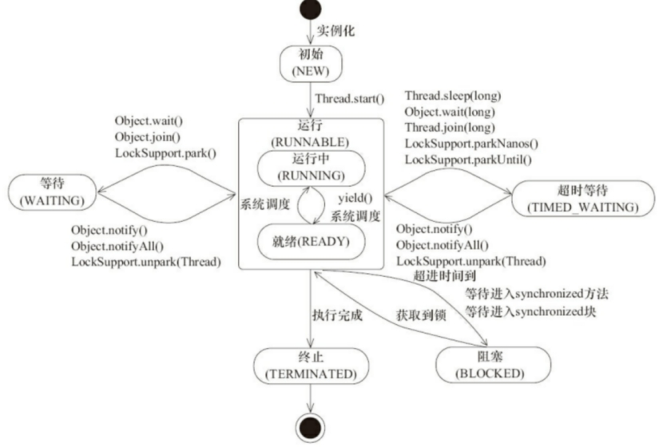
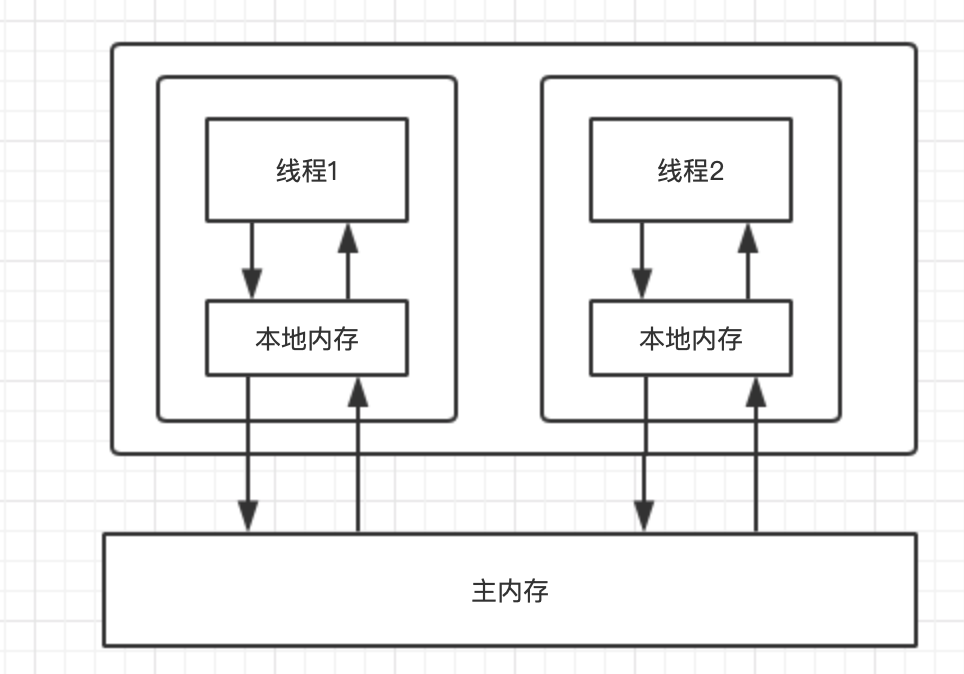
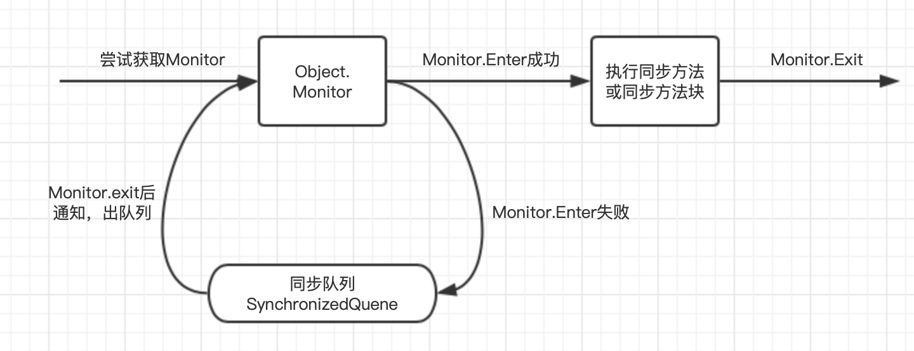
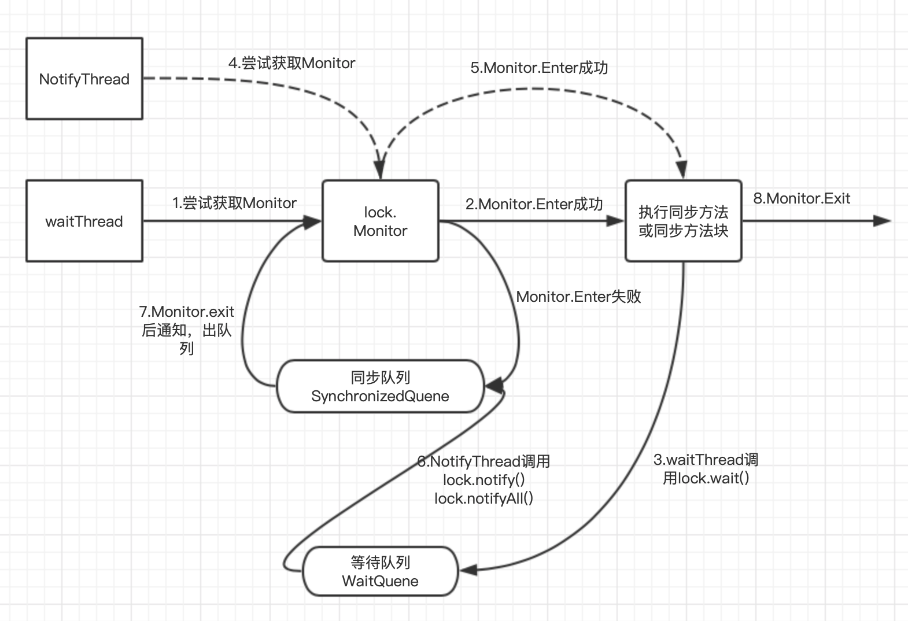

## java多线程篇——线程基础


### 1、进程与线程

在操作系统中运行一个程序时，操作系统会为其创建一个进程。例如启动Java程序时，操作系统就会创建一个Java进程。查看系统中的Java进程可以使用命令`jps`



操作系统调度的最小单元是线程。在一个进程中可以创建多个线程，每个线程拥有各自的程序计数器、虚拟机栈和本地方法栈，并且能够访问共享的内存变量。实际上Java程序本身就是多线程的，main()方法只是一个名称为main的线程。

```java

    public static void main(String[] args) {
        // 获取Java线程管理MXBean
        ThreadMXBean threadMXBean = ManagementFactory.getThreadMXBean();
        // 返回所有存活的线程
        ThreadInfo[] threadInfos = threadMXBean.dumpAllThreads(false, false);
        for (ThreadInfo threadInfo : threadInfos) {
            /**
             * 输出：
             *  Monitor Ctrl-Break
             *  Signal Dispatcher
             *  Finalizer
             *  Reference Handler
             *  main
             */
            System.out.println(threadInfo.getThreadName());
        }
    }
}
```


**为什么程序计数器、虚拟机栈和本地方法栈是线程私有的呢？**

1）程序计数器的作用是：字节码解释器通过改变程序计数器来读取指令，从而实现代码的流程控制；在多线程环境下，线程切换时程序计数器会记录线程的运行位置，以便线程切换回来能够知道从哪里执行。所以程序计数器私有的原因是为了线程切换回来后能够从切换前的位置执行；

2）虚拟机栈的作用：每个Java方法执行时都会在虚拟机栈中生成一个栈帧，栈帧由局部变量表、动态链接、操作数和方法返回信息等。所以虚拟机栈私有的原因是为了保证线程的局部变量表等信息不被其他线程访问；

3）本地方法栈：主要用于访问native方法，功能与虚拟机栈相似。所以线程私有的原因也一样。


### 2、线程的生命周期

#### 2.1 线程创建

创建线程的方法主要有3种：

1）继承Thread类，重写`run()`方法

```java
public class MyThread01 extends Thread {

    private int sum = 0;

    @Override
    public void run() {
        for (int i = 0; i < 100; i++) {
            sum += i;
        }
        System.out.println(sum);
    }
}
```

2）实现Runnable接口，实现`run()`方法

```java
public class MyThread02 implements Runnable {

    private int sum = 0;

    @Override
    public void run() {
        for (int i = 0; i < 100; i++) {
            sum += i;
        }
        System.out.println(sum);
    }

    public static void main(String[] args) {
        Thread thread = new Thread(new MyThread02());
        thread.start();
    }
}
```

3）通过Callable和Future创建，重写`call()`方法。这种方式的优点是可以获取线程中的返回值。

```java
public class MyThread03 implements Callable {

    @Override
    public Object call() throws Exception {
        int sum = 0;
        for (int i = 0; i < 100; i++) {
            sum += i;
        }
        return sum;
    }

    public static void main(String[] args) throws ExecutionException, InterruptedException {
        FutureTask<Integer> task = new FutureTask<>(new MyThread03());
        // 启动线程
        Thread thread = new Thread(task);
        thread.start();
        // 获取线程中的返回值
        int sum = task.get();
        System.out.println("sum = " + sum);
    }
}

```


**理解线程创建**

在创建Thread的实例时，Thread类提供了多个构造方法：




而每个构造方法都会调用`init()`方法，init()方法的源码为：

```java
/**
 * Initializes a Thread.
 *
 * @param g 线程组
 * @param target 调用哪个对象的run()方法
 * @param name 线程名
 * @param stackSize the desired stack size for the new thread, or
 *        zero to indicate that this parameter is to be ignored.
 * @param acc the AccessControlContext to inherit, or
 *            AccessController.getContext() if null
 * @param inheritThreadLocals if {@code true}, inherit initial values for
 *            inheritable thread-locals from the constructing thread
 */
private void init(ThreadGroup g, Runnable target, String name,
                  long stackSize, AccessControlContext acc,
                  boolean inheritThreadLocals) {
    if (name == null) {
        throw new NullPointerException("name cannot be null");
    }
  //默认名为“Thread-线程数”
    this.name = name;
  // 当前线程时该线程的父线程
    Thread parent = currentThread();
  // 获取系统安全管理器
    SecurityManager security = System.getSecurityManager();
  // 设置线程组
    if (g == null) {
        if (security != null) {
            g = security.getThreadGroup();
        }

        /* If the security doesn't have a strong opinion of the matter
           use the parent thread group. */
        if (g == null) {
            g = parent.getThreadGroup();
        }
    }
    g.checkAccess();
    if (security != null) {
        if (isCCLOverridden(getClass())) {
            security.checkPermission(SUBCLASS_IMPLEMENTATION_PERMISSION);
        }
    }
    g.addUnstarted();
    this.group = g;
  // 将线程的daemon、priority设置为父线程的
    this.daemon = parent.isDaemon();
    this.priority = parent.getPriority();
    if (security == null || isCCLOverridden(parent.getClass()))
        this.contextClassLoader = parent.getContextClassLoader();
    else
        this.contextClassLoader = parent.contextClassLoader;
    this.inheritedAccessControlContext =
            acc != null ? acc : AccessController.getContext();
  // 设置实现的Runnable实例
    this.target = target;
    setPriority(priority);
    if (inheritThreadLocals && parent.inheritableThreadLocals != null)
        this.inheritableThreadLocals =
            ThreadLocal.createInheritedMap(parent.inheritableThreadLocals);
    /* Stash the specified stack size in case the VM cares */
    this.stackSize = stackSize;
    //分配线程ID，线程数+1
    tid = nextThreadID();
}
```

从上述过程可以看出，新构造的线程对象由其父线程来分配空间，child线程继承parent是否为Daemon、优先级和加载资源的contextClassLoader以及可继承的ThreadLocal，同时还会分配唯一的ID来表示这个child线程。

#### 2.2 线程启动

为什么线程启动是调用`start()`方法？

首先看一下Thread的start()方法源码：

```java
public synchronized void start() {
    /**
     * This method is not invoked for the main method thread or "system"
     * group threads created/set up by the VM. Any new functionality added
     * to this method in the future may have to also be added to the VM.
     *
     * A zero status value corresponds to state "NEW".
     */
    if (threadStatus != 0)
        throw new IllegalThreadStateException();
  // 将线程添加到线程组，通知该线程待启动
    group.add(this);

    boolean started = false;
    try {
      // 调用native方法，让Java虚拟机启动线程
        start0();
        started = true;
    } finally {
        try {
            if (!started) {
                group.threadStartFailed(this);
            }
        } catch (Throwable ignore) {
            /* do nothing. If start0 threw a Throwable then
              it will be passed up the call stack */
        }
    }
}

private native void start0();
```

从源码中可以看出，start()方法的含义为：当前线程同步告知Java虚拟机，只要线程规划器空闲，立即启动调用start()方法的线程。而run()方法只是一个Java方法，不会创建新的线程。


#### 2.3 线程中断

线程中断理解过线程的一个标识属性，表示一个运行的线程是否被其他线程进行中断操作。主要是其他线程调用该线程的interrupt()方法对其进行中断操作。

当前线程通过方法isInterrupted()进行判断是否被中断，也可以调用方法Thread.interruptted()对当前线程的中断标识位进行复位。

```java
public class InterruptedDemo {

    public static void main(String[] args) throws InterruptedException {
        Thread sleepThread = new Thread(new SleepRunner(), "SleepThread");
        Thread busyThread = new Thread(new BusyRunner(), "BusyThread");
        sleepThread.setDaemon(true);
        busyThread.setDaemon(true);
        sleepThread.start();
        busyThread.start();
        Thread.sleep(5000);
        sleepThread.interrupt();
        busyThread.interrupt();
        System.out.println("SleepThread interrupted " + sleepThread.isInterrupted());  // false
        System.out.println("busyThread interrupted " + busyThread.isInterrupted());    // true
    }

    static class SleepRunner implements Runnable {

        @Override
        public void run() {
            while (true) {
                try {
                    Thread.sleep(10);
                } catch (InterruptedException e) {
                    e.printStackTrace();
                }
            }
        }
    }

    static class BusyRunner implements Runnable {

        @Override
        public void run() {
            while (true) {
            }
        }
    }
}
```

从运行结果可以发现，SleepThread的中断标示位位false，而BusyThread的中断标识位为true。这种因为SleepThread线程调用了sleep()方法，该方法会抛出InterruptedException。该方法在抛出InterruptedException之前，JVM会先将线程的中断标识位清除，然后再抛出InterruptedException。

#### 2.4 线程终止

线程终止可以调用stop()方法、cancel()方法。

但是stop方法已经被标示为过期，因为stop()方法在终结一个线程时不会保证线程的资源正常释放，通常没有给予线程完成资源释放工作的机会，因此会导致程序可能工作在不确定状态下。

比较安全的线程终止方式是利用一个boolean变量来控制是否需要停止任务并终止该线程

```java
public class CancelDemo {

    public static void main(String[] args) throws InterruptedException {
        MyRunnable runnable = new MyRunnable();
        Thread thread = new Thread(runnable);
        thread.start();

        Thread.sleep(1000);
        runnable.cancel();
    }


    static class MyRunnable implements Runnable {
        private long i;

        private volatile boolean isCancel = false;

        @Override
        public void run() {
            while (!isCancel) {
                i++;
            }
            System.out.println("sum is " + i);  //sum is 720121342
        }

        public void cancel() {
            isCancel = true;
        }
    }
}
```


### 3、线程属性

#### 3.1 线程的优先级

为什么线程需要设置优先级？这需要了解操作系统的线程调度原理。

操作系统采用时分的形式调度运行的线程，操作系统会分出一个个时间片，线程会分配到若干个时间片，当线程的时间片使用完后就会发生线程调度，并等待下一次分配。这整个过程也被称为**上下文切换**。

从线程的调度原理可以看出，分配的时间片越多，线程能够使用处理器资源就越多。所以线程通过优先级来决定线程分配的处理器资源，线程优先级越高，分配的处理器资源越多。Thread类通过priority来控制优先级，优先级的范围是1～10。在线程构建的时候可以通过setPriority()方法设置：

```java
public final void setPriority(int newPriority) {
    ThreadGroup g;
    checkAccess();
  // MAX_PRIORITY=10,MIN_PRIORITY=1
    if (newPriority > MAX_PRIORITY || newPriority < MIN_PRIORITY) {
        throw new IllegalArgumentException();
    }
    if((g = getThreadGroup()) != null) {
        if (newPriority > g.getMaxPriority()) {
            newPriority = g.getMaxPriority();
        }
      // 调用native方法
        setPriority0(priority = newPriority);
    }
}
```

从源码可以看出，线程优先级的设置依赖于JVM的native方法，所以在不同的JVM和操作系统上，线程规划可能存在差异，有些操作系统甚至会忽略对线程优先级的设置。

线程优先级设置建议：

- 针对频繁阻塞（休眠或IO操作）的线程设置较高的优先级，而偏重计算（需要较多CPU）的线程设置较低的优先级，保证线程不会被独占；
- 对于线程的调度不要依赖于优先级。

#### 3.2 线程的状态

线程在运行的生命周期可能处于6个不同的状态，在给定的一个时刻，线程只会处于其中一个状态：



1）new Thread()：NEW，初始状态，线程被创建；

2）thread.start()：RUNNABLE，可运行状态。当线程获取CPU切片时就是RUNNING状态，为获取到CPU切片就是READY状态；

3）调用wait()、join()、LockSupport.park()：WAITING状态，表示线程处于等待状态，进入该状态需要其他线程做出一些特定动作，例如notify()、notifyAll()、LockSupport.unPark()时，线程切回Runnable状态；

4）调用wait(time)、sleep(time)，join(time)等方法：TIMED_WAITING状态，超时等待状态，可以在指定时间自行返回。

5）当线程获取锁失败时：BLOCKED状态，阻塞状态；当获取到锁时转换为RUNNABLE状态；

6）程序运行结束：TERMINATED终止状态。

#### 3.3 Daemon线程

Daemon线程是一种支持型线程，作用是程序后台调度以及支持性工作，例如JVM的垃圾回收线程。当一个JVM不存在非Daemon线程的时候，JVM将会退出。

使用方法：

```java
Thread.setDaemon(true)
```

因为Daemon线程主要用作支持性工作，所以在JVM退出时Daemon线程的finally块不一定执行。

### 4、线程的通信机制

并发编程的通信机制主要有2种：共享内存和消息传递。共享内存是线程之间共享程序的公共状态，通过读-写程序的公共状态进行隐式通信，消息传递是线程之间通过发送消息进行显式通信。

Java采用共享内存的方式进行线程通信。Java内存模型的抽象结构是：线程之间的共享变量存储在主内存中，每个线程都有一个私有的本地地址，本地内存存储了该线程读/写的共享变量的副本。



共享变量主要是指堆内存，包括所有对象、静态实例和数组元素；本地内存是一个抽象概念，包括缓存、写缓冲区、寄存器以及其他硬件和编译器优化。

线程通信的步骤为：

- 线程1把本地内存中刷新过的共享变量store到主内存
- 线程2从主内存中读取更新过的共享变量到本地内存中

#### 4.1 volatile和synchronized关键字

volatile主要用于修饰成员变量，作用是告知程序该变量的访问均需从主内存中读取，对变量的修改也需要同步刷新到主内存，它保证所有线程对变量访问的可见性。

synchronized可以修饰方法、代码块，作用是确保多个线程在同一时刻只能有一个线程处于方法或同步块中，它保证了程序对变量访问的可见性和排他性。关于volatile和synchronized如何实现内存语义见《Java多线程篇——volatile和synchronized关键字》

任意一个对象都拥有监视器，当这个对象由同步块或这个对象的同步方法调用时，执行方法的线程必须先获取该对象的监视器才能进入同步块或同步方法，而没有获取到监视器的线程将会被阻塞在同步块和同步方法的入口处，进入Blocked状态。




#### 4.2 等待/通知机制（wait/notify）

线程A修改一个对象的值，而线程B感知到变化，然后进行相应的操作。整个过程开始于线程A，而最终执行又是线程B，这种模式称为生产-消费模式，线程A是生产者，线程B是消费者。

生产-消费模式可以借助于Object类的wait/notify方法实现，方法定义为：

```java
wait():调用该方法进入WAITING状态，只有等待另外一个线程通知或被中断才会返回，调用wait()方法会释放锁；
wait(long):超时等待一段时间，如果没有通知则返回，默认单位是毫秒；
wait(long,int)：对于超时时间更细粒度的控制，可精确到纳秒；
notify():通知一个在对象上等待的线程，使其从wait()方法返回，而返回的前提是该线程获取到对象的锁；
notifyAll():通知所有等待该对象的线程
```

等待/通知机制是指线程A调用对象O的wait()方法进入等待状态，线程B调用对象O的notify()或notifyAll()方法，线程A收到通知后从对象O的wait()方法返回，进而执行后续操作。

```java
public class WaitNotifyDemo {

    private static Object lock = new Object();
    private static boolean flag = true;

    public static void main(String[] args) throws InterruptedException {
        Thread waitThread = new Thread(new WaitRunnable());
        waitThread.start();
        Thread.sleep(5000);
        Thread notifyThread = new Thread(new NotifyRunnable());
        notifyThread.start();
    }

    static class WaitRunnable implements Runnable {

        @Override
        public void run() {
            synchronized (lock) {
                while (flag) {
                    try {
                        // 1、获取锁后打印：Thread[Thread-0,5,main] flag is true, wait @ 22:49:36；然后释放锁
                        System.out.println(Thread.currentThread() + " flag is true, wait @ " +
                                new SimpleDateFormat("HH:mm:ss").format(new Date()));
                        lock.wait();
                    } catch (InterruptedException e) {
                        e.printStackTrace();
                    }
                }
                // 3、线程重新获取锁，打印：Thread[Thread-0,5,main] flag is false, running @ 22:49:46
                System.out.println(Thread.currentThread() + " flag is false, running @ " +
                        new SimpleDateFormat("HH:mm:ss").format(new Date()));
            }
        }
    }

    static class NotifyRunnable implements Runnable {

        @Override
        public void run() {
            synchronized (lock) {
                /**
                 * 2、获取lock锁，
                 *  1）打印Thread[Thread-1,5,main] hold lock, notify @ 22:49:41
                 *  2）通知持lock对象的线程；
                 *  3）将flag设置为false
                 */
                System.out.println(Thread.currentThread() + " hold lock, notify @ " +
                        new SimpleDateFormat("HH:mm:ss").format(new Date()));
                lock.notifyAll();
                flag = false;
                try {
                    Thread.sleep(5000);
                } catch (InterruptedException e) {
                    e.printStackTrace();
                }
            }
            synchronized (lock) {
                // 4、再次获取锁，打印：Thread[Thread-1,5,main] hold lock again, sleep @ 22:49:46
                System.out.println(Thread.currentThread() + " hold lock again, sleep @ " +
                        new SimpleDateFormat("HH:mm:ss").format(new Date()));
                try {
                    Thread.sleep(5000);
                } catch (InterruptedException e) {
                    e.printStackTrace();
                }
            }
        }
    }
}
```

整个执行过程如下：



注：第3步和第4步的输出顺序可能相反，主要在第7步看哪个线程先竞争到锁，则先获取锁则先输出。

使用wait()、notify()需要注意：

1）使用wait()、notify()、notifyAll()需要先对调用对象加锁；

2）调用wait()方法后，线程状态由RUNNING转换为WAITING状态，并将当前线程防止在对象的等待队列中；

3）notify()或notifyAll()方法调用后，等待线程不会立刻从wait()返回，需要调用notify()或notifyAll()的线程释放锁后，等待线程获取的锁后才能返回；

4）notify()方法将等待队列中的一个等待线程从等待队列移到同步队列中，而notifyAll()方法将等待队列中所有的线程全部移到同步队列，被移动的线程状态由WAITING变为BLOCKED；

5）从wait()方法返回的前提是获得了调用对象的锁。


#### 4.3 管道输入/输出流

管道输入/输出流和普通的文件输入/输出流或网络输入/输出流的不同在于：管道输入/输出流的用于线程之间的数据传输，传输的媒介为内存。

管道输入/输出流主要实现为：

- 输入流：PipedInputStream、PipedInputReader；
- 输出流：PipedOutputStream、PipedOutputWriter

```java
public class PipedDemo {

    public static void main(String[] args) throws IOException {
        PipedReader in = new PipedReader();
        PipedWriter out = new PipedWriter();
      //将输入流和输出流进行连接，否则会抛出IOExecption
        out.connect(in);
        Thread writeThread = new Thread(new Write(out));
        Thread printThread = new Thread(new Print(in));
        writeThread.start();
        printThread.start();
    }

    static class Write implements Runnable {

        private PipedWriter out;

        public Write(PipedWriter out) {
            this.out = out;
        }

        @Override
        public void run() {
            int receive = 0;
            try {
                while ((receive = System.in.read()) != -1) {
                    out.write(receive);
                }
            } catch (IOException e) {
                e.printStackTrace();
            } finally {
                try {
                    out.close();
                } catch (IOException e) {
                    e.printStackTrace();
                }
            }

        }
    }

    static class Print implements Runnable {

        private PipedReader in;

        public Print(PipedReader in) {
            this.in = in;
        }

        @Override
        public void run() {
            int receive = 0;
            try {
                while ((receive = in.read()) != -1) {
                    System.out.print(((char) receive));
                }
            } catch (IOException e) {
                e.printStackTrace();
            }

        }
    }
}
```


#### 4.4 Thread.join()方法

如果线程A执行threadB.join()方法，表示当前线程A等待threadB线程终止之后才从threadB.join()返回。join能够使线程串行化运行，例如：

```java
public class JoinDemo {


    public static void main(String[] args) throws InterruptedException {
        Thread pre = Thread.currentThread();
        for (int i = 0; i < 10; i++) {
            Thread thread = new Thread(new MyThread(pre), "Thread-" + i);
            pre = thread;
            thread.start();
        }
        TimeUnit.SECONDS.sleep(5);
        System.out.println(Thread.currentThread().getName() + " terminate.");

        /**
         * 运行结果：
         *  main terminate.
         * Thread-0 terminate.
         * Thread-1 terminate.
         * Thread-2 terminate.
         * Thread-3 terminate.
         * Thread-4 terminate.
         * Thread-5 terminate.
         * Thread-6 terminate.
         * Thread-7 terminate.
         * Thread-8 terminate.
         * Thread-9 terminate.
         */
    }

    static class MyThread implements Runnable {

        private Thread thread;

        public MyThread(Thread thread) {
            this.thread = thread;
        }

        @Override
        public void run() {
            try {
                thread.join();
            } catch (InterruptedException e) {
                e.printStackTrace();
            }

            System.out.println(Thread.currentThread().getName() + " terminate.");
        }
    }
}
```

被等待的那条线程可能会执行很长时间，因此join函数会抛出InterruptedException。当调用threadA.interrupt()后，join函数就会抛出该异常。

join的源码如下：

```java
public final synchronized void join(long millis)
throws InterruptedException {
    long base = System.currentTimeMillis();
    long now = 0;

    if (millis < 0) {
        throw new IllegalArgumentException("timeout value is negative");
    }

    if (millis == 0) {
    	// 当线程仍然运行，则继续等待
        while (isAlive()) {
            wait(0);
        }
    } else {
        while (isAlive()) {
            long delay = millis - now;
            if (delay <= 0) {
                break;
            }
            wait(delay);
            now = System.currentTimeMillis() - base;
        }
    }
}
```

join属于Thread类，通过一个Thread对象调用。当在线程B中执行ThreadA.join()时，如果线程A仍然运行，则线程B会被阻塞，等到线程A运行完成。

线程A运行完成后，会调用线程自身的notifyAll()方法，通知所有等待该线程对象的线程。

