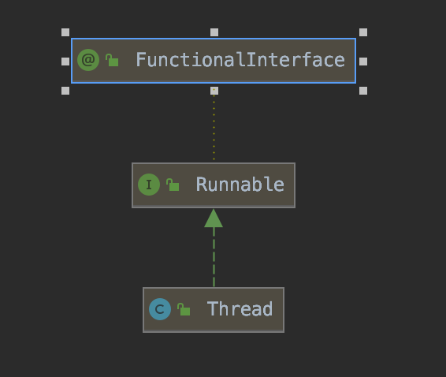

# 修炼并发（0）——认识多线程

## 1 认识线程

现代操作系统在运行一个程序时，会为其创建一个进程，进程是系统进行资源分配和调度的最小单元。线程是进程的一部分，是系统调度的最小单元，所以也被称为轻量级进程。线程拥有自己的程序计数器、虚拟机栈和本地方法栈，并且与进程以及其他线程共享堆、方法区和直接内存。

一个进程可以创建多个线程，处理器在这些线程上高速切换，让使用者感觉这些线程在同时运行。在了解线程之前，需要回答几个问题：

**为什么需要多线程？**

答：最直接的目的就是提高软件的性能。

**为什么多线程能够提高性能？**

答：

使用多线程一定好吗？

答：

在初步了解线程的概念后，我们结合实践与源码更深入了解线程在Java中的实现。

## 2 线程属性

在Java中，线程主要通过Thread类来实现的。Thread类的继承关系如下：

Runnable是一个函数式接口，只有一个`run()`方法，所有的线程都应该继承该接口，并重写run()方法。

### 2.1 线程状态

### 2.2 线程优先级

### 2.3 守护线程

## 3 线程创建

## 4 线程启动

## 5 线程中断

## 6 线程终止

## 7  多线程存在的挑战

## 参考文献