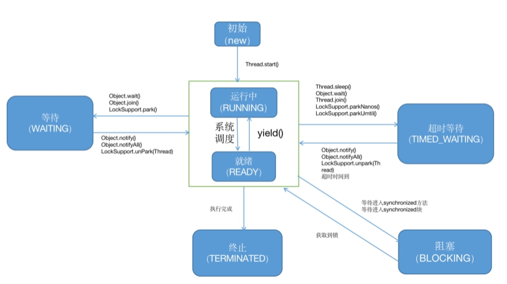

# 多线程（1）——基础概念

## 1、什么是线程

进程：

线程：

协程/纤程：

## 2、线程实现

1）继承Thread类

2）实现Runnable，创建Thread类

3）使用线程池，Executors.newCachedThread

## 3、常用方法

1）sleep：进入等待状态

2）yield：离开当前线程进入等待队列

3）join：在t1线程调用t2.join，线程切换到t2线程。等t2线程运行完才运行t1。

## 4、线程状态

6个状态：

## 5、线程同步

## 6、synchronized细节

sychronized(this)等价于synchronized方法

Synchronized static方法等价于synchronized(T.class)

## 7、异常与锁

## 8、volatile

## 9、AtomicXXX

## 10、wait notify线程通信