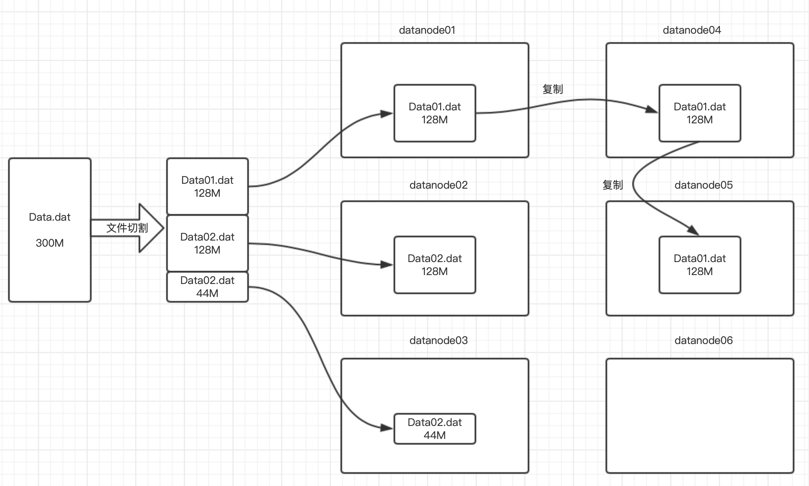

---

---

## Hadoop篇之HDFS基础


### 1. HDFS简介

Hadoop分布式文件系统（HDFS）是一个运行在普通硬件上的分布式文件系统。它与现有的分布式文件系统有许多相似之处，但也有很大的不同。例如：

- HDFS具有高度的容错性，设计用于部署在低成本硬件上。
- HDFS提供对应用程序数据的高吞吐量访问，适用于具有大数据集的应用程序。
- HDFS放宽了一些POSIX要求，以支持对文件系统数据的流式访问。

HDFS最初是作为apache nutch web搜索引擎项目的基础设施而构建的。HDFS是apachehadoop核心项目的一部分。

HDFS的设计思路和目标是：

- 硬件的高容错：检测故障并从中快速、自动地恢复故障是HDFS的一个核心架构目标；
- 数据的流式访问：HDFS更多的是为批处理而设计的，而不是用户的交互使用。重点是数据访问的高吞吐量，而不是数据访问的低延迟；
- 处理大数据集：HDFS被调整为支持大文件。它应该提供高聚合数据带宽，并且可以扩展到单个集群中的数百个节点。并且在一个实例中支持数千万个文件；
- 简化一致性模型：HDFS应用程序需要一种一次写入多次读取的文件访问模型；
- 移动计算代价比移动数据代价低：应用程序所请求的计算如果在其操作的数据附近执行，则效率要高得多；
- 跨异构硬件和软件平台的可移植性

HDFS的功能有：

- 文件权限和身份验证；
- 机架感知：在调度任务和分配存储时考虑节点的物理位置；
- 安全模式：维护的管理模式；
- fsck：诊断文件系统健康状况，用来查找丢失的文件或块；
- fetchdt：获取DelegationToken并将其存储在本地系统上的文件中；
- Balancer：当数据在数据节点之间分布不均匀时，用来平衡集群的工具；
- 升级和回滚：软件升级后，如果出现意外问题，可以回滚到升级前的HDFS状态；
- Secondary NameNode：执行命名空间的定期检查点，帮助将包含HDFS修改日志的文件大小保持在NameNode的特定限制内；
- Checkpoint node：执行命名空间的定期检查点，并帮助最小化NameNode中存储的包含HDFS更改的日志的大小。NameNode允许同时使用多个检查点节点，只要没有向系统注册备份节点。
- 备份节点：检查点节点的扩展。除了检查点之外，它还接收来自NameNode的编辑流，并维护自己的命名空间在内存中的副本，该副本始终与活动NameNode命名空间状态同步。一次只能向NameNode注册一个备份节点。


### 2. HDFS核心概念

HDFS具有主/从体系结构，由主节点NameNode、备份主节点SecondaryNameNode和若干个从节点DataNode组成，文件存储在DataNode上，并且被分成一个或多个块Block。下面分解介绍NameNode、SeconaryNameNode、DataNode和Block的概念。

#### 2.1 NameNode

NameNode是HDFS的主节点，主要功能有：

- 负责管理文件系统的元数据和命名空间（例如打开、关闭、重命名文件和目录），将HDFS的元数据存储在NameNode节点的内存中
- 负责响应客户端对文件的读写请求

HDFS的元数据有：

- 文件目录树、所有的文件（目录）名称、文件属性（生成时间、副本、权限）；
- 每个文件的块列表（文件名-数据块映射关系）、每个block块所在的datanode列表（数据块-DataNode列表的映射关系）；
- 每个文件、目录、block占用大概**150Byte字节的元数据**（namenode存储有限，如果小文件过多，则占用namenode的空间会很多，所以HDFS适合存储大文件，不适合存储小文件。如果小文件过多，参考小文件治理方案）；
- HDFS元数据信息以两种形式保存：①编辑日志**edits log**②命名空间镜像文件**fsimage**
  - edits log：HDFS编辑日志文件 ，保存客户端对HDFS的所有更改记录，如增、删、重命名文件（目录），这些操作会修改HDFS目录树；NameNode会在编辑日志edit日志中记录下来；
  - fsimage：HDFS元数据镜像文件 ，即将namenode内存中的数据落入磁盘生成的文件；保存了文件系统目录树信息以及文件、块、datanode的映射关系

- NameNode元数据相关的配置项为：

```shell
hdfs-site.xml中属性dfs.namenode.edits.dir的值决定edits.log文件

hdfs-site.xml中属性dfs.namenode.name.dir的值决定fsimage文件
```

同时，NameNode还提供被动的接收服务server，主要有三类协议接口：

- ClientProtocol接口：提供给客户端，用于访问NameNode，包含了文件的HDFS功能；
- DataNodeProtocol接口：用于DataNode向NameNode通信；
- NameNoeProtocol接口：用于NameNode与NameNode的通信。

NameNode的缺点：

- HDFS所有的编辑日志都存储在edits.log，系统出现故障后可以从edits.log恢复。但是随着edits.log文件越来越大，系统根据日志恢复时间也会越久；
- 故障恢复期间系统不可用

#### 2.2 SecondaryNameNode

SecondaryNameNode的主要功能是对NameNode的数据snapshots进行备份，这样可以降低NameNode崩溃后导致数据丢失的风险，主要任务是从NameNode获得fsImage和edits文件，然后重新合并发给NameNode。这样既能减轻NameNode的负担有能安全备份。


- SecondaryNameNode定期做checkpoint检查点操作

  - 创建检查点checkpoint的两大条件：
    - SecondaryNameNode每隔1小时创建一个检查点
    - 另外，Secondary NameNode每1分钟检查一次，从上一检查点开始，edits日志文件中是否已包括100万个事务，如果是，也会创建检查点

  - SecondaryNameNode执行检查点步骤：
    - SecondaryNameNode首先请求原NameNode进行edits的滚动，这样新的编辑操作就能够进入新的文件中
    - SecondaryNameNode通过**HTTP GET**方式读取原NameNode中的fsimage及edits
    - SecondaryNameNode读取fsimage到内存中，然后执行edits中的每个操作，并创建一个新的统一的fsimage文件
    - SecondaryNameNode通过**HTTP PUT**方式将新的fsimage发送到原NameNode
    - 原NameNode用新的fsimage替换旧的fsimage，同时系统会更新fsimage文件到记录检查点的时间。 
    - 这个过程结束后，NameNode就有了最新的fsimage文件和更小的edits文件

- SecondaryNameNode一般部署在另外一台节点上

  - 因为它需要占用大量的CPU时间
  - 并需要与namenode一样多的内存，来执行合并操作

- 查看edits日志文件

  ```shell
  hdfs oev -i edits_0000000000000000256-0000000000000000363 -o /home/hadoop/edit1.xml
  ```

- 查看fsimage文件

  ```shell
  hdfs oiv -p XML -i fsimage_0000000000000092691 -o fsimage.xml  
  ```

- checkpoint相关属性

  | 属性                                 | 值              | 解释                                                         |
  | ------------------------------------ | --------------- | ------------------------------------------------------------ |
  | dfs.namenode.checkpoint.period       | 3600秒(即1小时) | The number of seconds between two periodic checkpoints.      |
  | dfs.namenode.checkpoint.txns         | 1000000         | The Secondary NameNode or CheckpointNode will create a checkpoint of the namespace every 'dfs.namenode.checkpoint.txns' transactions, regardless of whether 'dfs.namenode.checkpoint.period' has expired. |
  | dfs.namenode.checkpoint.check.period | 60(1分钟)       | The SecondaryNameNode and CheckpointNode will poll the NameNode every 'dfs.namenode.checkpoint.check.period' seconds to query the number of uncheckpointed transactions. |

  

#### 2.3 DataNode

DataNode的作用是负责存储数据的组件，一个数据块block会在多个DataNode中进行冗余备份，而一个DataNode对于一个块最多只包含一个备份。一个HDFS集群可能包含上千个DataNode节点，这些DataNode定时主动和NameNode进行通信，同时接收NameNode的指令。

NameNode中保存的Block和DataNode的映射关系是通过DataNode启动时上报来更新的。

NameNode和DataNode的关系：

- NameNode和DataNode严格遵从客户端/服务器架构，NameNode是服务端，DataNode是客户端，所以NameNode不会主动发起对DataNode的请求。
- DataNode也可以作为服务端接受客户端的访问，处理数据块读/写请求，并保证写操作的一致性；
- DataNode之间会相互通信，执行数据块复制任务

#### 2.4 Block

**1）数据Block**

数据是以数据块Block的形式存储在HDFS中，每个数据块大小默认是128M。因此上传文件时文件被分割成128M的块，如果可能，每个块将驻留在不同的DataNode上。


Q：如果数据块小于128M，那么存储在HDFS上占用多大内存？

A：占用数据块实际大小内存，不会占用128M的内存。

**2）Block的副本**

因为HDFS的目标是要保证硬件的高容错，所以为了保证Block的可用及容错，HDFS默认副本数为3。如果需要调整副本数，有两种方式：

- 方式一：使用命令设置文件副本数；动态生效，不需要重启hadoop集群


```shell
hadoop fs -setrep -R 4 /path
```

- 方式二：修改配置文件hdfs-site.xml，需要重启hadoop集群才能生效


```xml
<property>
	<name>dfs.replication</name>
	<value>4</value>
</property>
```



当客户端将数据写入复制因子为3的HDFS文件时，NameNode使用复制目标选择算法检索数据节点列表。此列表包含将承载该块副本的DataNode。然后，客户端写入第一个DataNode。第一个DataNode将每个部分写入其本地存储库，并将该部分传输到列表中的第二个DataNode。第二个DataNode依次开始接收数据块的每个部分，将该部分写入其存储库，然后将该部分复制到第三个DataNode。最后，第三个DataNode将数据写入其本地存储库。

**3）机架存储策略**

现在大型企业的每个机房通常是由多个机架组成，每个机架上有若干服务器。复制因子为3的HDFS在多机架场景下的存储策略为：

- 第一块：在本机器的HDFS目录下存储Block的第一个副本；
- 第二块：在不同Rack(机架，暂且称为r1)的某个DataNode(称为dn2)上存储Block的第二个副本；
- 第三块：在dn2所在机架r1下，找一台其它的datanode节点，存储Block的第三个副本；
- 更能多副本：随机节点

Q：为什么第二和第三块副本存储在同一个机架上？

A：因为不同机架之间传输数据需要经过交换机、路由器等，如果数据量比较大的话，那么会占用很大的网络带宽。因为其他副本尽量在同一台机架上。

### 3. HDFS使用

HDFS有多种访问和使用方式，可以通过HDFS命令、API方式创建文件、存入、读取、修改、转储、删除文件等。

#### 3.1 HDFS命令

HDFS命令有两种风格：

```
hadoop fs开头的

hdfs dfs开头的
```

##### 3.1.1 常用命令

1. 如何查看hdfs或hadoop子命令的**帮助信息**，如ls子命令

   ```shell
   hdfs dfs -help ls
   hadoop fs -help ls	#两个命令等价
   ```

2. **查看**hdfs文件系统中已经存在的文件。对比linux命令ls

   ```shell
   hdfs dfs -ls /
   hadoop fs -ls /
   ```

3. 在hdfs文件系统中创建文件

   ```shell
   hdfs dfs -touchz /edits.txt
   ```

4. 向HDFS文件中追加内容

   ```shell
   hadoop fs -appendToFile edit1.xml /edits.txt #将本地磁盘当前目录的edit1.xml内容追加到HDFS根目录 的edits.txt文件
   ```

5. 查看HDFS文件内容

   ```shell
   hdfs dfs -cat /edits.txt
   ```

6. **从本地路径上传文件至HDFS**

   ````` shell
   #用法：hdfs dfs -put /本地路径 /hdfs路径
   hdfs dfs -put hadoop-2.7.3.tar.gz /
   hdfs dfs -copyFromLocal hadoop-2.7.3.tar.gz /  #根put作用一样
   hdfs dfs -moveFromLocal hadoop-2.7.3.tar.gz /  #根put作用一样，只不过，源文件被拷贝成功后，会被删除
   `````

7. **在hdfs文件系统中下载文件**

   ```shell
   hdfs dfs -get /hdfs路径 /本地路径
   hdfs dfs -copyToLocal /hdfs路径 /本地路径  #根get作用一样
   ```

8. 在hdfs文件系统中**创建目录**

   ```shell
   hdfs dfs -mkdir /shell
   ```

9. 在hdfs文件系统中**删除**文件

   ```shell
   hdfs dfs -rm /edits.txt
   hdfs dfs -rm -r /shell
   ```

10. 在hdfs文件系统中**修改文件名称**（也可以用来**移动**文件到目录）

     ```shell
     hdfs dfs -mv /xcall.sh /call.sh
     hdfs dfs -mv /call.sh /shell
     ```

11. 在hdfs中拷贝文件到目录

      ```shell
      hdfs dfs -cp /xrsync.sh /shell
      ```

12. 递归删除目录

      ```shell
      hdfs dfs -rmr /shell
      ```

13. 列出本地文件的内容（默认是hdfs文件系统）

      ```shell
      hdfs dfs -ls file:///home/bruce/
      ```

14. 查找文件

      ```shell
      # linux find命令
      find . -name 'edit*'
      
      # HDFS find命令
      hadoop fs -find / -name part-r-00000 # 在HDFS根目录中，查找part-r-00000文件
      ```


##### 3.1.2 hdfs与getconf结合使用

1. 获取NameNode的节点名称（可能有多个）

   ``````shell
   hdfs getconf -namenodes
   ``````

2. 获取hdfs最小块信息

   ``````shell
   hdfs getconf -confKey dfs.namenode.fs-limits.min-block-size
   ``````

3. 查找hdfs的NameNode的RPC地址

   ``````shell
   hdfs getconf -nnRpcAddresses
   ``````

##### 3.1.3 hdfs与dfsadmin结合使用

1. 同样要学会借助帮助信息

   ```shell
   hdfs dfsadmin -help safemode
   ```

2. 查看hdfs dfsadmin的帮助信息

   ``````shell
   hdfs dfsadmin
   ``````

3. 查看当前的模式

   ``````shell
   hdfs dfsadmin -safemode get
   ``````

4. 进入安全模式

  ``````shell
  hdfs dfsadmin -safemode enter
  ``````

#####    3.1.4 hdfs与fsck结合使用

1. fsck指令**显示HDFS块信息**

   ``````shell
   hdfs fsck /02-041-0029.mp4 -files -blocks -locations # 查看文件02-041-0029.mp4的块信息
   ``````


##### 3.1.5 其他命令

1. 检查压缩库本地安装情况

   ``````shell
   hadoop checknative
   ``````

2. 格式化名称节点（**慎用**，一般只在初次搭建集群，使用一次；格式化成功后，不要再使用）

   ``````shell
   hadoop namenode -format
   ``````

3. 执行自定义jar包

   ``````shell
   hadoop jar YinzhengjieMapReduce-1.0-SNAPSHOT.jar com.kaikeba.hadoop.WordCount /world.txt /out
   ``````

#### 3.2 Java API

##### 3.2.1 添加maven依赖

```xml
        <!--hdfs操作库-->
        <dependency>
            <groupId>org.apache.hadoop</groupId>
            <artifactId>hadoop-hdfs</artifactId>
            <version>2.6.0</version>
        </dependency>

        <!-- hHadoop核心类 -->
        <dependency>
            <groupId>org.apache.hadoop</groupId>
            <artifactId>hadoop-common</artifactId>
            <version>2.6.0</version>
        </dependency>
```

##### 3.2.2 HDFS编程核心类

- org.apache.hadoop.fs.FileSystem：一个相当通用的文件系统的抽象基类。它可以实现为分布式文件系统，或者作为反映本地连接磁盘的“本地”文件系统
- org.apache.hadoop.conf.Configuration：用于设置HDFS参数
- org.apache.hadoop.io.IOUtils：I/O相关功能的实用程序类


##### 3.2.3 利用HDFS实现文件上传下载

```java
public class FileUtils {

    private String sourceSrc;

    private String desSrc;

    public FileUtils(String sourceSrc, String desSrc) {
        this.desSrc = desSrc;
        this.sourceSrc = sourceSrc;
    }

    /**
     * 文件上传
     */
    public void copyFromLocal() {
        InputStream in = null;
        try {
            // 读取本地文件
            in = new BufferedInputStream(new FileInputStream(sourceSrc));

            // HDFS配置文件
            Configuration conf = new Configuration();

            // 输出HDFS
            FileSystem fs = FileSystem.get(URI.create(desSrc), conf);
            DataOutputStream fsDataOutputStream = fs.create(new Path(desSrc));

            // 拷贝数据
            IOUtils.copyBytes(in, fsDataOutputStream, 4096, true);

        } catch (FileNotFoundException e) {
            e.printStackTrace();
        } catch (IOException e) {
            e.printStackTrace();
        }
    }

    /**
     * 文件下载
     */
    public void copyToLocal() {
        InputStream in = null;
        try {
            // HDFS配置文件
            Configuration conf = new Configuration();
            // HDFS文件系统
            FileSystem fs = FileSystem.get(URI.create(sourceSrc), conf);
            in = fs.open(new Path(sourceSrc));

            // 输出配置
            OutputStream out = new BufferedOutputStream(new FileOutputStream(desSrc));

            IOUtils.copyBytes(in, out, 4096, true);

        } catch (IOException e) {
            e.printStackTrace();
        }
    }

}
```

