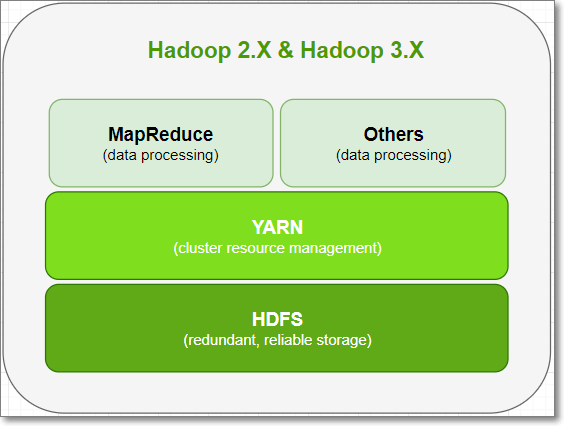
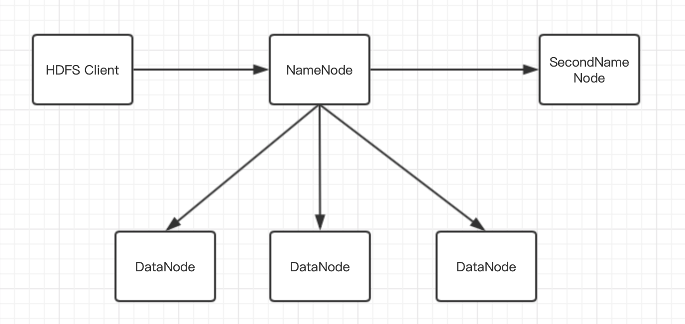

## Hadoop架构

Hadoop生态是大数据时代的基石，基于Hadoop衍生的一系列技术在大数据平台中发挥着重要的作用。所以学习大数据是避不开Hadoop的。从[Hadoop官网](http://hadoop.apache.org/)上可以了解，Hadoop的特点是是可靠的、可伸缩的、分布式计算的大数据处理软件。传统软件的可靠性主要依赖于硬件的可靠，而Hadoop集群建立在大量廉价的机器上，并通过分布式技术保证整个集群的可靠性。

大数据计算主要分为三大类：

- 离线处理平台：Hadoop、Spark core
- 交互式处理平台：Spark SQL、Hive、Impala
- 流处理平台：storm、Spark streaming、Flink

Hadoop的主要用于离线处理平台，其核心模块有：

### 1、Hadoop架构

Hadoop是典型的主从架构，主节点是NameNode，从节点是DataNode，具体架构图如下：

NameNode是主节点，主要功能有1）维护整个系统的目录树，以及目录树下的目录和文件；2）存储元数据。元数据的存储形式包括FSImage和EditLog，其中FSImage存储完整的元数据快照，editLog保存操作日志。

secondNameNode是第二主节点，主要作用是定期合并FSImage和EditLog，形成完整的FSImage。具体合并过程见[[HDFS基础](https://github.com/Rosscqu/toBeBigDataer/blob/master/3%E3%80%81Hadoop%E7%AF%87/Hadoop%E7%AF%87%E2%80%94%E2%80%94HDFS%E5%9F%BA%E7%A1%80.md)]。

DataNode是数据节点，主要以Block的形式存储数据。

在官网上提到Hadoop是高容错的，那么Hadoop是如何保证系统的可靠性？

Hadoop的容错机制有：

**1）心跳机制：**

- NameNode和DataNode之间维持心跳检测机制，DataNode以固定的周期（3S）向NameNode发送心跳；
- NameNode在一定时间（10min）没有收到DataNode的心跳，则认为DataNode宕机，NameNode不会向未检测到心跳的DataNode发送指令；
- NameNode还会定期检查副本数是否小于设置的值，如果小于则会复制副本到新的DataNode中。

**2）检测文件块的完整性**

- HDFS会记录每个文件所有块的校验和，如果读取文件时的校验和与HDFS记录的校验和不相同，则认为文件存在损坏；

**3）集群的负载均衡**

- 当DataNode的空闲时间大于设置的阈值，HDFS会将其他DataNode的数据迁移过来

**4）NameNode单点故障**

- SecondNameNode定期从NameNode拉取fsImage和edits log，然后进行合并成新的fsImage并上传到NameNode；
- 当NameNode发生故障时，只需要重新加载fsImage和新生成的edits log即可恢复。

**5）文件删除**

- 文件删除后会放在/trash目录下，只有超过设置的时间才会真正的删除；

虽然HDFS已经有很多容错机制保证系统的可靠性，但是当NameNode发生单点故障时，依然会存在部分元数据丢失，并且会产生停机，停机这段时间系统是不可用的。所以需要更高可用的架构来保证系统的可靠性。

### 2、Hadoop HA架构

HDFS2.x采用了Hadoop HA的架构，具体架构如下：

Hadoop HA架构增加了NameNode standby节点，该节点的作用是作为NameNode的热备，实时同步NameNode的元数据；当NameNode发生故障时，zookeeper会检测到故障，并通知standby节点切换成active对外提供服务。

standby节点是如何热备份元数据？

- 首先active节点将元数据写入到共享数据库中，standby节点一直监听该数据库，当发生数据变化时就将共享数据库中的数据同步到内存中，从而保证standby节点的数据与active节点的数据同步；
- 共享数据库可以选择zookeeper、Quorum Journal Manager、NFS（networkFile system）。

Hadoop HA的主要贡献是解决的单点故障的问题。但是没有解决其他的缺点：

- 扩展性受限与NameNode的内存；
- 客户端都与一个NameNode通信，存在网络瓶颈；
- 隔离性不好，当一个程序占用的资源较多时，可能会影响其他程序的运行。

所以Hadoop HA架构本质上还是单名称节点。下面介绍Hadoop联邦的架构。

### 3、Hadoop联邦

- HDFS联邦中，设计了多个命名空间；每个命名空间有一个NN或一主一备两个NN，使得HDFS的命名服务能够水平扩展；这些NN分别进行各自命名空间namespace和块的管理，相互独立，不需要彼此协调
- HDFS联邦每个相互独立的NN对应一个独立的命名空间，每一个命名空间管理属于自己的一组块，这些属于同一命名空间的块对应一个“块池”的概念。
- 每个DN要向集群中所有的NN注册，并周期性的向所有NN发送心跳信息和块信息，报告自己的状态，每个DN会为所有块池提供块的存储，块池中的各个块实际上是存储在不同DN中的