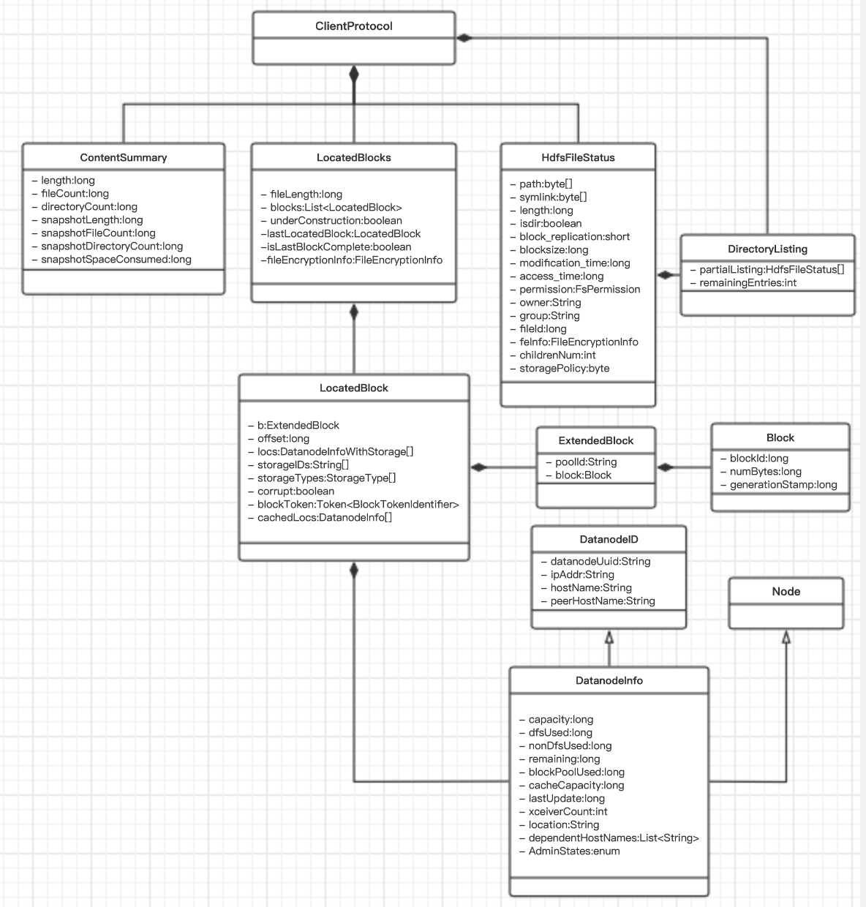
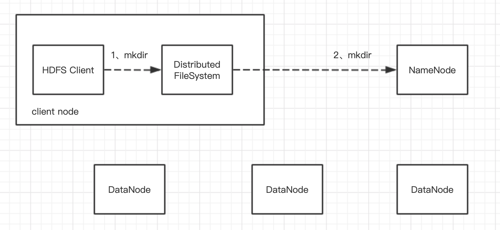
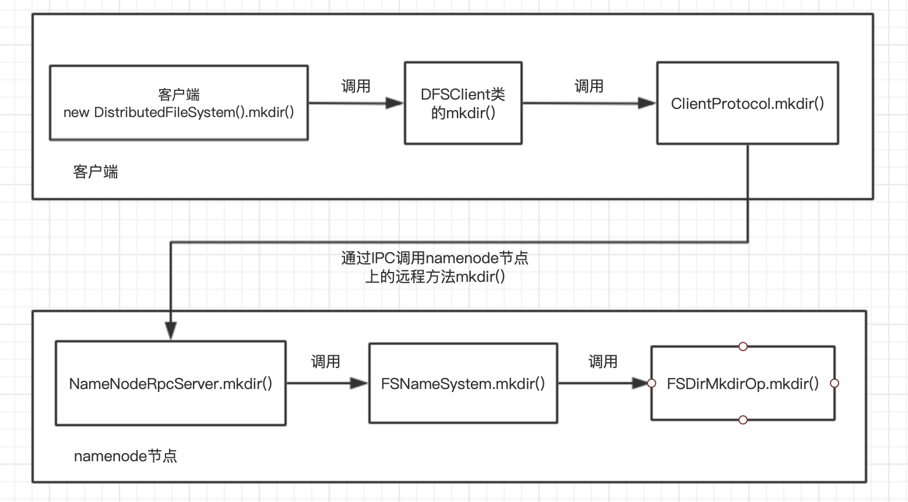
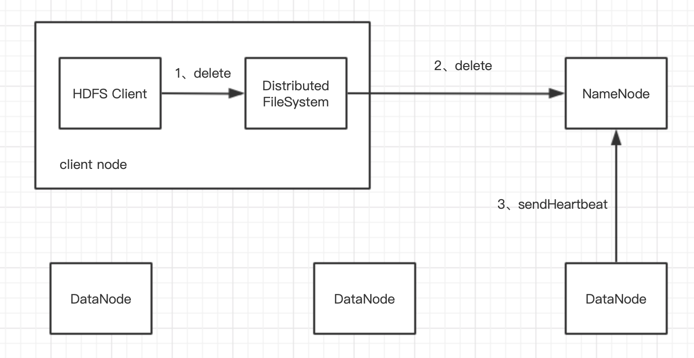
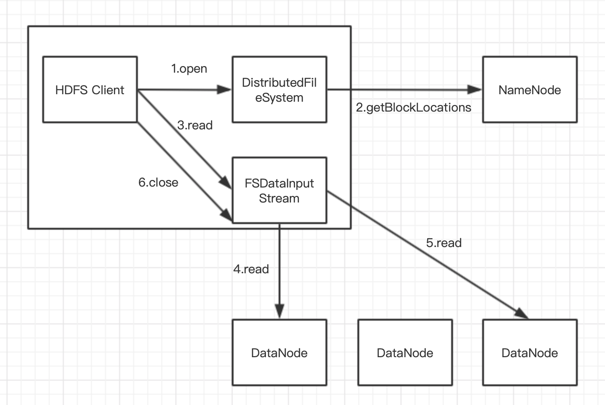
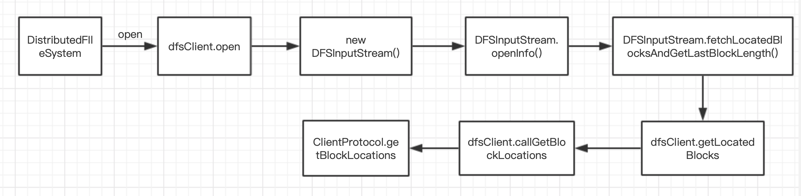
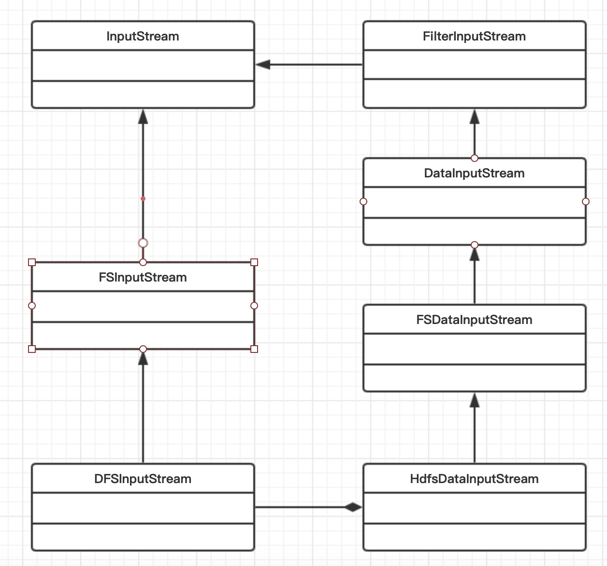
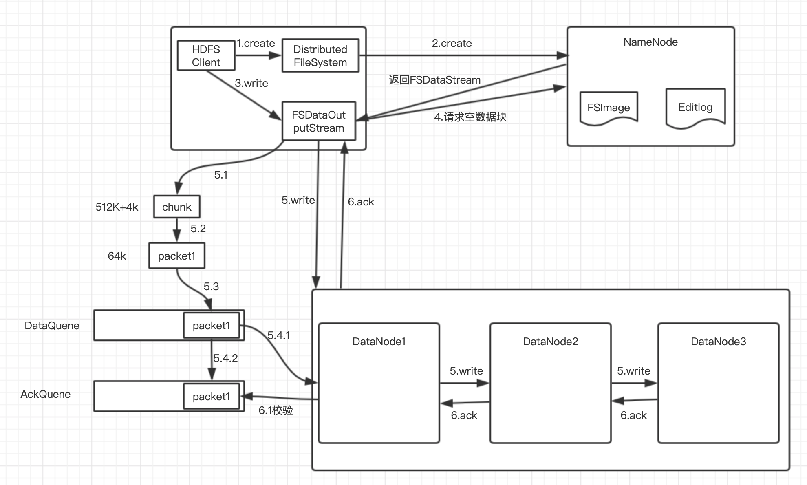

## Hadoop篇——深入剖析HDFS文件读取与写入

本文主要通过源码（以2.8.5版本为例）的方式，梳理操作客户端的3个流程：客户端到名称节点的元数据操作、客户端读文件、客户端写文件。

HDFS中名称节点、数据节点和客户端之间主要有2种主要的通信接口：Hadoop远程过程调用接口和基于TCP或HTTP的流式接口。其中客户端相关的接口定义在Hadoop-hdfs-project工程下的hadoop-hdfs-client模块的org.apache.hadoop.hdfs.protocol包中，具体接口为：

- ClientProtocol：客户端与名称节点间的接口，是HDFS客户访问文件系统的入口。提供的能力可以分为：
  - 用于实现Hadoop文件系统相关功能的能力；
  - 用于对HDFS状态进行查询、设置的能力。
- ClientDatanodeProtocol：用于客户端和数据节点进行交互，这个接口用得比较少，客户端和数据节点间主要是通过HTTP的流式接口进行读/写文件的操作。

### 1、ClientProtocol接口的数据类型

在介绍客户端相关流程前，先了解一下出现在接口上的数据类型。

该类图中可以分成3类：数据块相关、数据节点相关、HDFS文件元数据相关。

1）数据块相关

- Block:数据块基础信息
- ExtendedBlock:数据块池中唯一标识块
- LocatedBlock:已经确认位置的数据块
- LocatedBlocks：数据块集合，包括块的位置和长度，用于一次定位多个数据块，包含一系列的LocatedBlock对象

2）数据节点相关

- Node:数据节点相关的方法接口
- DatanodeInfo：提供数据节点上的一些度量信息
- DataNodeID:用于在HDFS集群中确定一个数据节点

3）HDFS文件元数据

- HdfsFileStatus：保存HDFS文件/目录的属性
- DirectoryListing：用于一次返回一个目录下的多个文件/子目录的属性

### 2、客户端到名称节点的文件与目录操作

客户端到名称节点有大量元数据操作，例如更改文件名(rename)、在给定目录下创建一个字目录(mkdir)等，这些操作一般只涉及客户端和名称节点的交互，通过远程接口ClientProtocol进行。

创建子目录的示例如下：

整个创建过程中，客户端和namenode的调用链为：

一些复杂的操作例如setReplication()增加副本数、delete()删除文件，会需要数据节点配合执行一些动作。以删除文件为例，客户端在调用delete()方法后，nameNode会执行delete()方法，标记需要被删除但数据块，但不会立即删除dataNode的文件。当dataNode向nameNode发送心跳时，在心跳应答，nameNode会通过dataNodeCommand命令dataNode节点删除数据。具体流程如下图：

本文仅分析客户端与NameNode或DataNode之间的交互，DataNode与NameNode之间的交互待以后分析。

### 3、客户端读文件

下图显示在读取HDFS上的文件时，客户端、名称节点和数据节点间发生的事件以及事件的顺序：

1. client端读取HDFS文件，client调用文件系统对象DistributedFileSystem的open方法；
2. 构造DFSInputStream对象时，调用namenode的getBlockLocations方法，获得file的开始若干block（如blk1, blk2, blk3, blk4）的存储datanode（以下简称dn）列表；针对每个block的dn列表，会根据网络拓扑做排序，离client近的排在前，具体调用链如下：

3. 客户端再调用FSInputStream（DFSInputStream）的read方法，先读取blk1的数据，与client最近的datanode建立连接，读取数据;

4. 读取完后，关闭与dn建立的流;

5. 读取下一个block，如blk2的数据（重复步骤3、4、5）;

6. 这一批block读取完后，再读取下一批block的数据（重复2、3、4、5、6）;

7. 完成文件数据读取后，调用FSDataInputStream的close方法;

8. 返回FSDataInputStream对象（对DFSInputStream的包装）;

在看源码过程中，存在几个输入流，各个输入流的关系如下：

在客户端读取文件时，如果数据节点发生错误，如节点停机或者网络出现故障，那么客户端会尝试下一个数据块位置。同时，它也会记住出现故障的那个数据节点。读数据的应答包不仅包含了数据，还包含了数据的校验和，客户端会检查数据的一致性，如果发现有校验错误，会将这个信息报告给名称节点，同时尝试从别的数据节点读取另一个副本的文件内容。

Q：客户端直接联系名称节点，检索数据存放位置，并有名称节点安排数据节点读取顺序的优点？

A：1）能够将读取文件引起的数据传输分散到集群到各个数据节点，HDFS可以支持大量的并发客户端；2）名称节点只处理数据块定位请求，不提供数据，可以避免名称节点成为系统的瓶颈。

### 4、客户端写文件

下图显示HDFS写文件时流程图：

整个写文件的流程为：

1、创建文件

2、建立数据流管道

3、向数据流管道pipline写分块数据

4、packet写满后写入dataQuene

5、packet数据取完后写入ackQuene

6、Datanode之间同步完数据后返回ack，如果ack是success，则删除dataQuene的packet，否则将packet重新放入dataQuene的队首；

7、文件写完后发送空的packet，关闭pipeline；

8、clientProtocol.complete()方法通知NameNode当前数据已经写完。

Q：在写的过程中，pipeline中的datanode出现故障（如网络不通），输出流如何恢复

- 输出流中ackQueue缓存的所有packet会被重新加入dataQueue；
- 输出流调用ClientProtocol.updateBlockForPipeline()，为block申请一个新的时间戳，namenode会记录新时间戳，确保故障datanode即使恢复，但由于其上的block时间戳与namenode记录的新的时间戳不一致，故障datanode上的block进而被删除
- 输出流调用ClientProtocol.getAdditionalDatanode()通知namenode分配新的datanode到数据流pipeline中，并使用新的时间戳建立pipeline
- 新添加到pipeline中的datanode，目前还没有存储这个新的block，HDFS客户端通过DataTransferProtocol通知pipeline中的一个datanode复制这个block到新的datanode中
- pipeline重建后，输出流调用ClientProtocol.updatePipeline()，更新namenode中的元数据
- 故障恢复完毕，完成后续的写入流程