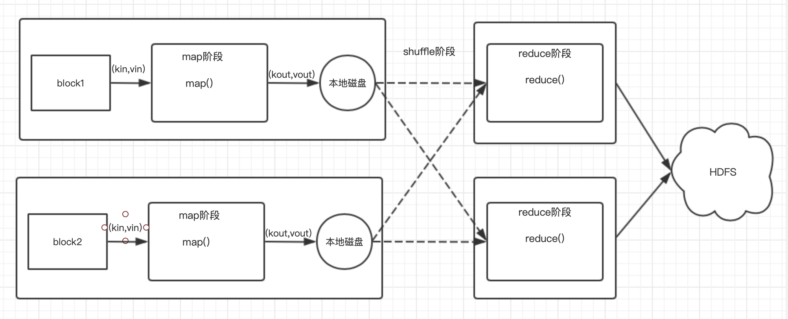
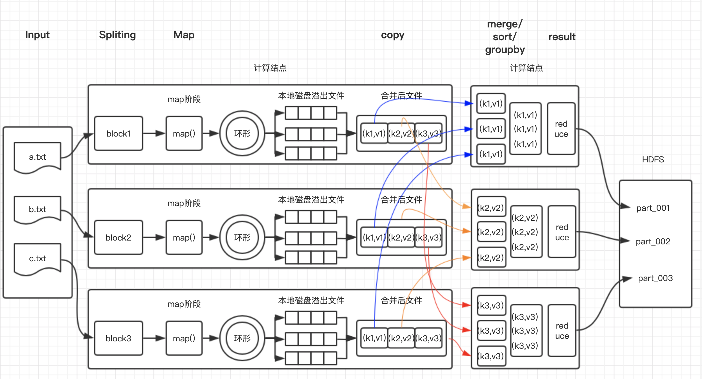

## MapReduce篇——MapReduce编程模型

本文主要介绍MapReduce编程模型。

### 1、MapReduce编程模型简介

MapReduce的编程模型是将问题抽象成**Map和Reduce两个阶段**。

- Map阶段：使用map()函数将输入数据解析成key/value，产生另一系列key/values对作为中间输出到本地目录。MapReduce框架会自动将这些中间数据按照key值进行聚集，且key相同（可自定义聚集策略，默认是对key值进行哈希取值）的数据被统一交给reduce()函数处理。
- Reduce阶段：以key对应的value列表进行输入，并将key相同的value进行规约处理，并将最终结果写到HDFS。

使用时只需要编写map()和reduce()函数即可完成简单的分布式程序的设计。



下一节详细介绍MapReduce编程模型原理。

### 2、MapReduce编程模型原理



如图所示，Hadoop将输入数据切分成若干个分片（split），每个分片对应一个block，每个split对应一个map任务；并将每个split交给一个Map task处理；处理完后将结果分成若干个分片(partition)到环形缓冲区，环形缓冲区使用率超过80%后将写到本地溢出磁盘。Reduce阶段时从每个Map task读取属于自己的partition，然后使用基于排序的方法将key相同的数据聚集在一起，调用reduce()函数处理并将结果输出到文件中。

**Map阶段：**

- MR编程时，每个block对应一个分片split
- 每一个split对应一个map任务（map task）
- map1读取block1的数据；一次读取block1的一行数据；
  - 产生键值对(key/value)，作为map()的参数传入，调用map()；
  - 假设当前所读行是第一行，将当前所读行的行首相对于当前block开始处的字节偏移量作为key（0），当前行的内容作为value

**Reduce阶段：**

- reduce任务的个数由程序编程指定，main()内的job.setNumReduceTasks(4)指定；
- map任务完成后，reduce通过网络，连接到所有map，将map输出结果中属于reduce的分区的数据，通过网络传输到reduce1端（拷贝阶段）；
- 每个reduce任务最终输出文件，文件写入到HDFS

Map和Reduce阶段处理的都是key/value对数据，其中key的作用有：

- 若要针对某个值进行分组、聚合时，需将key作为MR中的reduce的输入
- key还具有可排序的特性，因为MR中的key类需要实现WritableComparable接口；而此接口又继承Comparable接口

### 3、MapReduce的wordcount

以统计词频为例，演示如何利用MapReduce编程模型实现wordcount。

#### 3.1 maven依赖

```xml
				<dependency>
            <groupId>org.apache.hadoop</groupId>
            <artifactId>hadoop-client</artifactId>
            <version>2.6.0-mr1-cdh5.14.2</version>
        </dependency>
        <dependency>
            <groupId>org.apache.hadoop</groupId>
            <artifactId>hadoop-common</artifactId>
            <version>${cdh.version}</version>
        </dependency>
        <dependency>
            <groupId>org.apache.hadoop</groupId>
            <artifactId>hadoop-hdfs</artifactId>
            <version>${cdh.version}</version>
        </dependency>

        <dependency>
            <groupId>org.apache.hadoop</groupId>
            <artifactId>hadoop-mapreduce-client-core</artifactId>
            <version>${cdh.version}</version>
        </dependency>
```

#### 3.2 编写Mapper类

```java
public class WordMapper extends Mapper<LongWritable, Text, Text, IntWritable> {

    public void map(LongWritable key, Text value, Context context) throws IOException, InterruptedException {
        String line = value.toString();

        String[] words = line.split(" ");

        for (String word : words) {
            context.write(new Text(word), new IntWritable(1));
        }
    }
}
```

从代码中可以看出，要继承Mapper类，并实现map()方法实现Map阶段的功能。

#### 3.3 编写Reducer类

```java
public class CountReduce extends Reducer<Text, IntWritable, Text, IntWritable> {

    IntWritable amount = new IntWritable();
    protected void reduce(Text key, Iterable<IntWritable> values, Context context) throws IOException, InterruptedException {
        int sum = 0;
        Iterator<IntWritable> iterator = values.iterator();
        while (iterator.hasNext()) {
            IntWritable value = iterator.next();
            sum = value.get();
        }

        amount.set(sum);
        context.write(key, amount);

    }
}
```

Reduce阶段需要继承Reducer类，并将逻辑写在reduce()方法中。

#### 3.4 main()函数

```java
public class WordCountMain {

    public static void main(String[] args) throws Exception {
        if (args == null || args.length != 2) {
            throw new Exception("param length is error!");
        }

        // Hadoop 配置
        Configuration conf = new Configuration();
        // 设置mapReduce计算任务
        Job job = Job.getInstance(conf, WordCountMain.class.getSimpleName());
        job.setJarByClass(WordCountMain.class);

        // 设置输入和输出文件
        job.setInputFormatClass(TextInputFormat.class);
        job.setOutputFormatClass(TextOutputFormat.class);

        FileInputFormat.setInputPaths(job, new Path(args[0]));
        FileOutputFormat.setOutputPath(job, new Path(args[1]));

        // 设置map算子
        job.setMapperClass(WordMapper.class);
        // 设置combine算子
        job.setCombinerClass(CountReduce.class);
        // 设置reduce算子
        job.setReducerClass(CountReduce.class);

        // 设置map算子输出的key和value类型
        job.setMapOutputKeyClass(Text.class);
        job.setMapOutputValueClass(IntWritable.class);

        // 设置reduce算子输出的key和value类型
        job.setOutputKeyClass(Text.class);
        job.setOutputValueClass(IntWritable.class);

        // 提交作业，等待完成
        job.waitForCompletion(true);
        
    }
}
```

从主程序入口可以看出，整个Java的MapReduce的编程流程为：

1. 配置mapReduce任务
2. 设置输入和输出文件，其中InputFormat和OutputFormat类可以自定义；
3. 设置map、combiner、reduce算子，其中Mapper和Reducer类需要自定义，combiner类一般与Reducer类相同；
4. 提交任务

在上面的案例中还没有提到Partitioner类，该类主要用于map阶段到reduce阶段，也就是第一张图中的shuffle。总结来说，MapReduce编程模型共提供了5个可编程组件：

- InputFormat
- Mapper
- Partitioner
- Reducer
- OutputFormat

下面分别介绍各个编程组件。

### 4、自定义编程组件


#### 4.1 自定义Inputformat类


#### 4.2 自定义Mapper类


#### 4.3 自定义Partitioner——shuffle


#### 4.4 自定义Reducer


#### 4.5 自定义OutputFormat类


### 5、性能调优


#### 5.1 MR压缩


#### 5.2 数据倾斜调优

