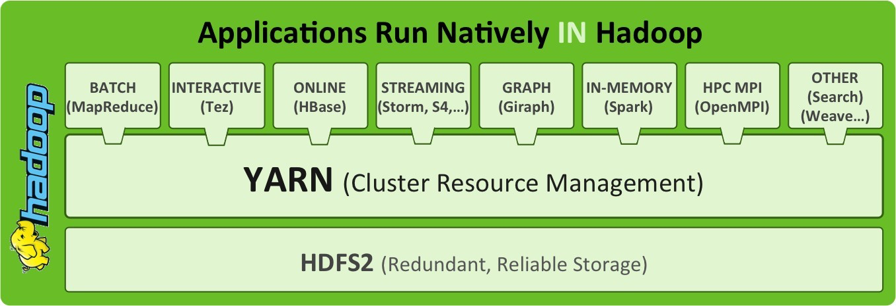
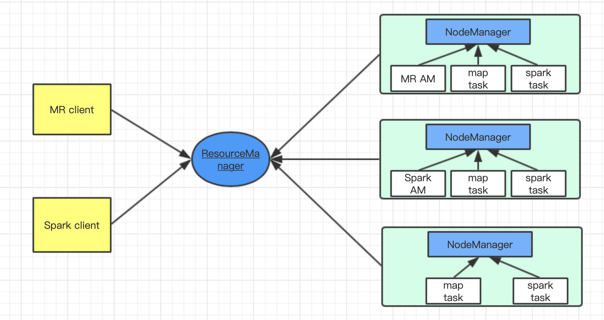
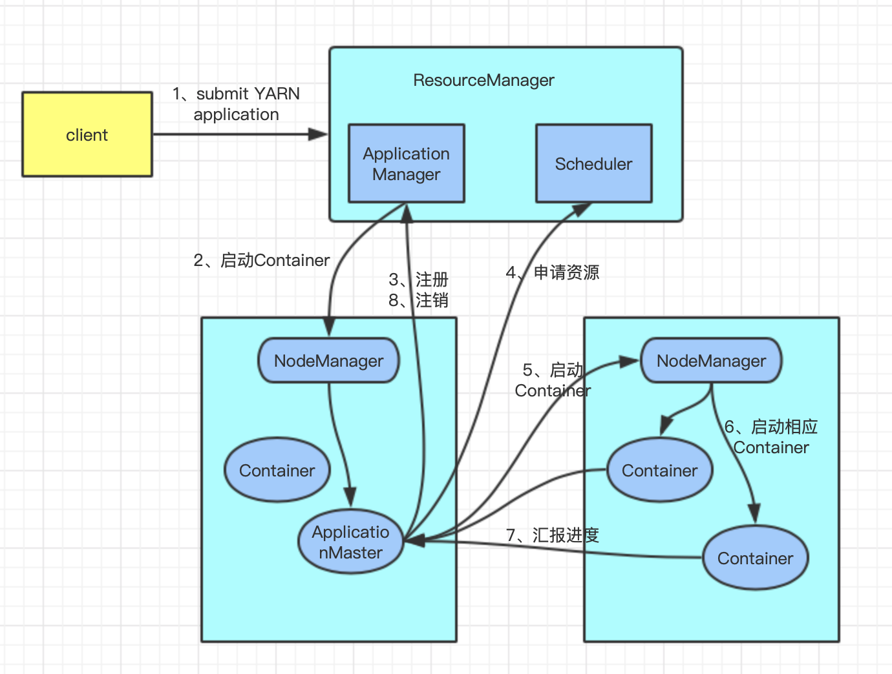

## 一文搞懂YARN、MapReduce on YARN、Spark on YARN的运行原理

[TOC]

YARN是Hadoop集群的资源管理系统，是Hadoop生态中非常重要的成员项目。

本文先了解YARN的架构，然后分别深入了解YARN以及常用计算框架在YARN上的运行原理。

### 1、YARN的架构

#### 1.1 常见调度系统架构

目前常见的调度机制有3种：集中式调度器、双层调度器和状态共享调度器。下面分别简单介绍3种调度器。

- 集中式调度器
  - 特点：全局只有一个中央调度器，计算框架的资源申请全部提交给中央调度器，所有调度逻辑由中央调度器实现；
  - 缺点：在高并发作业情况下，容易出现性能瓶颈；
  - 调度逻辑：FIFO
  - 示例：MR v1的jobTracker
- 双层调度器
  - 特点：将整个调度工作划分为两层：中央调度器和框架调度器。
    - 中央调度器负责管理集群中所有资源的状态，并按照一定的调度策略（FIFO、Fair、Capacity、Dominant Resource Fair）将资源粗粒度地分配给框架调度器；
    - 框架调度器：接收中央调度器的资源，再根据作业特性细粒度将资源分配给容器中执行具体的计算任务；
  - 优点：减轻中央调度器的负载；提高资源的利用率
  - 示例：YARN、Mesos
  - 双层调度器机制类似与并发中的悲观并发
- 状态共享调度器
  - 特点：弱化中央调度器，只需要保存一份集群的状态信息，每个框架调取器都能获取集群的全部信息，并采用乐观锁控制并发；
    - 框架调度器会不断地从主调度器更新集群信息并保存一份，而框架对资源的申请则会在该份信息上进行，一旦框架作出决策就会将信息同步到主调度
  - ​	优点：因为采取类似MVCC的乐观并发机制，所以系统整体的并发性能更好
  - 示例：谷歌的Omega

#### 1.2 YARN的架构

YARN是Hadoop2.0引入的统一资源管理与调度系统。YARN的架构是经典的主从架构，其架构如下：

从架构图中可以看出，YARN主要由ResourceManager、NodeManager、ApplicationMaster、Container几个组件组成。YARN的调度采用的是双层调度器，中央调度器为ResourceManager(RM)，框架调度器为ApplicationMaster(AM)，其中RM专门负责资源管理和调度，而AM主要负责与具体应用程序相关的任务切分、任务调度和容错等，而每个应用程序对应一个AM。下面分别介绍几个组件的作用。

**1）ResourceManager**

ResourceManager扮演中央调度器的作用，负责管理整个集群的资源和向应用程序分配基础计算资源（CPU、内存等）。其作用主要有：

- 处理客户端请求；
- 启动或监控ApplicationMaster；
- 监控NodeManager
- 资源的分配和调度

ResourceManager主要包括2个组件：调度器（Scheduler）和应用程序管理器（Applications Manager）（注意不要和ApplicationMaster混淆）。

调度器根据容量、队列等限制条件将资源分配给正在运行的应用程序。调度器不参与任何与具体应用程序相关的工作，只根据各个应用程序的资源需求，将单位资源封装成一个抽象的资源容器（Resource Container， 下文会介绍到Container）。常见的调度器有

- FIFO Scheduler：先进先出
- Capacity Scheduler：专门队列执行小任务，apache hadoop默认调度器
- Fair Scheduler：多个任务公平分配资源，CDH默认调度器

应用程序管理器主要负责整个系统中所有的应用程序，其作用有：

- 接收job的提交请求；
- 为应用程序分配第一个Container来运行ApplicationMaster，包括应用程序的提交、与资源调度去协调以启动ApplicationMaster、监控ApplicationMaster的运行状态、ApplicationMaster失败重启等。

**2）NodeManager**

NodeManager是YARN的slave节点，在集群中可以存在多个。NodeManager管理YARN集群中的每个节点，其主要作用有：

- 管理单个节点的资源；
- 负责接收ResourceManager的资源分配请求，分配Container给应用；
- 负责监控并报告Container的资源使用情况给ResourceManager;
- 负责处理来自ApplicationMaster的命令

MRv1与MRv2的不同在于：MRv1通过插槽管理Map和Reduce任务的执行，而NodeManager管理抽象资源容器，这些容器代表着可供一个特定应用程序使用的节点资源。

**3）ApplicationMaster**

ApplicationMaster管理在YARN中运行的每个应用程序示例。ApplicationMaster负责协调来自ResouceManager的资源，并通过NodeManager监控容器的执行和资源使用。从YARN的角度来看，ApplicationMaster是用户代码，因此存在潜在的安全问题。YARN假设ApplicationMaster存在错误甚至恶意的，因此将它们当作无特权代码对待。总的来说，ApplicationMaster的作用为：

- 负责数据的切分；
- 为应用程序申请资源并进一步分配给内部的Task;
- 任务的监控和容错

ApplicationMaster与ResourceManager的通信是整个YARN应用从提交到运行最核心的部分，是YARN对整个集群资源的动态管理的根本步骤。

**4）Container**

Container是YARN中资源的抽象，它封装了某个节点上的多维度资源，例如内存、CPU、磁盘、网络等。当AM向RM申请资源时，返回的资源便是用Container表示的。YARN会为每个任务分配一个Container，且该任务只能用该Container中描述的资源。

Container与NodeManager的关系为：

- 一个NodeManager可以包含多个Container；
- Container不能跨节点；
- 一个Job或Application至少包含一个Container;
- 在YARN框架里，RM只需要告诉AM哪些Container可以使用，AM还需要向NM请求分配Container

总结来说，Yarn的架构是主从架构，主节点是ResourceManager，所有的资源空闲和使用情况都由ResourceManager管理；从节点是NodeManager，负责管理Container生命周期，监控节点资源的使用情况；Container是资源的表示模型，Task是计算框架的计算任务，会运行在Container中；ApplicationMaster被认为是二级调度器，同样运行在Container中。

### 2、YARN应用运行过程

Application在YARN提交过程主要有3步：

- 应用程序提交；
- 启动应用的ApplictionMaster；
- ApplicationMaster管理应用实例运行

其运行过程如下：

第1步：客户端向RM提交自己的应用，并请求第一个ApplicationMaster;

第2步：RM的ApplicationManager向NM发出指令，为该应用启动第一个Container，并在其中启动ApplicationMaster

第3步：ApplicationMaster向RM注册，注册后客户端就可以查询RM获得ApplicationMaster的信息，并与ApplicationMaster直接交互；

第4步：ApplicationMaster根据**resource_request**的协议、通过轮询的方式向RM的Scheduler申请资源；

第5步：当ApplicationMaster申请到资源后，便向NM发送**container-launch-specification**信息，请求启动计算任务；container-launch-specification包含Container与ApplicationMaster通信所需要的信息；

第6步：NodeManager根据资源量大小、所需的运行环境，在Container中启动任务；

第7步：各任务将运行的状态、进度通过**application-specification**发送给ApplicationMaster;

第8步：应用程序运行完成后，ApplicationMaster向ResourceManager注销并关闭自己。

### 3、MapReduce on YARN的运行原理

通过上一节大概了解YARN的运行原理。下面介绍在YARN上如何运行MapReduce应用程序。

0）将应用程序打成jar包，在客户端运行hadoop jar命令，提交job到集群中

1）调用job的submit()方法，然后该方法调用JobSubmitter的submitJobInternal()方法：

- 检查输入和输出格式；
- 计算job的分片数；
- 设置job的必要信息；
- 该方法内部获取jobId:`submitClient.getNewJobID()`

2）将jobId、HDFS路径返回给客户端；

3）将作业的分片信息、配置信息、jar包等资源上传到HDFS上，jar包默认副本为10，Map或Reduce任务从这些副本中读取；

4）向ResourceManager申请MRAppMaster；

5）RM生成Task，并通知Scheduler；

6）RM与NM通信，调度器分配Container;

7）NM接收到RM的指令后，创建占据特定资源的Container，然后在Container中运行MRAppMaster；

8）MRAppMaster需要记录多个Container的状态、进度等信息，所以需要创建多个簿记对象记录这些信息；

9）从HDFS获取Client计算出的分片数：

- 每个分片split创建一个map任务；
- 通过mapreduce.job.reduces指定reduce任务的个数

10）若需要额外的Container，MRAppMaster向RM申请Container:

- 优先为申请map的Container，因为Reduce任务执行是所有的map任务必须执行完；
- 5%的map任务执行完，才会申请reduce的Container；
- 为map申请Container时尽量遵循数据本地化原则，因为移动计算比移动数据效率更高；
- reduce任务可以在任意节点；
- 默认情况下，为每个Task分配1Core、1G的Container，配置参数分别为：mapreduce.map.memory.mb、mapreduce.map.cpu.vcore、mapreduce.reduce.memory.mb、mapreduce.reduce.cpu.vcore

如果是小作业，appMaster会以uberize方式运行作业，即不申请额外的Container，直接在MRAppMaster中运行作业。

- 小作业判断的标准：小于10个map任务；只有1个reduce任务；输入小于HDFS块大小；
- 开启uber模式：mapduce.job.ubertask.enable=true

11）RM与NM通信，调度器分配Container；

12）MRAppMaster发送程序和脚本到NM中；

13）NM启动一个占据指定资源的Container，容器中运行YarnChild；

14）YarnChild从HDFS中拉取，例如作业的Jar包、配置信息、分布式缓存等；

15）YarnChild负责运行Map Task或Reduce Task;

16）任务执行完后，MRAppMaster向RM注销.

简单来说，YARN的生命周期为：申请资源-->申请运行任务的Container-->分发Task-->运行Task-->Task运行结束-->回收资源。

### 4、Spark on YARN的运行原理

Spark on Yarn模式是将Spark任务资源的分配交给ResourceManager。Spark根据Driver分布的不同，分为Spark-client、Spark-cluster两种模式。下面分别介绍这两种模式。

#### 4.1 Spark-client模式

#### 4.2 Spark-cluster模式

