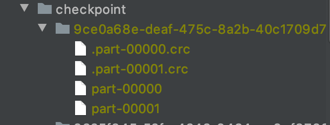
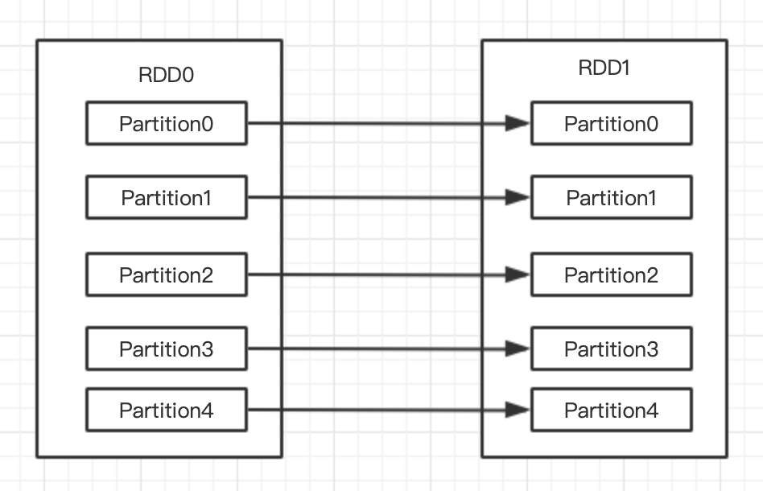
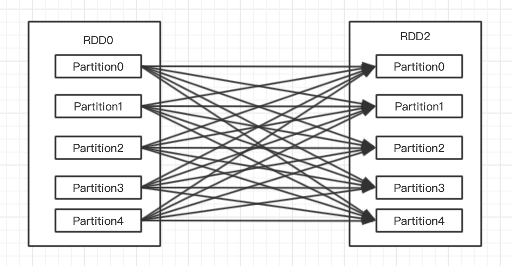
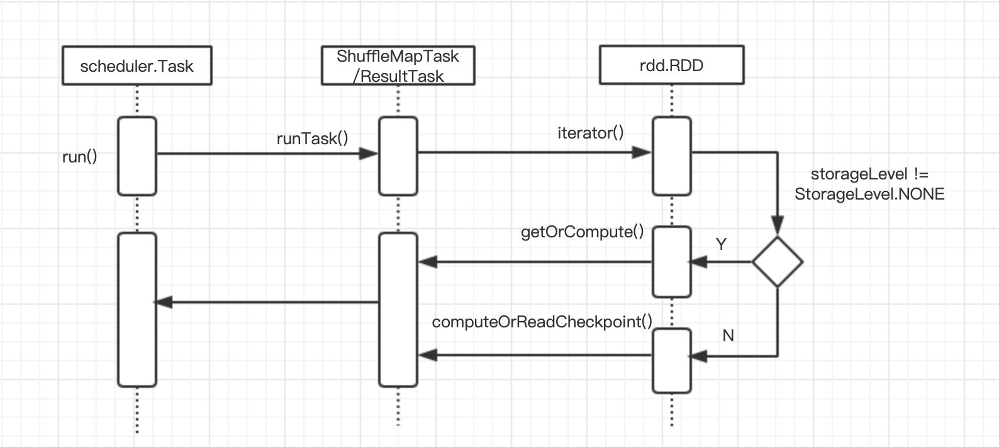

## Spark篇——核心数据结构RDD

Spark目标是为了基于工作集的应用提供抽象，同时保持MapReduce及其模型的优势特性，即自动容错、位置感知性调度和可伸缩性。弹性分布式数据集（RDD）是Spark的数据结构的基本抽象，表示一个不可变的、可分区的并行操作的集合。本文主要介绍详细介绍RDD。


### 1、RDD基础

#### 1.1 RDD属性

1）**分区列表**

- 数据集的基本组成单位；
- 一个分区对应一个task线程；

2）**计算每个分区的算子**

- 该算子会作用于RDD的每个分区；

3）**RDD的依赖关系**

- 主要用于容错机制，记录血缘（后面会介绍血缘）

4）**KV类型的RDD具有散列函数**

系统默认的散列函数有两种：

- 基于哈希的HashPartitioner：分区逻辑是key.hashcode%分区总数=分区号
- 基于范围的RangePartitioner：

如果业务需要，也可以自定义散列函数。自定义散列函数的步骤：

- 继承Partitioner类；
- 实现numPartitions()方法；
- 实现getPartition()方法

例如自定义实现HashPartitioner散列函数：

```java
public class MyPartitioner extends Partitioner {
    
    private int partitions;

    public MyPartitioner(int partitions) {
        this.partitions = partitions;
    }

    @Override
    public int numPartitions() {
        return partitions;
    }

    @Override
    public int getPartition(Object key) {
        if (key == null) {
            return 0;
        } else {
            return key.hashCode() % numPartitions();
        }
    }
    
}
```

值得注意的是，对于KV的RDD，只有产生shuffle时，才会使用的partition。

5）存储存取每个Partition的优先位置

对于一个HDFS文件来说，这个列表保存的就是每个partition所在的块位置。


#### 1.2 创建RDD的方式 

创建RDD有3种方式：

- **通过并行集合**

  ```java
  public static void main(String[] args) {
      SparkConf conf = new SparkConf().setMaster("local[2]").setAppName("create rdd");
      JavaSparkContext sc = new JavaSparkContext(conf);
      List<String> list = Arrays.asList("a", "b", "c");
      JavaRDD<String> listRdd = sc.parallelize(list);
      System.out.println(listRdd.take(1));
  
  }
  ```

- **从外部数据源获取**

  目前支持的数据源包括：HDFS、HBASE、ES、mysql、本地文件等；

  ```java
  JavaRDD<String> textRdd = sc.textFile("src/main/resources/kv1.txt");
  System.out.println(textRdd.take(2));
  ```

- **从已有的RDD通过转换获取**

```java
JavaRDD<String> textMapRdd = textRdd.flatMap(new FlatMapFunction<String, String>() {
    @Override
    public Iterator<String> call(String s) throws Exception {
        String[] strings = s.split(",");
        List<String> stringList = Arrays.asList(strings);
        return stringList.iterator();
    }
});
System.out.println(textMapRdd.take(4));
```


### 2、RDD的转换和行动算子

算子主要分成两类：转换和行动，转换（transform）算子是根据已有的RDD转换生成一个新的RDD，转换操作是延迟加载不会立刻执行；动作(action)算子顾名思义是触发计算任务的执行，将RDD的计算结果返回Driver或者输出到外部存储介质。下面

#### 2.1 转换transform算子

转换算子包括：

- map
- flatmap
- filter
- mapPartitions
- mapPartitionsWithIndex
- union
- intersection
- distinct
- groupByKey
- reduceByKey：首先生成一个MapPartitionsRDD，起到map端combiner的作用；然后生成一个ShuffledRDD，从上一个RDD的输出读取数据，最为reducer端的开始；最后还会生成一个MapPartitionsRDD，起到reducer端reduce的作用。
- sortByKey
- sortBy
- join
- cogroup
- coalesce
- repartition
- repartitionAndSortWithinPartitions

#### 2.2 动作action算子

动作算子包括：

- reduce
- count
- collect
- first
- take
- takeSample
- saveAsTextFile
- saveAsSequenceFile
- saveAsObjectFile
- countByKey
- foreach
- foreachPartition


#### 2.3 RDD缓存机制

缓存的作用是当其他job需要使用该RDD的结果数据，可以直接从缓存中直接读取，避免重复计算。例如下图中，将RDD2进行缓存，然后RDD3和RDD4进行计算时可以直接从缓存中读取，可以提高计算效率。


1）RDD缓存机制实现方式：

- 方法persist()

  - 原理：调用persist()待参数的方法，默认存储级别是MEMORY_ONLY
  - 其他的缓存级别：

  ```scala
  val NONE = new StorageLevel(false, false, false, false)
  val DISK_ONLY = new StorageLevel(true, false, false, false)
  val DISK_ONLY_2 = new StorageLevel(true, false, false, false, 2)
  val MEMORY_ONLY = new StorageLevel(false, true, false, true)
  val MEMORY_ONLY_2 = new StorageLevel(false, true, false, true, 2)
  val MEMORY_ONLY_SER = new StorageLevel(false, true, false, false)
  val MEMORY_ONLY_SER_2 = new StorageLevel(false, true, false, false, 2)
  val MEMORY_AND_DISK = new StorageLevel(true, true, false, true)
  val MEMORY_AND_DISK_2 = new StorageLevel(true, true, false, true, 2)
  val MEMORY_AND_DISK_SER = new StorageLevel(true, true, false, false)
  val MEMORY_AND_DISK_SER_2 = new StorageLevel(true, true, false, false, 2)
  val OFF_HEAP = new StorageLevel(true, true, true, false, 1)
  ```

  StorageLevel对象参数参数分别是：

  ```scala
  StorageLevel private(
      private var _useDisk: Boolean,
      private var _useMemory: Boolean,
      private var _useOffHeap: Boolean,
      private var _deserialized: Boolean,
      private var _replication: Int = 1)
  ```

- 方法cache()

  - 原理：调用persist()方法，固定的存储级别是MEMORY_ONLY。

2）可以创建缓存，也可以清除缓存，清除缓存的方法有：

- 自动清除：应用结束会自动清除内存的缓存；
- 手动清除：调用unpersist()方法

3）什么时候适合使用缓存？

- 某个RDD被多次使用；
- 为了获取一个RDD的结果，需要经过一系列复杂的算子操作或计算才能获取。

#### 2.4 RDD的checkpoint机制

通过缓存，spark避免了RDD上重新计算，能够极大地提升计算速度。但是如果缓存丢失，那么就需要重新计算，如果计算特别复杂或者计算特别耗时，那么会影响整个job的计算。为了避免由于RDD缓存丢失重新计算带来的开销，RDD引进了**检查点（checkpoint）机制**。

检查点是在计算后，重新建立一个job来计算。检查点的使用方式：

```java
public class CheckpointJob {

    public static void main(String[] args) {
        SparkConf conf = new SparkConf().setAppName("checkpoint job").setMaster("local[2]");
        JavaSparkContext sc = new JavaSparkContext(conf);
        // 设置检查点目录
        sc.setCheckpointDir("file:///Users/chengxi/workspace/sourceWorkspace/spark-2.4.0/examples/src/main/resources/checkpoint");

        JavaRDD<String> dataSource = sc.textFile("/Users/chengxi/workspace/sourceWorkspace/spark-2.4.0/examples/src/main/resources/people.csv");
        // 在checkpoint前先缓存，可以提高效率
        dataSource.cache();
        dataSource.checkpoint();

        System.out.println(dataSource.count());

    }
}
```

检查点执行成功后，在检查点目录下会出现文件：



在使用checkpoint时可以先使用cache()方法，可以直接从缓存持久化到checkpoint中。


#### 2.5 RDD的数据共享机制

RDD的数据共享有两种：广播变量和累加器。

##### 2.5.1 广播变量

广播变量是在每个Executor上保存一个只读副本，避免每个task都保存一个副本。这样的好处是减少内存的使用，例如现在有5个Executor，每个Executor运行10个task，现在需要的共享数据大小为100M，如果不使用共享变量需要5 * 10 * 100M共5G内存，如果使用广播变量，那么只需要5 * 100M的内存。

广播变量的使用方式：

```java
public static void main(String[] args) {
    SparkConf conf = new SparkConf().setMaster("local[2]").setAppName("broadcast example");
    JavaSparkContext sc = new JavaSparkContext(conf);
    Broadcast<String> broadcast = sc.broadcast("broadcast");

    List<String> list = Arrays.asList("a", "b", "c");
    JavaRDD<String> source = sc.parallelize(list);

    JavaRDD<String> mapRdd = source.map((s) -> {
        return s.concat(broadcast.getValue());
    });

    System.out.println(mapRdd.collect());
}
```

使用广播变量需要注意：

1）广播变量不能为RDD；

2）广播变量只能在Driver端定义，不能在Executor定义；

3）只能在Driver端修改广播变量的值；

##### 2.5.2 累加器

累加器的作用是统计某些事件的全局计数，一般用于程序调试。

累加的使用方式：

```java
public static void main(String[] args) {
    SparkConf conf = new SparkConf().setMaster("local[*]").setAppName("accumulator example");
    JavaSparkContext sc = new JavaSparkContext(conf);

    Accumulator<Integer> accumulator = sc.accumulator(0);

    List<String> list = Arrays.asList("a", "b", "c");
    JavaRDD<String> source = sc.parallelize(list);

    JavaRDD<String> mapRdd = source.map((s) -> {
        accumulator.add(1);
       return s;
    });

    // 必须触发计算，累加器才会计数
    mapRdd.count();
    System.out.println(accumulator.value());
}
```


#### 2.6 RDD序列化

**1）为什么需要序列化？**

Spark的计算是在Executor上进行的，map、foreach等转换算子的步骤：

- 在Driver端本地序列化；
- 对象序列化传输到executor上；
- executor进行反序列化；
- 最终节点上运行

从Driver传输数据到Executor端，需要对数据进行序列化。在实际应用中，也经常因为对象没有序列化而报错。

**2）序列化的场景**

在map、foreach等算子内部使用到外部定义的变量或函数。

**3）解决序列化方案**

- 对自定义的类进行序列化，实现Serializable接口；
- 对不能序列化的对象使用@transient注解；
- 直接将对象放在函数中，避免序列化；
- 将传输的对象放在class中


### 3、RDD依赖关系

Spark会根据用户提交的计算逻辑中的RDD的转换和动作来生成RDD之间的依赖关系，依赖的维度包括：RDD的parent RDD是什么；依赖于parent RDD的哪些Partition。根据依赖的parent RDD的Partition的不同情况，将依赖关系分为：宽依赖和窄依赖。下面分别介绍这两种依赖关系。

#### 3.1 窄依赖

窄依赖是指每个Parent RDD的Partition最多被子RDD的一个Partition使用。例如：



常见的窄依赖算子有：map、flatMap、filter等。

所有的类都要实现Dependency类，具体类图如下：


其中NarrowDependency就是窄依赖。窄依赖又有两种实现：一对一依赖（OneToOneDependency）和范围的依赖(RangeDependency)。

1）一对一依赖

```java
class OneToOneDependency[T](rdd: RDD[T]) extends NarrowDependency[T](rdd) {
  override def getParents(partitionId: Int): List[Int] = List(partitionId)
}
```

从源码中可以看出，RDD仅依赖于Parent RDD相同ID的Partition，即如上图所示。


2）范围的依赖

```java
/**
 * @param rdd the parent RDD
 * @param inStart parent RDD的起始点
 * @param outStart 子RDD的起始点
 * @param length parent RDD的Partition的数量
 */
class RangeDependency[T](rdd: RDD[T], inStart: Int, outStart: Int, length: Int)
  extends NarrowDependency[T](rdd) {

  override def getParents(partitionId: Int): List[Int] = {
    if (partitionId >= outStart && partitionId < outStart + length) {
      List(partitionId - outStart + inStart)
    } else {
      Nil
    }
  }
}
```

从源码中可以看出，范围的依赖是将多个RDD合并成一个RDD，这些RDD是被拼接起来的，每个parent RDD的Partition的相对顺序不会变。

目前该依赖仅仅被UnionRDD使用。


#### 3.2 宽依赖与shuffle依赖

宽依赖是指多个子RDD的Partition会依赖于同一个parent RDD的Partition，例如：



宽依赖只有1种实现：ShuffleDependency：

```java
class ShuffleDependency[K: ClassTag, V: ClassTag, C: ClassTag](
    @transient private val _rdd: RDD[_ <: Product2[K, V]],
    val partitioner: Partitioner,
    val serializer: Serializer = SparkEnv.get.serializer,
    val keyOrdering: Option[Ordering[K]] = None,
    val aggregator: Option[Aggregator[K, V, C]] = None,
    val mapSideCombine: Boolean = false)
  extends Dependency[Product2[K, V]] {

  if (mapSideCombine) {
    require(aggregator.isDefined, "Map-side combine without Aggregator specified!")
  }
  override def rdd: RDD[Product2[K, V]] = _rdd.asInstanceOf[RDD[Product2[K, V]]]

  private[spark] val keyClassName: String = reflect.classTag[K].runtimeClass.getName
  private[spark] val valueClassName: String = reflect.classTag[V].runtimeClass.getName
  // Note: It's possible that the combiner class tag is null, if the combineByKey
  // methods in PairRDDFunctions are used instead of combineByKeyWithClassTag.
  private[spark] val combinerClassName: Option[String] =
    Option(reflect.classTag[C]).map(_.runtimeClass.getName)
  // 获取新的shuffleID
  val shuffleId: Int = _rdd.context.newShuffleId()

  // 向shuffleManager注册shuffle信息
  val shuffleHandle: ShuffleHandle = _rdd.context.env.shuffleManager.registerShuffle(
    shuffleId, _rdd.partitions.length, this)

  _rdd.sparkContext.cleaner.foreach(_.registerShuffleForCleanup(this))
}
```

从源码可以看出，子RDD依赖parent RDD的所有Partition，所以需要shuffle过程。宽依赖支持两种shuffle Manager：1）基于Hash的Shuffle机制的HashShuffleManager；2）基于排序的Shuffle机制的SortShuffleManager。具体的shuffle机制后面专门讲解。

### 4、DAG有向无环图

Spark生成RDD间的依赖关系后，同时这个计算链也就生成了逻辑上的DAG。

#### 4.1 Lineage血统

DAG之间的依赖关系包含RDD由哪些Parent RDD转换而来和它依赖Parent RDD的哪些Partition，这是DAG的重要属性。借助这些依赖关系，DAG可以认为这些RDD之间形成了Lineage（血统）。

Lineage在Spark中具有重要作用，不仅借能保证一个RDD计算前，它所依赖的parent RDD都已经完成计算；而且实现RDD的容错性，如果一个RDD的部分或全部计算结果丢失，那么只需要重新计算这部分丢失的数据，不需要全量的重新计算。

RDD的Lineage在逻辑上就是有向无环图（DAG）。

#### 4.2 stage划分

首先为什么要划分stage？因为Spark是根据DAG来生成计算任务的，而计算任务的划分是根据stage划分的。

stage的划分由依赖关系决定。对于窄依赖，由于Partition依赖关系是确定的，Partition的转换处理可以在一个线程中完成，所以窄依赖被Spark划分到同一个执行阶段；而对于宽依赖，由于shuffle的存在，只能在parent RDD的shuffle处理完成后才能开始计算，因此宽依赖是划分stage的依据。

task数由stage的partition决定。stage表示调度的不同阶段，每个stage对应一个taskset，而每个Partition对应一个task，这些task是可以并行计算的。

task的类型由stage的类型决定。stage有两种类型：shuffleMapStage和ResultStage。shuffle之前的所有转换被划分为shuffleMapStage，对应的task类型是shuffleMapTask；而shuffle之后的stage就是resultStage，对应的task类型是resultTask。


#### 4.3 Task执行

Task的执行由org.apache.spark.scheduler.Task的run方法开始调用，具体调用图如下：



真正任务执行是在RDD类中iterator()方法执行，其源码为：

```java
final def iterator(split: Partition, context: TaskContext): Iterator[T] = {
  if (storageLevel != StorageLevel.NONE) {
    // 如果存储级别不是None，那么先检查是否有缓存；没有则要进行计算
    getOrCompute(split, context)
  } else {
    // 如果有checkpoint，那么直接读取结果；否则直接进行计算
    computeOrReadCheckpoint(split, context)
  }
}
```


**1）存储级别不为NONE**

当存储级别不为NONE时，会先检查是否有缓存，如果没有会调用computeOrReadCheckpoint()方法进行计算。

```java
private[spark] def getOrCompute(partition: Partition, context: TaskContext): Iterator[T] = {
  // blockId格式：rdd_{id}_{partition.index}
  val blockId = RDDBlockId(id, partition.index)
  var readCachedBlock = true
  // This method is called on executors, so we need call SparkEnv.get instead of sc.env.
  // 调用executor，blockManager提供Storage模块与其他模块交互的接口
  // getOrElseUpdate方法：若block被缓存则返回，否则返回一个迭代器代表该RDD需要计算
  SparkEnv.get.blockManager.getOrElseUpdate(blockId, storageLevel, elementClassTag, () => {
    readCachedBlock = false
    // 查询checkpoint是否有数据，如果有则直接读取，否则调用compute()方法计算
    computeOrReadCheckpoint(partition, context)
  }) match {
      // 当缓存命中时
    case Left(blockResult) =>
      if (readCachedBlock) {
        // 更新统计信息，将缓存作为结果返回
        val existingMetrics = context.taskMetrics().inputMetrics
        existingMetrics.incBytesRead(blockResult.bytes)
        new InterruptibleIterator[T](context, blockResult.data.asInstanceOf[Iterator[T]]) {
          override def next(): T = {
            existingMetrics.incRecordsRead(1)
            delegate.next()
          }
        }
      } else {
        new InterruptibleIterator(context, blockResult.data.asInstanceOf[Iterator[T]])
      }
      // iter有数据时，任务终止
    case Right(iter) =>
      new InterruptibleIterator(context, iter.asInstanceOf[Iterator[T]])
  }
}
```

整个代码逻辑：

1）BlockManager发起请求，根据blockId查询是否有缓存信息；

2）如果能够获取Block的信息会直接返回Block信息；

3）否则代表该RDD是可计算的，这时会调用computeOrReadCheckpoint()方法，查询是否有checkpoint，如果有则直接读取，否则调用compute()方法进行计算。


**2）存储级别为NONE**

当存储级别为NONE时，会首先检查当前RDD是否被checkpoint过，如果有读取checkpoint数据（checkpoint原理见2.4节）；否则开始计算。

```java
  private[spark] def computeOrReadCheckpoint(split: Partition, context: TaskContext): Iterator[T] =
  {
    if (isCheckpointedAndMaterialized) {
      // 如果被checkpoint，则会被清除Lineage，firstParent就是CheckpointRDD
      firstParent[T].iterator(split, context)
    } else {
      compute(split, context)
    }
  }
```

从源码中可以看出，如果有checkpoint，那么最终会调用CheckpointRDD的iterator，然后调用它的compute()方法。

```java
override def compute(split: Partition, context: TaskContext): Iterator[T] = {
  val file = new Path(checkpointPath, ReliableCheckpointRDD.checkpointFileName(split.index))
  ReliableCheckpointRDD.readCheckpointFile(file, broadcastedConf, context)
}
```

