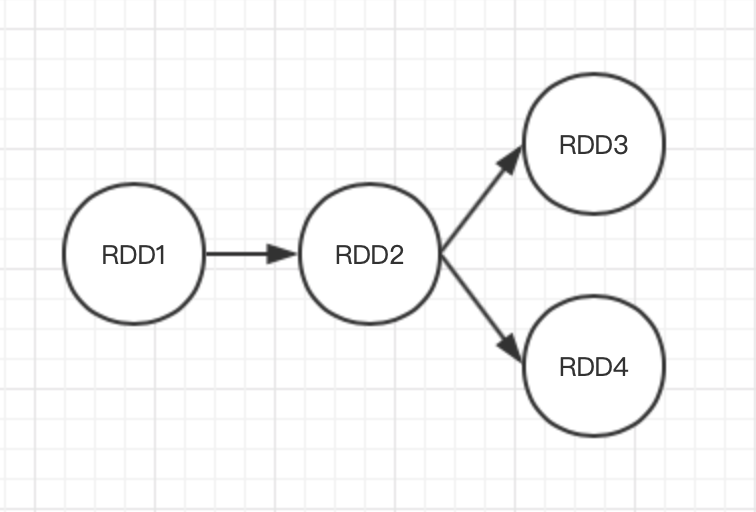

## Spark篇——核心数据结构RDD

Spark目标是为了基于工作集的应用提供抽象，同时保持MapReduce及其模型的优势特性，即自动容错、位置感知性调度和可伸缩性。弹性分布式数据集（RDD）是Spark的数据结构的基本抽象，表示一个不可变的、可分区的并行操作的集合。本文主要介绍详细介绍RDD。


### 1、RDD基础

#### 1.1 RDD属性

1）**分区列表**

- 数据集的基本组成单位；
- 一个分区对应一个task线程；

2）**计算每个分区的算子**

- 该算子会作用于RDD的每个分区；

3）**依赖其他RDD的集合**

- 主要用于容错机制，记录血缘（后面会介绍血缘）

4）**KV类型的RDD具有散列函数**

系统默认的散列函数有两种：

- 基于哈希的HashPartitioner：分区逻辑是key.hashcode%分区总数=分区号
- 基于范围的RangePartitioner：

如果业务需要，也可以自定义散列函数。自定义散列函数的步骤：

- 继承Partitioner类；
- 实现numPartitions()方法；
- 实现getPartition()方法

例如自定义实现HashPartitioner散列函数：

```java
public class MyPartitioner extends Partitioner {
    
    private int partitions;

    public MyPartitioner(int partitions) {
        this.partitions = partitions;
    }

    @Override
    public int numPartitions() {
        return partitions;
    }

    @Override
    public int getPartition(Object key) {
        if (key == null) {
            return 0;
        } else {
            return key.hashCode() % numPartitions();
        }
    }
    
}
```

值得注意的是，对于KV的RDD，只有产生shuffle时，才会使用的partition。

5）**用来计算每个分区的地址集合**


#### 1.2创建RDD的方式 

创建RDD有3种方式：

- **通过并行集合**

  ```java
  public static void main(String[] args) {
      SparkConf conf = new SparkConf().setMaster("local[2]").setAppName("create rdd");
      JavaSparkContext sc = new JavaSparkContext(conf);
      List<String> list = Arrays.asList("a", "b", "c");
      JavaRDD<String> listRdd = sc.parallelize(list);
      System.out.println(listRdd.take(1));
  
  }
  ```

- **从外部数据源获取**

  目前支持的数据源包括：HDFS、HBASE、ES、mysql、本地文件等；

  ```java
  JavaRDD<String> textRdd = sc.textFile("src/main/resources/kv1.txt");
  System.out.println(textRdd.take(2));
  ```

- **从已有的RDD通过转换获取**

```java
JavaRDD<String> textMapRdd = textRdd.flatMap(new FlatMapFunction<String, String>() {
    @Override
    public Iterator<String> call(String s) throws Exception {
        String[] strings = s.split(",");
        List<String> stringList = Arrays.asList(strings);
        return stringList.iterator();
    }
});
System.out.println(textMapRdd.take(4));
```

### 2、RDD算子

算子主要分成两类：转换和行动，转换（transform）算子是根据已有的RDD转换生成一个新的RDD，转换操作是延迟加载不会立刻执行；行为(action)算子顾名思义是触发计算任务的执行，将RDD的计算结果返回Driver或者输出到外部存储介质。下面

#### 2.1 转换transform算子

转换算子包括：

- map
- flatmap
- filter
- mapPartitions
- mapPartitionsWithIndex
- union
- intersection
- distinct
- groupByKey
- reduceByKey
- sortByKey
- sortBy
- join
- cogroup
- coalesce
- repartition
- repartitionAndSortWithinPartitions

#### 2.2 行动action算子

行动算子包括：

- reduce
- count
- collect
- first
- take
- takeOrdered
- saveAsTextFile
- saveAsSequenceFile
- saveAsObjectFile
- countByKey
- foreach
- foreachPartition


#### 2.3 RDD缓存机制

缓存的作用是当其他job需要使用该RDD的结果数据，可以直接从缓存中直接读取，避免重复计算。例如下图中，将RDD2进行缓存，然后RDD3和RDD4进行计算时可以直接从缓存中读取，可以提高计算效率。



1）RDD缓存机制实现方式：

- 方法persist()

  - 原理：调用persist()待参数的方法，默认存储级别是MEMORY_ONLY
  - 其他的缓存级别：

  ```scala
  val NONE = new StorageLevel(false, false, false, false)
  val DISK_ONLY = new StorageLevel(true, false, false, false)
  val DISK_ONLY_2 = new StorageLevel(true, false, false, false, 2)
  val MEMORY_ONLY = new StorageLevel(false, true, false, true)
  val MEMORY_ONLY_2 = new StorageLevel(false, true, false, true, 2)
  val MEMORY_ONLY_SER = new StorageLevel(false, true, false, false)
  val MEMORY_ONLY_SER_2 = new StorageLevel(false, true, false, false, 2)
  val MEMORY_AND_DISK = new StorageLevel(true, true, false, true)
  val MEMORY_AND_DISK_2 = new StorageLevel(true, true, false, true, 2)
  val MEMORY_AND_DISK_SER = new StorageLevel(true, true, false, false)
  val MEMORY_AND_DISK_SER_2 = new StorageLevel(true, true, false, false, 2)
  val OFF_HEAP = new StorageLevel(true, true, true, false, 1)
  ```

  StorageLevel对象参数参数分别是：

  ```scala
  StorageLevel private(
      private var _useDisk: Boolean,
      private var _useMemory: Boolean,
      private var _useOffHeap: Boolean,
      private var _deserialized: Boolean,
      private var _replication: Int = 1)
  ```

- 方法cache()

  - 原理：调用persist()方法，固定的存储级别是MEMORY_ONLY。

2）可以创建缓存，也可以清除缓存，清除缓存的方法有：

- 自动清除：应用结束会自动清除内存的缓存；
- 手动清除：调用unpersist()方法

3）什么时候适合使用缓存？

- 某个RDD被多次使用；
- 为了获取一个RDD的结果，需要经过一系列复杂的算子操作或计算才能获取。

#### 2.4 RDD的checkpoint机制


#### 2.5 RDD的数据共享机制


#### 2.6 RDD序列化


### 3、RDD依赖关系


#### 3.1 窄依赖


#### 3.2 宽依赖与shuffle依赖


### 4、DAG有向无环图


#### 4.1 DAG有向无环图生成


#### 4.2 stage划分


