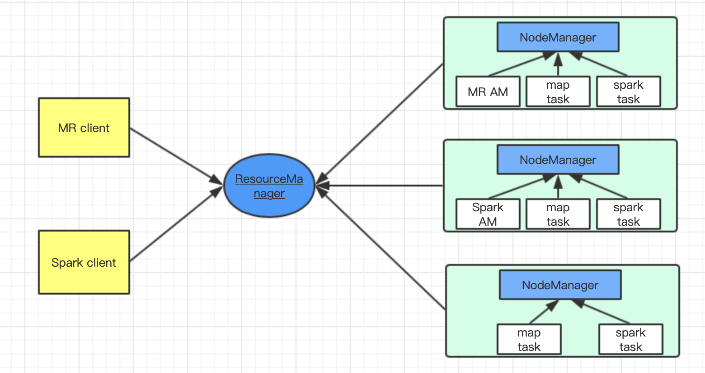

## Spark篇——运行时架构

Spark的Cluster Manager支持的部署模式有：Standalone、mesos、YARN、k8s、Local。其中Local模式一般用于本地调试时使用，Standalone是最简单的集群模式，而为了兼容Hadoop生态，Spark也支持了YARN作为资源的管理器和应用内的任务调度器。

### 1、Spark运行模式简介

不同的运行模式实际上实现了不同的SchedulerBackend和TaskScheduler。在SparkContext的创建过程中，会通过传入的Master URL的值来确定不同的运行模式，并且创建的SchedulerBackend和TaskScheduler。具体的创建过程在org.apache.spark.SparkContext#createTaskScheduler中：

```java
private def createTaskScheduler(
    sc: SparkContext,
    master: String,
    deployMode: String): (SchedulerBackend, TaskScheduler) = {
  import SparkMasterRegex._

  // When running locally, don't try to re-execute tasks on failure.
  val MAX_LOCAL_TASK_FAILURES = 1

  master match {
    case "local" =>
      val scheduler = new TaskSchedulerImpl(sc, MAX_LOCAL_TASK_FAILURES, isLocal = true)
      val backend = new LocalSchedulerBackend(sc.getConf, scheduler, 1)
      scheduler.initialize(backend)
      (backend, scheduler)

    case LOCAL_N_REGEX(threads) =>
      def localCpuCount: Int = Runtime.getRuntime.availableProcessors()
      // local[*] estimates the number of cores on the machine; local[N] uses exactly N threads.
      val threadCount = if (threads == "*") localCpuCount else threads.toInt
      if (threadCount <= 0) {
        throw new SparkException(s"Asked to run locally with $threadCount threads")
      }
      val scheduler = new TaskSchedulerImpl(sc, MAX_LOCAL_TASK_FAILURES, isLocal = true)
      val backend = new LocalSchedulerBackend(sc.getConf, scheduler, threadCount)
      scheduler.initialize(backend)
      (backend, scheduler)

    case LOCAL_N_FAILURES_REGEX(threads, maxFailures) =>
      def localCpuCount: Int = Runtime.getRuntime.availableProcessors()
      // local[*, M] means the number of cores on the computer with M failures
      // local[N, M] means exactly N threads with M failures
      val threadCount = if (threads == "*") localCpuCount else threads.toInt
      val scheduler = new TaskSchedulerImpl(sc, maxFailures.toInt, isLocal = true)
      val backend = new LocalSchedulerBackend(sc.getConf, scheduler, threadCount)
      scheduler.initialize(backend)
      (backend, scheduler)

    case SPARK_REGEX(sparkUrl) =>
      val scheduler = new TaskSchedulerImpl(sc)
      val masterUrls = sparkUrl.split(",").map("spark://" + _)
      val backend = new StandaloneSchedulerBackend(scheduler, sc, masterUrls)
      scheduler.initialize(backend)
      (backend, scheduler)

    case LOCAL_CLUSTER_REGEX(numSlaves, coresPerSlave, memoryPerSlave) =>
      // Check to make sure memory requested <= memoryPerSlave. Otherwise Spark will just hang.
      val memoryPerSlaveInt = memoryPerSlave.toInt
      if (sc.executorMemory > memoryPerSlaveInt) {
        throw new SparkException(
          "Asked to launch cluster with %d MB RAM / worker but requested %d MB/worker".format(
            memoryPerSlaveInt, sc.executorMemory))
      }

      val scheduler = new TaskSchedulerImpl(sc)
      val localCluster = new LocalSparkCluster(
        numSlaves.toInt, coresPerSlave.toInt, memoryPerSlaveInt, sc.conf)
      val masterUrls = localCluster.start()
      val backend = new StandaloneSchedulerBackend(scheduler, sc, masterUrls)
      scheduler.initialize(backend)
      backend.shutdownCallback = (backend: StandaloneSchedulerBackend) => {
        localCluster.stop()
      }
      (backend, scheduler)

    case masterUrl =>
      val cm = getClusterManager(masterUrl) match {
        case Some(clusterMgr) => clusterMgr
        case None => throw new SparkException("Could not parse Master URL: '" + master + "'")
      }
      try {
        val scheduler = cm.createTaskScheduler(sc, masterUrl)
        val backend = cm.createSchedulerBackend(sc, masterUrl, scheduler)
        cm.initialize(scheduler, backend)
        (backend, scheduler)
      } catch {
        case se: SparkException => throw se
        case NonFatal(e) =>
          throw new SparkException("External scheduler cannot be instantiated", e)
      }
  }
}
```

具体UML图如下：


其中集群管理器是第三方时，SchedulerBackend和TaskScheduler由相应的管理器创建。

### 2、local模式

Local模式就是本地启动Spark。具体的形式有以下几种：

1）local

使用一个工作线程运行计算任务，不会重新计算失败的计算任务；

2）local[N]/local[*]

N表示使用N个工作线程，*表示使用的工作线程的数量取决于本机的CPU Core数量，保证逻辑上一个工作线程可以使用一个CPU Core。

3）local[threads,maxFailures]

threads表示使用的工作线程数，maxFailures设置计算任务最大的失败重试次数。

4）local-cluster[numSlaves, corePerSlave, memoryPerSlave]

伪分布式模式，本机会运行Master和Worker。其中numSlaves表示Worker的数量，corePerSlave表示worker所能使用的CPU core数目；memoryPerSlave设置每个Worker所能使用的内存数目。

从上面源码可以看出，前3中情况所使用的都是LocalSchedulerBackend，区别在于启动的工作线程数和是否失败重试。


第4中情况与standalone模式一样，使用StandaloneSchedulerBackend，所以就放在standalone中介绍。


### 3、 standalone模式

standalone是spark提供的集群模式，主要采用主从架构，其中Master负责整个集群的资源调度和Application的管理，Slave接收Master的资源分配调度命令后启动Executor，由Executor完成最终的计算任务。


standalone模式包括三个角色：Master、Worker和Client。在spark2.x的版本下，它们之间的额通信已经从AKKA变成netty。

这三者之间的关系如下：

1）Master：接收Worker的注册并管理所有的Worker，接收Client提交的Application，FIFO调度等待的Application并向Worker提交；

2）Worker：向Master注册自己，根据Master发送的Application配置进程环境，并启动StandaloneExecutorBackend；

3）Client：向Master注册并监控Application。


### 4、 yarn模式

Yarn是双层调度系统，采用主-从架构。YARN的整体架构如下：



资源调度的主节点是ResourceManager，全局管理所有应用程序计算资源的分配，从节点NodeManager是每一台机器框架的代理，是执行应用程序的容器，监控应用程序的资源使用情况并且向调度器汇报。

框架调度的主节点是ApplicationMaster，负责向调度器申请适当的资源容器，运行任务，跟踪应用程序的状态和监控它们的进程，处理任务的失败原因。

整体流程为：client提交job后，会启动一个Container并运行ApplicationMaster，ApplicationMaster向ResourceManager申请资源，获取资源后ApplicationMaster会在NodeManager启动Container，运行计算任务，并且和Container保持联系，监控任务的运行状态等。

根据Spark Driver程序运行的位置不同，又分为yarn-cluster模式和yarn-client模式。

#### 4.1 yarn cluster模式


1）用户通过Yarn client提交Application到YARN的主节点ResourceManager;

2）ResourceManager会在一个NodeManager上启动ApplicationMaster，完成Spark application的提交；

3）ApplicationMaster将自己注册成注册成YARN ApplicationMaster后，才会开始执行用户提交的Application。具体实现是YarnClusterScheduler和TaskScheduler；

4）ApplicationMaster向ResourceManager申请资源，ResourceManager在集群中启动若干个容器，用于启动CoarseGrainedExecutroeBackend，之后它负责启动Executor运行任务。

#### 4.2  yarn client模式

Yarn-client模式与cluster的区别在于：用户提交的Application的SparkContext在本机运行，适合Application本身需要在本地进行交互的场景，一般用于上线前的调试。


