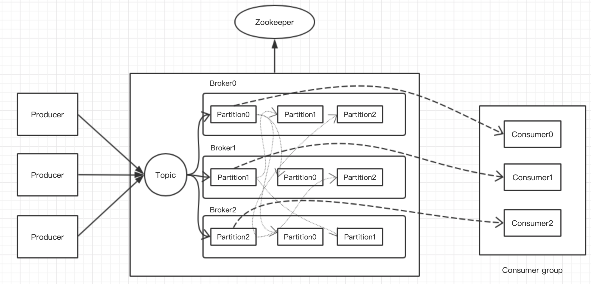

## Kafka学习笔记


### 1、认识Kafka

Kafka既是消息引擎系统，也是一个分布式流处理平台。典型的Kafka架构包含若干Producer、若干Broker、若干Consumer，以及一个Zookeeper集群，具体架构如下：



其中Zookeeper集群是Kafka用来管理集群元数据、控制器选举等操作；Producer将消息发送到Broker，Broker负责将收到的消息存储到磁盘中，而Consumer负责从Broker中订阅并消费消息。

整个Kafka体系结构引入3个术语：

- 生产者Producer：向主题发送消息的客户端
- 消费者Consumer：从主题中订阅并消费的客户端
- 服务代理点Broker：一个Kafka集群由多个Broker组成，Broker负责接收并处理客户端的请求，以及对消息的持久化。

Kafka中还需要掌握以下概念：

- 主题Topic：发布订阅的对象，生产者负责将消息发送到特定主题，而消费者负责订阅主题并消费。生产中可以为每个业务、每个应用甚至每类数据创建一个topic；
- 分区Partition：
  - Kafka将每个topic分成多个partition，一个partition只属于一个topic；
  - 每个partition中是一组有序的消息日志，在存储层面看作一个可追加的日志文件；
  - 每个partition有若干个副本，其中1个是leader，其余的副本是follower；
  - 分区的好处是使Kafka集群具有扩展性，因为partition可以分布在不同的机器上，比单台机器具有更强的性能；
- 副本Replica：
  - leader副本负责与客户端（生产者和消费者）进行交互，follower副本负责从leader请求并拉取数据；
  - Kafka的副本机制是：生产者总是向leader发送写请求，消费者总是从leader消费消息；follower向leader；当leader副本出现故障时，从follower中重新选举leader并对外提供服务；
  - 作用：通过增加副本数提高集群的容灾能力；
- 偏移Offset：
  - 消费者偏移量：每个消费者的消费位置。0.8之前是保存在Zookeeper中，0.8后保存在Kafka集群中，原因是ZK不适合高并发场景下的读写；
  - 消息偏移：分区的消息位置
- 消费组Consumer group:多个消费者共同组成的消费组，可以实现同时消费多个分区实现高吞吐量；
- 重平衡Rebalance：消费组内的某个实例挂掉后，其他消费实例重新分配订阅主题分区的过程；
- 高水位HW：标识一个偏移量，消费者只能消费这个偏移量之前的消息；
- AR：分区中所有的副本称为AR，AR=ISR+OSR
- ISR：与leader保持同步的副本集合，当重新选举leader时，只能从ISR中选择
- OSR：与leader同步滞后的副本集合
- LEO：Log end offset，表示当前日志下一条消息写入的偏移量


### 2、生产者

#### 2.1 生产者客户端开发

生产者开发的步骤：

1. 配置生产者客户端参数；
2. 利用1中的参数对象，创建KafkaProducer对象实例；
3. 构建待发送的消息；
4. 使用KafkaProducer的send方法发送消息；
5. 调用kafkaProducer的close方法关闭生产者并释放各种资源

开发客户端需要引入POM依赖：

```xml
<dependency>
    <groupId>org.apache.kafka</groupId>
    <artifactId>kafka-clients</artifactId>
    <version>1.0.1</version>
</dependency>
```

具体生产者示例代码如下：

```java
public class ProducerDemo {

    public static void main(String[] args) {
        Properties properties = new Properties();

        properties.put("bootstrap.servers", "192.168.1.100:9092,192.168.1.110:9092,192.168.1.120:9092");
        properties.put("acks", "all");
        properties.put("retries", 0);
        properties.put("batch.size", 100);
        properties.put("linger.ms", 1);
        properties.put("buffer.memory", 1024000);
        properties.put("key.serializer", "org.apache.kafka.common.serialization.StringSerializer");
        properties.put("value.serializer", "org.apache.kafka.common.serialization.StringSerializer");

        Producer<String, String> producer = new KafkaProducer<String, String>(properties);
        for (int i = 0; i < 100; i++) {
            System.out.println(i);
            producer.send(new ProducerRecord<String, String>("kafka-study", String.valueOf(i), "hello kafka " + i));

        }
        producer.close();

    }
}
```

下面对生产者客户端代码进行庖丁解牛：

1）参数设置


2）KafkaProducer类


3）序列化


4）分区器


5）拦截器


#### 2.2 生产者发送消息原理


### 3、消费者


### 4、服务端