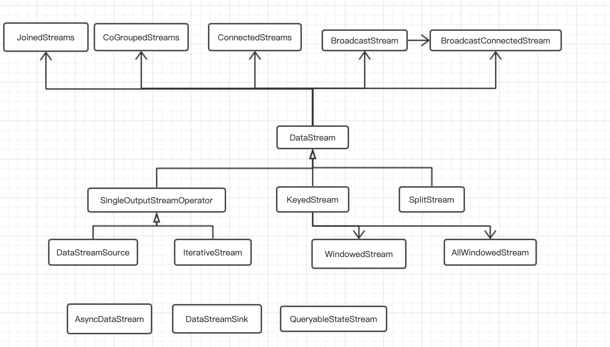

## Flink篇——核心API之DataStream

对于以流为核心的分布式计算引擎来说，数据流是核心数据抽象，表示一个持续产生的数据流。Flink的数据流用DataStream表示，DataStram是一种逻辑概念，并不是底层执行的概念

### 1、 DataStream类型

1）DataStream

2)

### 2、数据流API

#### 2.1 数据读取

#### 2.2 数据转换

#### 2.3 数据输出

