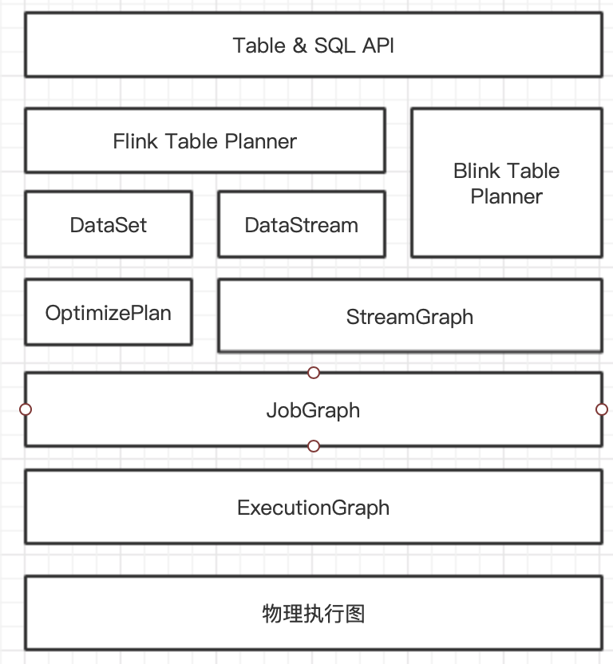
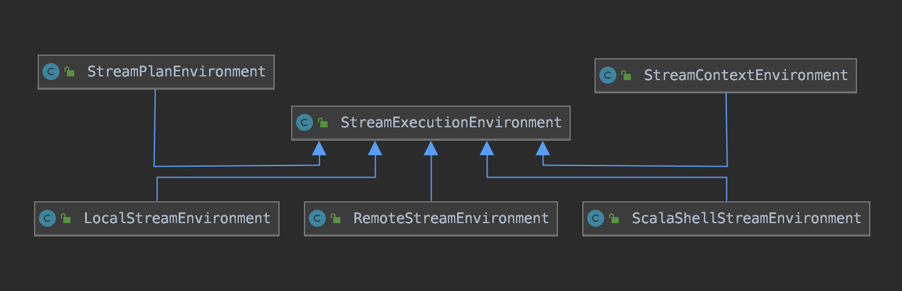
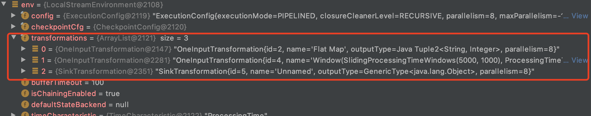
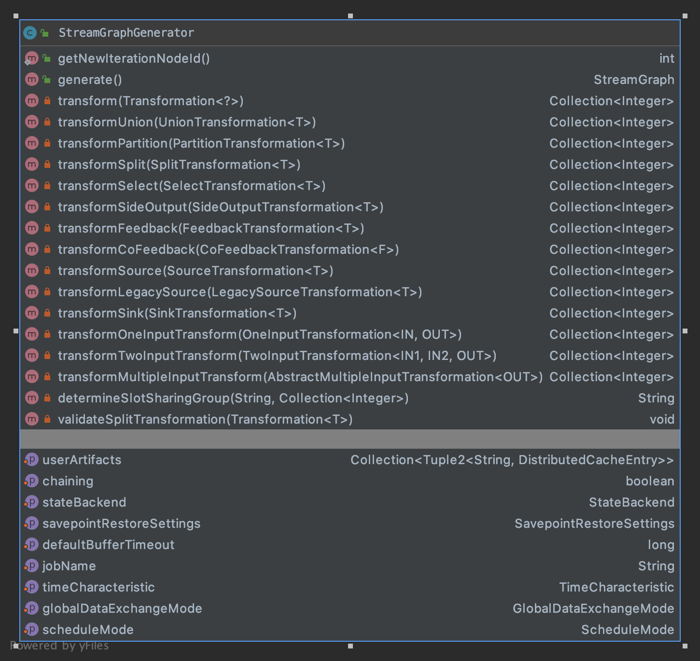

## Flink篇——作业提交流程

### 1、作业提交流程概览


#### 1.1 作业提交流程概览

Flink的作业提交流程如下：


#### 1.2 Graph概览

Flink的流计算和批处理采用不同的抽象，批处理使用OptimizePlan来做Batch相关的优化，使用StreamGraph表达流计算的逻辑，最终都转换为JobGraph实现流批的统一。



流计算应用的Graph转换流程为：

1）首先将DataStream API的调用转换为Transformation;

2）经过StreamGraph—>JobGraph—>ExecutionGraph三层转换；

3）经过Flink调度执行，在Flink集群中启动计算任务，形成物理执行图。


### 2、作业入口


### 3、Flink 应用程序流程

Flink的编程模型为：

- 创建执行环境
- 注册数据source
- 编写运行逻辑
- 注册数据sink
- 调用env.execute()

以WordCount为例：

```java
public class StreamingJob {

   public static void main(String[] args) throws Exception {
      // 1、创建Flink运行上下文
      final StreamExecutionEnvironment env = StreamExecutionEnvironment.getExecutionEnvironment();

      // 2、创建输入源，这里监听本地socket的9000端口
      DataStreamSource<String> input = env.socketTextStream("123.57.254.25", 9000, "\n");

      // 3、业务处理逻辑：flapMap将word压平成（word, 1）的键值对，对键值对进行分组统计
      DataStream<Tuple2<String, Integer>> wordCount = input.flatMap(new FlatMapFunction<String, Tuple2<String, Integer>>() {
         @Override
         public void flatMap(String s, Collector<Tuple2<String, Integer>> collector) throws Exception {
            System.out.println(s);
            String[] words = s.split("\\s");
            for (String word : words) {
               collector.collect(new Tuple2<>(word, 1));
            }
         }
      }).keyBy(0)
            .timeWindow(Time.seconds(5L), Time.seconds(1L))
            .sum(1);

      // 4、输出统计结果
      wordCount.writeAsText("a");


      // 5、提交任务
      env.execute("Flink Streaming Java API Skeleton");
   }
}
```

#### 

#### 3.1 Flink作业执行环境

对于每个Flink任务，首先要创建作业的执行环境。执行环境是Flink作业开发、执行的入口。目前Flink还具有流计算和批处理两套执行环境。执行环境的类体系如下：



StreamExecutionEnvironment表示流计算作业的执行环境，是作业开发的入口、数据源接口、生成和转换DataStream的接口、数据sink的接口、作业配置接口、作业启动执行的入口。StreamExecutionEnvironment的实现类如下：

1）LocalStreamEnvironement

作用：本地执行环境，在单个JVM中使用多线程模拟Flink集群；

使用场景：本地开发、调试；

基本的工作流程：

- 执行Flink作业的main函数生成StreamGraph，转化为JobGraph；
- 设置任务运行的配置信息；
- 根据配置信息启动对应的LocalFlinkMiniCluster；
- 根据配置信息和miniCluster生成对应的MiniClusterClient；
- 通过MiniClusterClient提交JobGraph到MiniCluster。

2）RemoteStreamEnvironment

作用：在大规模数据中心中部署的Flink生成集群的执行环境

使用场景：Flink集群

基本工作流程：

- 执行Flink作业的main函数生成StreamGraph，转化为JobGraph；
- 设置任务运行的配置信息
- 提交JobGraph到远程的Flink集群

3）StreamContextEnvironment

使用场景：在Cli命令行或单元测试时使用

基本工作流程：如上

4）StreamPlanEnvironment

作用：在Flink Web UI管理界面中可视化展现Job的时候，专门用来生成执行计划

5）ScalaShellStreamEnvironment

作用：Scala Shell执行环境，可以在命令行中交互式开发Flink作业

基本工作流程：

- 校验部署模式，目前仅支持attached模式
- 上传每个作业需要的Jar文件

#### 3.2 StreamGraph生成

##### 3.2.1 StreamGraph核心抽象


##### 3.2.2 StreamGraph生成过程


使用DataStream API开发的应用程序，在运行时刻DtaStream的API调用都会转换为Transformation。WordCount的transformation为：



在任务提交后，Transformation被映射为StreamGraph，该图与具体的执行无关，核心是表达计算过程的逻辑。StreamExecutionEnvironment中的execute()方法中会调用getStreamGraph()方法得到StreamGraph：

```java
public StreamGraph getStreamGraph(String jobName, boolean clearTransformations) {
   // 生成StreamGraph
   StreamGraph streamGraph = getStreamGraphGenerator().setJobName(jobName).generate();
   if (clearTransformations) {
      this.transformations.clear();
   }
   return streamGraph;
}

private StreamGraphGenerator getStreamGraphGenerator() {
   if (transformations.size() <= 0) {
      throw new IllegalStateException("No operators defined in streaming topology. Cannot execute.");
   }
   return new StreamGraphGenerator(transformations, config, checkpointCfg)
      .setStateBackend(defaultStateBackend)
      .setChaining(isChainingEnabled)
      .setUserArtifacts(cacheFile)
      .setTimeCharacteristic(timeCharacteristic)
      .setDefaultBufferTimeout(bufferTimeout);
}
```

从源码中可以看出，生成StreamGraph主要在StreamGraphGenerator类中，所以下面看一下这个类：




#### 3.3 JobGraph生成

JobGraph可以由StreamGraph和OptimizePlan转换而来。在流计算中，在StreamGraph的基础上进行一些优化，例如通过OperatorChain机制将算子合并起来，在执行时，调度在同一个task线程上，避免数据的线程跨线程、跨网络的传递。


### 4、JobGraph提交集群


#### 4.1 提交方法


#### 4.2 ExecutionGraph生成

ExecutionGraph是调度Flink作业执行的核心数据结构，包含作业中所有并行执行的task信息、task之间的关联关系、数据流转关系。

JobGraph到ExecutionGraph的转换在JobMaster中完成，转换过程中的变化如下：

1）加入并行度的概念，并成为真正可调度的图结构；

2）JobVertex转换为ExecutionJobVertex和ExecutionVertex，Intermediate Dataset转换为IntermediateResult和IntermediateResultPartition等，通过并行将这些类实现。

