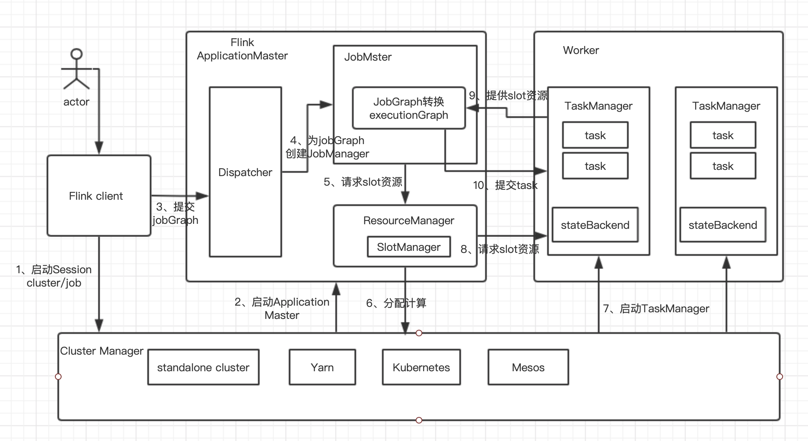

## Flink篇——作业提交流程

### 1、作业提交流程

​                           

​                                                                                       

### 2、StreamGraph流图

使用DataStream API开发的应用程序，首先被转换为Transformation，然后被映射为StreamGraph，该图与具体的执行无关，核心是表达计算过程的逻辑。

### 3、JobGraph作业图

JobGraph可以由StreamGraph和OptimizePlan转换而来。在流计算中，在StreamGraph的基础上进行一些优化，例如通过OperatorChain机制将算子合并起来，在执行时，调度在同一个task线程上，避免数据的线程跨线程、跨网络的传递。

### 4、ExecutionGraph执行图

ExecutionGraph是调度Flink作业执行的核心数据结构，包含作业中所有并行执行的task信息、task之间的关联关系、数据流转关系。

JobGraph到ExecutionGraph的转换在JobMaster中完成，转换过程中的变化如下：

1）加入并行度的概念，并成为真正可调度的图结构；

2）JobVertex转换为ExecutionJobVertex和ExecutionVertex，Intermediate Dataset转换为IntermediateResult和IntermediateResultPartition等，通过并行将这些类实现。

