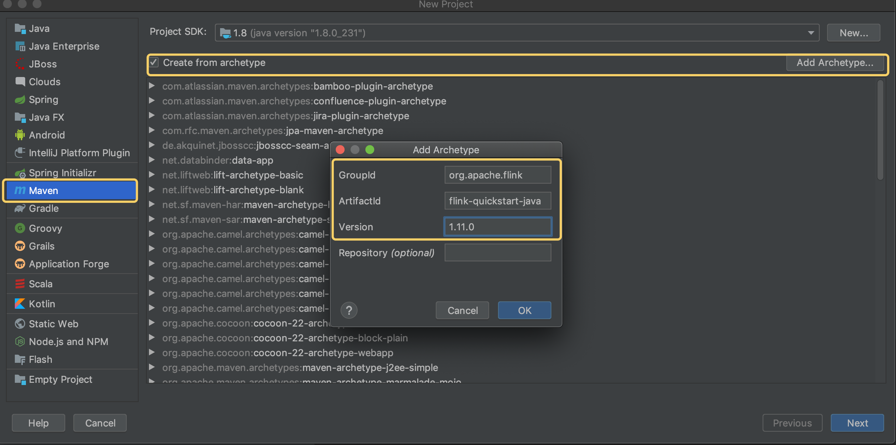
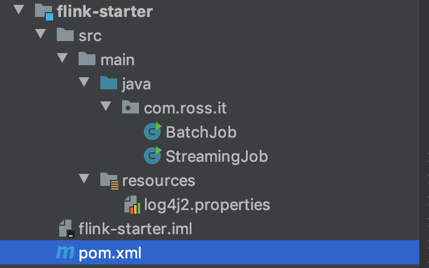
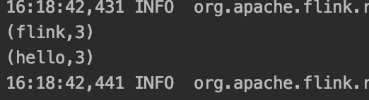

# Flink篇——Flink编程模型

[TOC]

本文以大数据领域经典的WordCount为例，分别演示DataStream、DataSet、Flink Table & SQL的编程模型。

### 1、开发环境

对于Java语言开发而言，JDK、Maven和Git这三个开发工具是必不可少的。Flink开发环境建议安装如下：

| 工具  | 版本            | 备注 |
| ----- | --------------- | ---- |
| JDK   | 1.8或以上       |      |
| Maven | 建议Maven 3.2.5 |      |
| Git   | 无特殊要求      |      |

Flink官网提供两种方式创建项目：1）通过Maven archetype命令创建；2）通过Flink提供的Quickstart Shell脚本进行创建。

本人一般通过IDEA创建Maven工程，然后添加Maven archetype，方便以后复用这个脚手架工程。具体设置如下：



主要设置GroupId、ArtifactId、Version来设置Maven archetype模板。

同时也可以直接在终端执行：

```shell
curl https://flink.apache.org/q/quickstart.sh | bash -s 1.11.0
```

项目创建成功后，目录结果如下：



搞定了开发环境，接下来开始Flink编程之路。

### 2、DataStream 编程模型

WordCount号称是大数据界的“Hello World”，此程序虽然逻辑简单，不过麻雀虽小五脏俱全。

需求分析：通过监听本地的Socket 9000端口，并且每5秒打印因此单词统计结果。

代码实现：

```java
public class StreamingJob {

	public static void main(String[] args) throws Exception {
		// 1、创建Flink运行上下文
		final StreamExecutionEnvironment env = StreamExecutionEnvironment.getExecutionEnvironment();

		// 2、创建输入源，这里监听本地socket的9000端口
		DataStreamSource<String> input = env.socketTextStream("127.0.0.1", 9000, "\n");

		// 3、业务处理逻辑：flapMap将word压平成（word, 1）的键值对，对键值对进行分组统计
		DataStream<Tuple2<String, Integer>> wordCount = input.flatMap(new FlatMapFunction<String, Tuple2<String, Integer>>() {
			@Override
			public void flatMap(String s, Collector<Tuple2<String, Integer>> collector) throws Exception {
				System.out.println(s);
				String[] words = s.split("\\s");
				for (String word : words) {
					collector.collect(new Tuple2<>(word, 1));
				}
			}
		}).keyBy(0)
				.timeWindow(Time.seconds(5L), Time.seconds(1L))
				.sum(1);

		// 4、输出统计结果
		wordCount.writeAsText("a");


		// 5、提交任务
		env.execute("Flink Streaming Java API Skeleton");
	}
}
```

整个处理逻辑：1）利用StreamExecutionEnvironment的静态方法getExecutionEnvironment()创建Flink运行的上下文环境；2）初始化数据，监听127.0.0.1:9000获取数据；3）执行业务处理逻辑：对原始数据按行处理，使用flatMap将数据切分并生成(word,1)的键值对，并使用keyBy按word进行分组，因为是流式数据处理，所以选择窗口大小为5s的滑动窗口进行求和；4）将统计结果输出到本地；5）最后提交计算任务。


### 3、DataSet编程模型

需求分析：通过流式的方式读取文本文件，并对文本中的单词数量进行统计，然后将结果打印到控制台

代码实现：

```java
public class BatchJob {

   public static void main(String[] args) throws Exception {
      // 1、创建Flink运行的上下文环境
      final ExecutionEnvironment env = ExecutionEnvironment.getExecutionEnvironment();

      // 2、 创建DataSet，包括输入算子、转换算子
      DataSet<String> text = env.readTextFile("word.txt");

      DataSet<Tuple2<String, Integer>> word = text.flatMap(new FlatMapFunction<String, Tuple2<String, Integer>>() {
         @Override
         public void flatMap(String s, Collector<Tuple2<String, Integer>> collector) throws Exception {
            for (String word : s.split("\\s")) {
               collector.collect(new Tuple2<>(word, 1));
            }
         }
      }).groupBy(0)
            .sum(1);

      // 3、输出算子
      word.print();

      // 4、提交任务
      env.execute("word count by DataSet");
   }
}
```

整个处理逻辑包括：1）首先创建Flink运行的上下文环境；2）创建Source算子，这里是按行读取本地的文件；3）处理业务逻辑：对于每一行数据进行切分成（word，1）的键值对，然后对键进行分组并求和；4）将统计结果输出到控制台；5）最后使用env提交整个任务即可执行任务。计算结束后任务也就结束了，打印在控制的结果如下：



### 4、Flink table & SQL编程模型

Flink SQL是Flink实时计算为了简化计算模型，降低用户实时计算门槛而设计的符合标准的SQL语义的开发语言。

一个完整的Flink SQL编写的程序包括三个部分：

- Source Operator：对外部数据源的抽象，目前Flink内置了很多常用的数据源实现，比如mysql、Kafka等；
- Transformation Operator：转换算子，例如完成查询、聚合操作等，目前支持union、join、projection、difference、intersection及window等操作；
- Sink Operator：对外结果表。

实现Flink SQL版本的word count还需要添加maven依赖：

```xml
<dependency>
    <groupId>org.apache.flink</groupId>
    <artifactId>flink-table-api-java-bridge_2.11</artifactId>
    <version>${flink.version}</version>
</dependency>
<dependency>
    <groupId>org.apache.flink</groupId>
    <artifactId>flink-table-planner-blink_2.11</artifactId>
    <version>${flink.version}</version>
</dependency>
<dependency>
    <groupId>org.apache.flink</groupId>
    <artifactId>flink-table-planner_2.11</artifactId>
    <version>${flink.version}</version>
</dependency>
<dependency>
    <groupId>org.apache.flink</groupId>
    <artifactId>flink-table-api-scala-bridge_2.11</artifactId>
    <version>${flink.version}</version>
</dependency>
```

具体实现逻辑如下：

```java
public class TableJob {

    public static void main(String[] args) throws Exception {

        // 1、创建flink SQL上下文环境
        ExecutionEnvironment env = ExecutionEnvironment.getExecutionEnvironment();
        BatchTableEnvironment tableEnv = BatchTableEnvironment.create(env);

        // 2、创建输入数据集，与DataSet一样
        DataSet<String> input = env.readTextFile("word.txt");
        DataSet<WordCount> wordCountDataSet = input.flatMap(new FlatMapFunction<String, WordCount>() {
            @Override
            public void flatMap(String s, Collector<WordCount> collector) throws Exception {
                for (String word : s.split("\\s")) {
                    collector.collect(new WordCount(word, 1));
                }
            }
        });

        // 3、DataSet转换SQL，指定字段名
        Table table = tableEnv.fromDataSet(wordCountDataSet, "word,frequency");
        table.printSchema();

        // 4、创建视图，并写查询语句，并将查询结果存储在Table中
        tableEnv.createTemporaryView("WordCount", table);
        Table table1 = tableEnv.sqlQuery("select word as word, sum(frequency) as frequency from WordCount group by word");

        // 5、将SQL处理结果转换为DataSet
        DataSet<WordCount> dataSet = tableEnv.toDataSet(table1, WordCount.class);

        dataSet.printToErr();
    }

    public static class WordCount {
        public String word;
        public Integer frequency;

        public WordCount(){}

        public WordCount(String word, Integer frequency) {
            this.word = word;
            this.frequency = frequency;
        }

        @Override
        public String toString() {
            return word + ", " + frequency;
        }
    }
}
```


### 5 总结

总结来说，Flink的编程模型主要是设置Flink运行上下文、创建和加载数据集、对数据集指定转换操作逻辑、指定计算结果输出位置、调用execute方法触发程序执行。