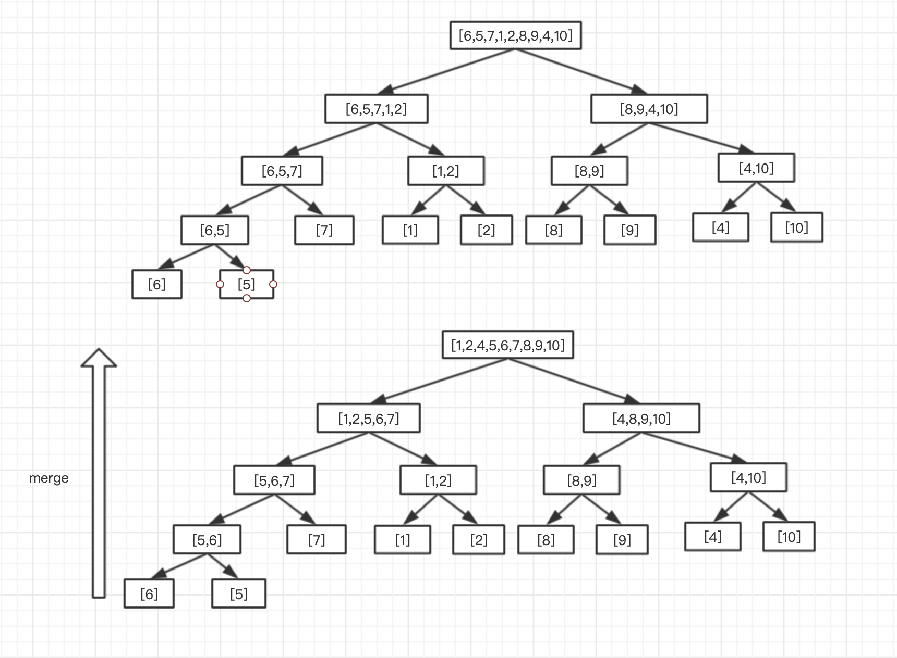
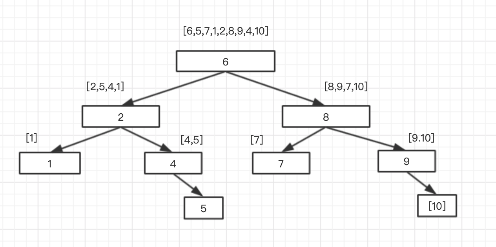

## 数据结构——排序算法


### 1、排序算法模板

```java
public abstract class Sort {

    private Order order = Order.ASC;

    public Sort(){}

    public Sort(Order order) {
        this.order = order;
    }

    public abstract void sort(Comparable[]data);

    /**
     * 比较大小
     * @param a
     * @param b
     * @return
     */
    public boolean compare(Comparable a, Comparable b) {
        if (order.equals(Order.ASC)) {
            return a.compareTo(b) < 0;
        } else {
            return a.compareTo(b) > 0;
        }

    }

    /**
     * 交换数组元素位置
     * @param nums
     * @param i
     * @param j
     */
    public void exch(Comparable[] nums, int i, int j) {
        Comparable tmp = nums[i];
        nums[i] = nums[j];
        nums[j] = tmp;
    }

    /**
     * 打印结果
     * @param values
     */
    public void show(Comparable[] values) {
        for (Comparable value : values) {
            System.out.print(value + " ");
        }
        System.out.println();
    }
}

enum Order {
      /**
     * DESC：降序
     * ASC：升序
     */
    DESC, ASC;
}
```


### 2、选择排序

算法思想：首先找到数组中最小的元素，将它与数组的第一个元素交换位置；其次在剩下的元素中找到最小的元素，将它与数组第二个元素交换位置。如此往复，直到将整个数组排序。

```java
public class SelectionSort extends Sort {

    public SelectionSort() {
        super();
    }

    public SelectionSort(Order order) {
        super(order);
    }

    @Override
    public void sort(Comparable[] data) {
        for (int i = 0; i < data.length; i++) {
            int minIndex = i;
            for (int j = i + 1; j < data.length; j++) {
                if (compare(data[j], data[minIndex])) {
                    minIndex = j;
                }
            }
            exch(data, i, minIndex);
        }
    }
}
```

特点：

- 运行时间和输入无关
- 数据移动是最少的


### 3、插入排序

算法思想：对于每个元素，依次将该元素与左边的元素进行比较，如果小于左边的元素则交换位置，直到移动到起始点或者比左边元素大时终止该元素。依次往复，直到元素索引到达数组的右端时排序结束。该方法就类似于整理扑克牌一样，将每张牌插入到左边有序的牌中。

```java
public class InsertSort extends Sort{

    public InsertSort() {
        super();
    }

    public InsertSort(Order order) {
        super(order);
    }

    @Override
    public void sort(Comparable[] data) {
        for (int i = 1; i < data.length; i++) {
            for (int j = i; j > 0 && compare(data[j], data[j-1]); j--) {
                exch(data, j, j-1);
            }
        }
    }
}
```

每一轮排序完后，与选择排序相同，i的左边元素都是有序的。

特点：

- 运行时间取决于数组的初始顺序：如果数组已经有序或接近有序，那么排序效率接近O(N)

使用场景：

- 数组中每个元素距离它的最终位置都不远；
- 一个有序的大数组接一个小数组；
- 数组中只有几个元素的位置不正确

### 4、归并排序

算法思想：将一个数组排序，可以递归地将数组分成两个子数组分别排序，最后将排序的结果合并。

```java
public class MergeSort extends Sort {

    private Comparable[] tmp;

    public MergeSort() {
        super();
    }

    public MergeSort(Order order) {
        super(order);
    }

    @Override
    public void sort(Comparable[] data) {
        tmp = new Comparable[data.length];

        sort(data, 0, data.length - 1);
    }

    private void sort(Comparable[] data, int low, int high) {
        // 终止条件
        if (high <= low) {
            return;
        }
        int mid = low + (high - low) / 2;
        // 递归排序左分支
        sort(data, low, mid);
        // 递归排序右分支
        sort(data, mid + 1, high);
        // 将左右分支的有序数组合并
        merge(data, low, mid, high);
    }

    /**
     * 归并data[low...mid]和data[mid+1...high]两个数组
     * @param data
     * @param low
     * @param mid
     * @param high
     */
    public void merge(Comparable[] data, int low, int mid, int high) {
        int i = low;
        int j = mid + 1;
        for (int k = low; k <= high; k++) {
            tmp[k] = data[k];
        }

        for (int k = low; k <= high; k++) {
            if (i > mid) {
                data[k] = tmp[j++];
            } else if (j > high) {
                data[k] = tmp[i++];
            } else if (compare(tmp[j], tmp[i])) {
                data[k] = tmp[j++];
            } else {
                data[k] = tmp[i++];
            }
        }

    }
}
```

归并排序的实现思路本质就是二叉树的后序遍历：




### 5、快速排序

算法思想：从数组中随机挑选切分数据a，并将小于a的值放在左边，大于a的值放在右边。然后分别递归排序左右两个数组；

```java
public class QuickSort extends Sort {

    public QuickSort(){
        super();
    }

    public QuickSort(Order order) {
        super(order);
    }

    @Override
    public void sort(Comparable[] data) {
        sort(data, 0, data.length - 1);
    }

    /**
     * 快排，类似二叉树前序遍历
     * @param data
     * @param low
     * @param high
     */
    private void sort(Comparable[] data, int low, int high) {
        if (high <= low) {
            return;
        }
        int j = partition(data, low, high);
        sort(data, low, j - 1);
        sort(data, j+1, high);

    }

    /**
     * 选择元素，将数组分成两个子数组，左子数组都小于flag，右子数组都大于flag
     * @param data
     * @param low
     * @param high
     * @return
     */
    private int partition(Comparable[] data, int low, int high) {
        Comparable flag = data[low];
        int i = low;
        int j = high + 1;
        while (true) {
            while (compare(data[++i], flag)) {
                if (i == high) {
                    break;
                }
            }
            while (compare(flag, data[--j])) {
                if (j == low) {
                    break;
                }
            }
            if (i >= j) {
                break;
            }
            exch(data, i, j);
        }
        exch(data, low, j);
        return j;
    }
}
```

快速排序的实现本质上是二叉树的前序遍历：




### 6、堆排序(TODO)

